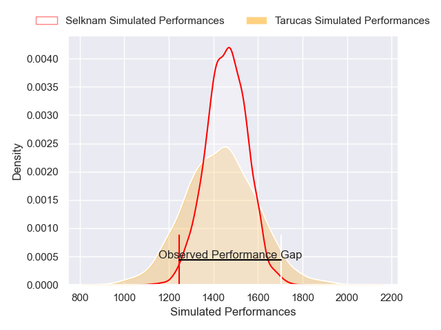
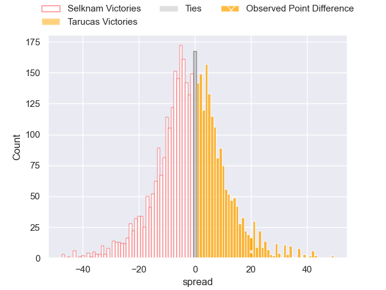
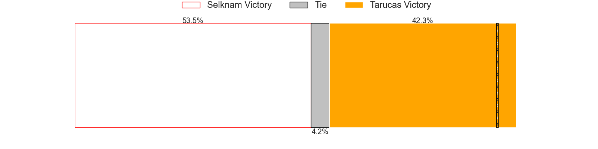
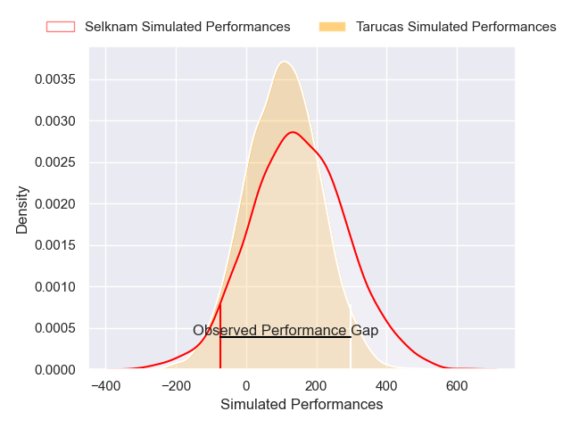
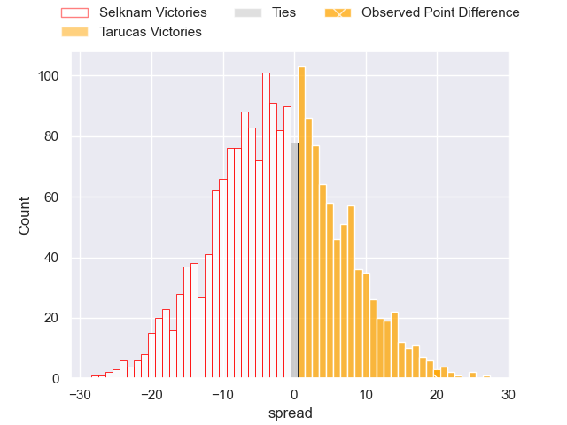

---  
layout: page  
title: Selknam at Tarucas; 21-41  
date: 2025-05-10 18:00:00 -0500  
categories: "Super Rugby Americas 2025" match review  
---
# Selknam at Tarucas; 21-41

# Club Level Predictions

The first set of predictions treats a club as the smallest object, as the club develops its members, organizes a gameplan, and deploys its players as needed for each match. This club model has a prediction of 0.47, which translates to predicting Selknam to win by 1.1.

Our Over/Under is 50.5 - and combined with the spread above, we have a predicted scoreline of 26 to 24

Each club has a rating and a rating deviation (similar to a Glicko rating), and expected performances can be generated. This allows for simulated matches and spreads like the ones below.
## Projected Performances - Club Model

## Projected Spreads - Club Model

## Projected Results - Club Model

# Player Level Predictions

Treating teams instead as an entity made up of the currently active players, I have ratings for each player in an altogether different system. These can be combined to form team ratings once teamsheets are announced, weighting starters a bit higher than the reserves. After the match is played, players can be weighted by their minutes on the field, allowing for an accurate measure of the team's composition. With these compiled team ratings, we can make predictions, measure inaccuracy, and update the individual player ratings.
## Prediction without Player Minutes: Selknam by 2.4

Selknam by 4.6 on a neutral pitch

## Projected Performances - Player Model

## Projected Spreads - Player Model

## Projected Results - Player Model

|   Away Minutes | Away Player                 |   Away Percentile |   Number |   Home Percentile | Home Player             |   Home Minutes |
|---------------:|:----------------------------|------------------:|---------:|------------------:|:------------------------|---------------:|
|             48 | Javier Carrasco             |             78.58 |        1 |             47.26 | Julian Martin           |             77 |
|             39 | Augusto Bohme Alemparte     |             10.7  |        2 |             53.48 | Tomas Bartolini         |             21 |
|             29 | Augusto Bohme Alemparte     |             10.7  |        2 |             53.48 | Tomas Bartolini         |             21 |
|             80 | Nahuel Debiassi             |             57.48 |        3 |             67.46 | Francisco Moreno        |             48 |
|             21 | Santiago Pedrero Poduje     |             78.66 |        4 |             55.02 | Mariano Perondi         |             39 |
|             29 | Bruno Saez                  |             67.66 |        5 |             36.27 | Luciano Asevedo         |             21 |
|             24 | Martin Sigren               |             63.25 |        6 |             50.43 | Facundo Javier Cardozo  |             15 |
|             24 | Clemente Saavedra Cartajena |             69.23 |        7 |             44.54 | Agustin Sarelli         |             19 |
|             31 | Raimundo Martinez Amar      |             40.7  |        8 |             47.03 | Thiago Sbrocco          |             73 |
|             29 | Marcelo Torrealba           |              5.12 |        9 |             84.28 | Simon Benitez Cruz      |             59 |
|             80 | Juan Cruz Reyes             |             48.54 |       10 |             28.03 | Nicolas Roger           |             29 |
|             80 | Nicolas Garafulic Schar     |             79.23 |       11 |             13.49 | Tomas Vanni             |             63 |
|             80 | Gonzalo Lara                |             16    |       12 |             24.72 | Mariano García Ascárate |             23 |
|             80 | Luca Strabucchi             |             64    |       13 |             72.31 | Tomas Medina            |             30 |
|             55 | Manuel Bustamante           |             24.78 |       14 |             61.91 | Mateo Pasquini          |             51 |
|             41 | Tomas Salas Walther         |             35.52 |       15 |             53.91 | Stefano Ferro           |             63 |
|             80 | Joaquin Milesi              |             85.28 |       16 |             60.78 | Juan Manuel Vivas       |             71 |
|             80 | Benjamin Videla             |             34.98 |       17 |             25.76 | Benjamin Garrido        |             80 |
|             48 | Emilio Shea                 |            nan    |       18 |             37.83 | Santiago Aguilar        |             59 |
|             41 | Baltazar Gurruchaga         |             57.73 |       19 |            nan    | Joaquin Aguilar         |             30 |
|             80 | Salvador Lues Soto          |            nan    |       20 |             31.4  | Rodrigo Navarro         |             25 |
|             80 | Tomas Baguley               |            nan    |       21 |            nan    | Ignacio Cerrutti        |             66 |
|             73 | Agustin Toth                |              0.86 |       22 |             18.77 | Bautista Estofan        |             48 |
|             80 | Augusto Villanueva          |            nan    |       23 |             29.68 | Estanislao Pregot       |             29 |

