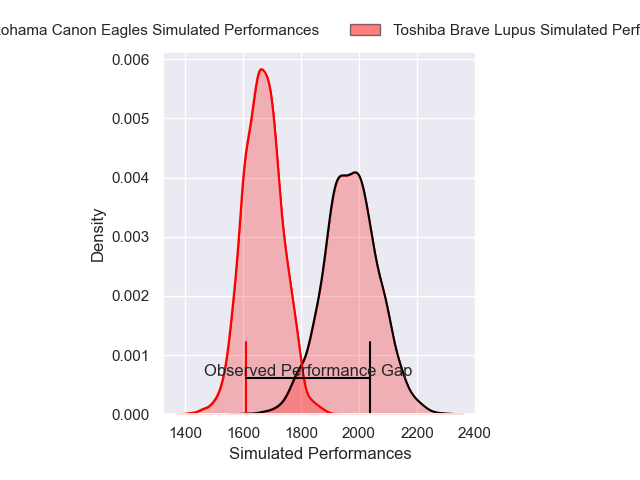
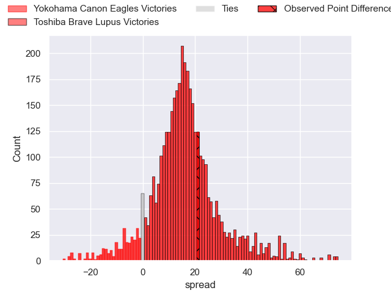
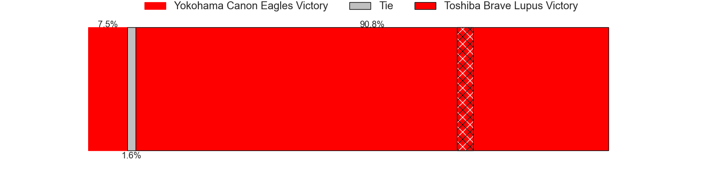
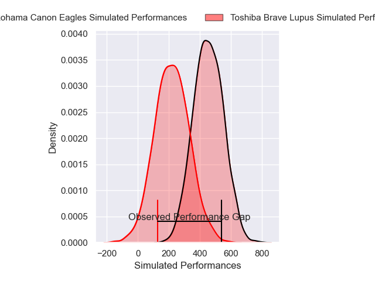
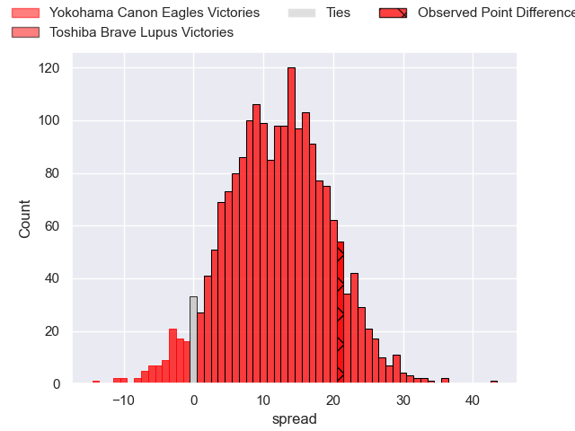
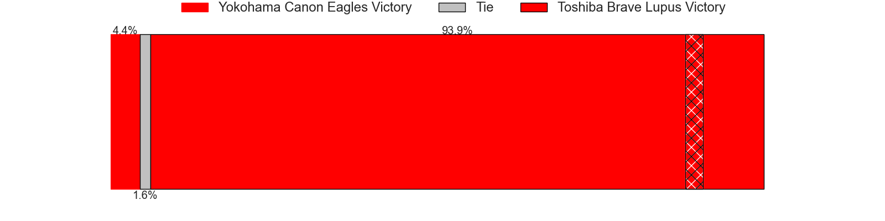

---  
layout: page  
title: Yokohama Canon Eagles at Toshiba Brave Lupus; 28-49  
date: 2025-05-10 18:00:00 -0500  
categories: "Japan Rugby League One 24/25" match review  
---
# Yokohama Canon Eagles at Toshiba Brave Lupus; 28-49

# Club Level Predictions

The first set of predictions treats a club as the smallest object, as the club develops its members, organizes a gameplan, and deploys its players as needed for each match. This club model has a prediction of 0.846, which translates to predicting Toshiba Brave Lupus to win by 15.1.

Our Over/Under is 54.5 - and combined with the spread above, we have a predicted scoreline of 20 to 35

Each club has a rating and a rating deviation (similar to a Glicko rating), and expected performances can be generated. This allows for simulated matches and spreads like the ones below.
## Projected Performances - Club Model

## Projected Spreads - Club Model

## Projected Results - Club Model

# Player Level Predictions

Treating teams instead as an entity made up of the currently active players, I have ratings for each player in an altogether different system. These can be combined to form team ratings once teamsheets are announced, weighting starters a bit higher than the reserves. After the match is played, players can be weighted by their minutes on the field, allowing for an accurate measure of the team's composition. With these compiled team ratings, we can make predictions, measure inaccuracy, and update the individual player ratings.
## Prediction without Player Minutes: Toshiba Brave Lupus by 21.1

Toshiba Brave Lupus by 16.9 on a neutral pitch

## Projected Performances - Player Model

## Projected Spreads - Player Model

## Projected Results - Player Model

|   Away Minutes | Away Player      |   Away Percentile |   Number |   Home Percentile | Home Player      |   Home Minutes |
|---------------:|:-----------------|------------------:|---------:|------------------:|:-----------------|---------------:|
|             50 | Takato Okabe     |             97.66 |        1 |             94.02 | Sena Kimura      |             60 |
|             70 | Shunta Nakamura  |             78.17 |        2 |             95.07 | Mamoru Harada    |             52 |
|             80 | Ryosuke Iwaihara |             47.17 |        3 |             84.17 | Taufa Latu       |             80 |
|             52 | Liaki Moli       |              4.98 |        4 |             99.8  | Jacob Pierce     |             60 |
|             80 | Matt Philip      |             28    |        5 |             91.12 | Warner Dearns    |             17 |
|             70 | Billy Harmon     |             50.1  |        6 |             96.17 | Shannon Frizell  |             68 |
|             30 | Naoto Shimada    |             15.13 |        7 |             94.54 | Takeshi Sasaki   |             80 |
|             30 | Amanaki Mafi     |             92.99 |        8 |             95.75 | Michael Leitch   |             29 |
|             80 | Kouki Arai       |             57.19 |        9 |             91.37 | Yuhei Sugiyama   |             29 |
|             80 | Yuragi Muto      |             12.68 |       10 |             99.79 | Richie Mo'unga   |             53 |
|             33 | Chihito Matsui   |             55.16 |       11 |             73.74 | Toshiki Kuwayama |             13 |
|             30 | Yu Tamura        |             75.83 |       12 |             58.14 | Rob Thompson     |             80 |
|             80 | Jesse Kriel      |             97.27 |       13 |             98.18 | Seta Tamanivalu  |             57 |
|             68 | Kippei Ishida    |             12.65 |       14 |             73.05 | Yuto Mori        |             24 |
|             75 | Jumpei Ogura     |             97.66 |       15 |             88.3  | Shohei Toyoshima |             70 |

