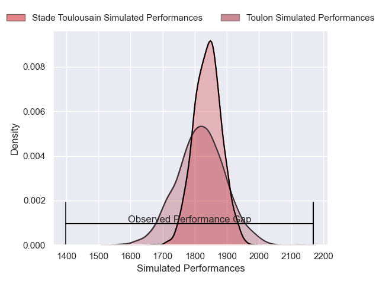
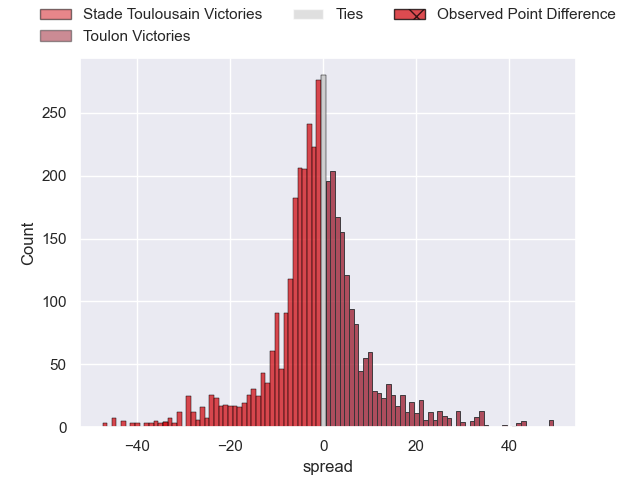
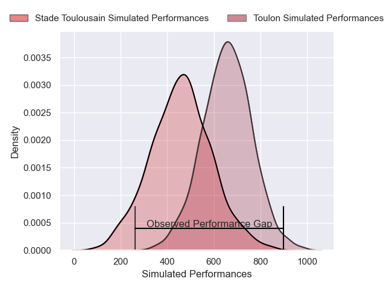
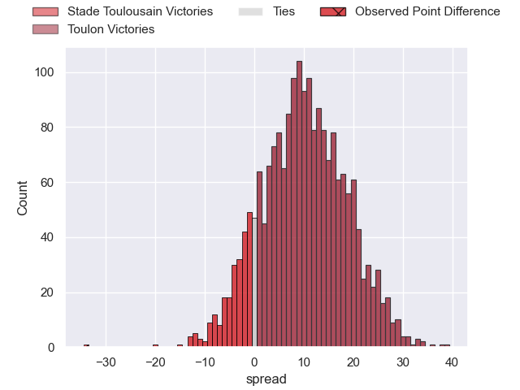
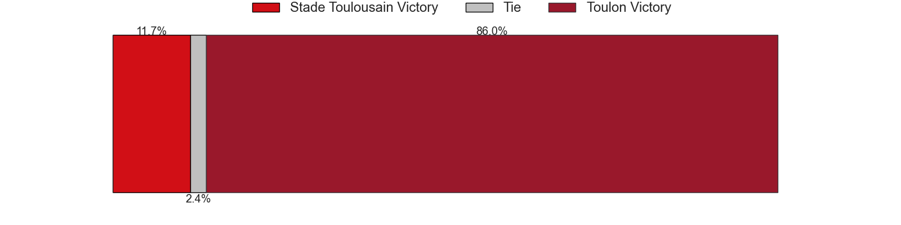

---  
layout: page  
title: Stade Toulousain at Toulon; 50-16  
date: 2025-05-10 18:00:00 -0500  
categories: "Top 14 Orange 24/25" match review  
---
# Stade Toulousain at Toulon; 50-16

# Club Level Predictions

The first set of predictions treats a club as the smallest object, as the club develops its members, organizes a gameplan, and deploys its players as needed for each match. This club model has a prediction of 0.468, which translates to predicting Stade Toulousain to win by 1.1.

Our Over/Under is 45.5 - and combined with the spread above, we have a predicted scoreline of 23 to 22

Each club has a rating and a rating deviation (similar to a Glicko rating), and expected performances can be generated. This allows for simulated matches and spreads like the ones below.
## Projected Performances - Club Model

## Projected Spreads - Club Model

## Projected Results - Club Model

# Player Level Predictions

Treating teams instead as an entity made up of the currently active players, I have ratings for each player in an altogether different system. These can be combined to form team ratings once teamsheets are announced, weighting starters a bit higher than the reserves. After the match is played, players can be weighted by their minutes on the field, allowing for an accurate measure of the team's composition. With these compiled team ratings, we can make predictions, measure inaccuracy, and update the individual player ratings.
## Prediction without Player Minutes: Toulon by 8.8

Stade Toulousain by 3.0 on a neutral pitch

## Projected Performances - Player Model

## Projected Spreads - Player Model

## Projected Results - Player Model

|   Away Minutes | Away Player            |   Away Percentile |   Number |   Home Percentile | Home Player            |   Home Minutes |
|---------------:|:-----------------------|------------------:|---------:|------------------:|:-----------------------|---------------:|
|             80 | David Ainu'u           |             93.14 |        1 |             96.09 | Jean-Baptiste Gros     |             70 |
|             69 | Guillaume Cramont      |             93.85 |        2 |             82.95 | Teddy Baubigny         |             10 |
|             80 | Joel Merkler           |             91.86 |        3 |             92.18 | Kyle Sinckler          |             72 |
|             41 | Joshua Brennan         |             95.56 |        4 |             34.84 | Matthias Halagahu      |             80 |
|             80 | Thibaud Flament        |             98.3  |        5 |             57.41 | Brian Alainu'uese      |             80 |
|             80 | Francois Cros          |             98.26 |        6 |             57.06 | Lewis Ludlam           |             29 |
|             57 | Mathis Castro-Ferreira |             81.53 |        7 |             77.47 | Esteban Abadie         |             29 |
|             22 | Anthony Jelonch        |             99.58 |        8 |             89.03 | Facundo Isa            |             29 |
|             39 | Naoto Saito            |              5.74 |        9 |             98.96 | Baptiste Serin         |             69 |
|             27 | Romain Ntamack         |             97.26 |       10 |             63.58 | Paolo Garbisi          |             66 |
|             36 | Matthis Lebel          |             99.53 |       11 |             93.26 | Gabin Villiere         |             54 |
|             39 | Santiago Chocobares    |             71.56 |       12 |             48.99 | Jeremy Sinzelle        |             80 |
|             80 | Paul Costes            |             93.93 |       13 |             91.5  | Leicester Fainga'anuku |             33 |
|             25 | Ange Capuozzo          |             98.96 |       14 |             29.03 | Gael Drean             |             45 |
|             80 | Matias Remue           |             91.19 |       15 |             71.7  | Marius Domon           |             22 |
|             54 | Matias Remue           |             91.19 |       15 |             71.7  | Marius Domon           |             22 |
|             48 | Thomas Lacombre        |             81.72 |       16 |             95.25 | Mickael Ivaldi         |             76 |
|             41 | Cyril Baille           |             95.53 |       17 |             93.77 | Dany Priso             |             49 |
|             67 | Emmanuel Meafou        |             78.75 |       18 |             77.34 | Swan Rebbadj           |             29 |
|             57 | Alexandre Roumat       |             95.99 |       19 |             88.39 | Matteo Le Corvec       |             76 |
|             14 | Theo Ntamack           |             64.35 |       20 |             98.53 | Dan Biggar             |             26 |
|             12 | Paul Graou             |             70.09 |       21 |             63.48 | Jules Danglot          |             26 |
|             25 | Pierre-Louis Barassi   |             91.19 |       22 |             94.88 | Jiuta Wainiqolo        |             21 |
|             23 | Dorian Aldegheri       |             95.61 |       23 |             74.62 | Beka Gigashvili        |              0 |

