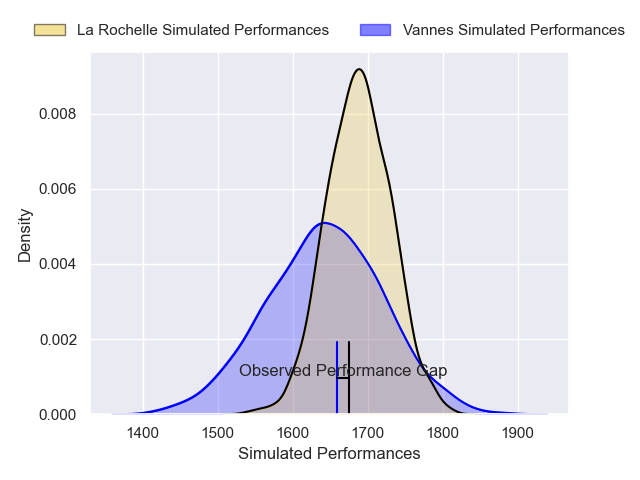
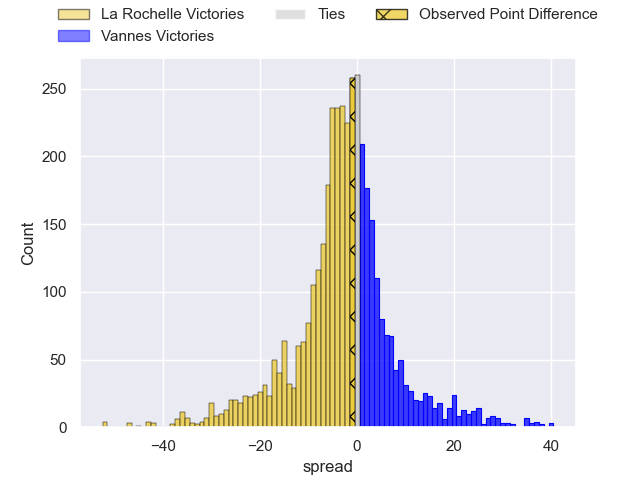
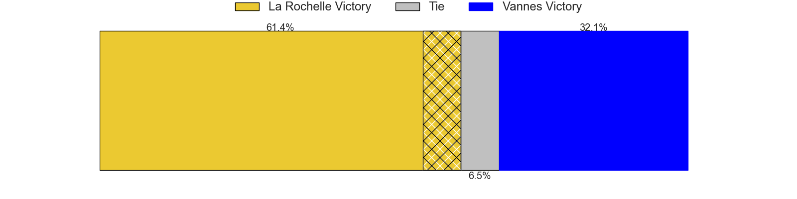
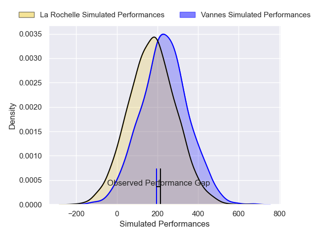
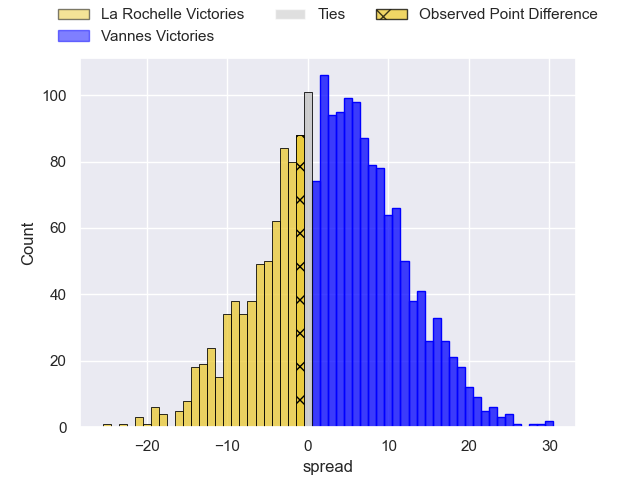
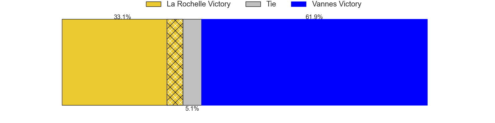

---  
layout: page  
title: La Rochelle at Vannes; 30-29  
date: 2025-05-10 18:00:00 -0500  
categories: "Top 14 Orange 24/25" match review  
---
# La Rochelle at Vannes; 30-29

# Club Level Predictions

The first set of predictions treats a club as the smallest object, as the club develops its members, organizes a gameplan, and deploys its players as needed for each match. This club model has a prediction of 0.432, which translates to predicting La Rochelle to win by 2.4.

Our Over/Under is 54.5 - and combined with the spread above, we have a predicted scoreline of 28 to 26

Each club has a rating and a rating deviation (similar to a Glicko rating), and expected performances can be generated. This allows for simulated matches and spreads like the ones below.
## Projected Performances - Club Model

## Projected Spreads - Club Model

## Projected Results - Club Model

# Player Level Predictions

Treating teams instead as an entity made up of the currently active players, I have ratings for each player in an altogether different system. These can be combined to form team ratings once teamsheets are announced, weighting starters a bit higher than the reserves. After the match is played, players can be weighted by their minutes on the field, allowing for an accurate measure of the team's composition. With these compiled team ratings, we can make predictions, measure inaccuracy, and update the individual player ratings.
## Prediction without Player Minutes: Vannes by 6.1

Vannes by 0.7 on a neutral pitch

## Projected Performances - Player Model

## Projected Spreads - Player Model

## Projected Results - Player Model

|   Away Minutes | Away Player         |   Away Percentile |   Number |   Home Percentile | Home Player         |   Home Minutes |
|---------------:|:--------------------|------------------:|---------:|------------------:|:--------------------|---------------:|
|             48 | Reda Wardi          |             95.4  |        1 |            100    | Mako Vunipola       |             29 |
|             32 | Nika Sutidze        |             15.32 |        2 |             61.8  | Theo Beziat         |             25 |
|             45 | Nika Sutidze        |             15.32 |        2 |             61.8  | Theo Beziat         |             25 |
|             13 | Uini Atonio         |             95.8  |        3 |              7.67 | Santiago Medrano    |             45 |
|             13 | Uini Atonio         |             95.8  |        3 |              7.67 | Santiago Medrano    |             43 |
|             13 | Uini Atonio         |             95.8  |        3 |              7.67 | Santiago Medrano    |             28 |
|             80 | Thomas Lavault      |             79.12 |        4 |              8.88 | Eric Marks          |             29 |
|             24 | Will Skelton        |             94.24 |        5 |             76.2  | Fabrice Metz        |             80 |
|             37 | Judicael Cancoriet  |              9.48 |        6 |             94.25 | Joe Edwards         |              0 |
|             37 | Paul Boudehent      |              4.89 |        7 |             97.61 | Francisco Gorrissen |             80 |
|             80 | Gregory Alldritt    |             98.3  |        8 |             36.73 | Sione Kalamafoni    |             37 |
|             37 | Tawera Kerr-Barlow  |             98.2  |        9 |              1.8  | Stephen Varney      |             51 |
|             80 | Antoine Hastoy      |             42.49 |       10 |             92.6  | Maxime Lafage       |             27 |
|             23 | Hoani Bosmorin      |             23.83 |       11 |             79.57 | Romaric Camou       |             28 |
|             51 | Jules Favre         |             89.69 |       12 |              5.66 | Francis Saili       |             80 |
|             71 | Ulupano Seuteni     |             76.74 |       13 |             72.7  | Robin Taccola       |             29 |
|             80 | Jack Nowell         |              0.19 |       14 |             94.07 | John Porch          |             80 |
|             61 | Dillyn Leyds        |             94.47 |       15 |             43.4  | Paul Surano         |             80 |
|             29 | Thierry Paiva       |             65.67 |       16 |             35.14 | Thomas Moukoro      |             47 |
|             36 | Levani Botia        |             94.06 |       17 |             48.94 | Cyril Blanchard     |             80 |
|             14 | Oscar Jegou         |             38.6  |       18 |            nan    | Phil Kite           |             80 |
|             35 | Quentin Lespiaucq   |             29.93 |       19 |             52.68 | Timothe Mezou       |              7 |
|             40 | Jonathan Danty      |             92.62 |       20 |             65.12 | Pierre Boudehent    |             23 |
|             34 | Aleksandre Kuntelia |             18.74 |       21 |             74.93 | Anton Bresler       |             15 |
|             40 | Thomas Berjon       |             85.61 |       22 |              7.28 | Simon Augry         |             22 |
|             75 | Matthias Haddad     |             30.15 |       23 |            nan    | nan                 |            nan |

