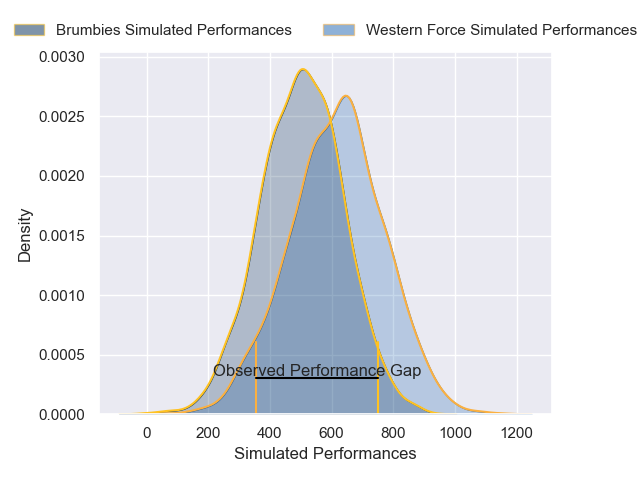
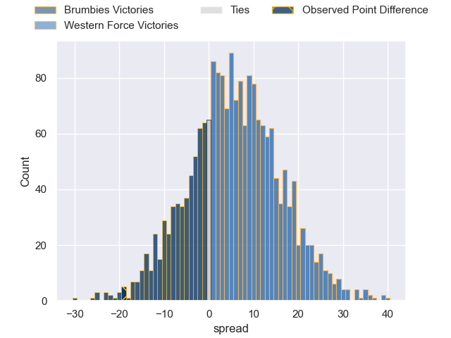

---  
layout: page  
title: Brumbies at Western Force; 33-14  
date: 2025-05-10 18:00:00 -0500  
categories: "Super Rugby Pacific 2025" match review  
---
# Brumbies at Western Force; 33-14

# Club Level Predictions

The first set of predictions treats a club as the smallest object, as the club develops its members, organizes a gameplan, and deploys its players as needed for each match. This club model has a prediction of 0.371, which translates to predicting Brumbies to win by 4.7.

Our Over/Under is 60.5 - and combined with the spread above, we have a predicted scoreline of 33 to 28

Each club has a rating and a rating deviation (similar to a Glicko rating), and expected performances can be generated. This allows for simulated matches and spreads like the ones below.
## Projected Performances - Club Model

## Projected Spreads - Club Model

## Projected Results - Club Model

# Player Level Predictions

Treating teams instead as an entity made up of the currently active players, I have ratings for each player in an altogether different system. These can be combined to form team ratings once teamsheets are announced, weighting starters a bit higher than the reserves. After the match is played, players can be weighted by their minutes on the field, allowing for an accurate measure of the team's composition. With these compiled team ratings, we can make predictions, measure inaccuracy, and update the individual player ratings.
## Prediction without Player Minutes: Western Force by 1.2

Brumbies by 5.2 on a neutral pitch

## Projected Performances - Player Model

## Projected Spreads - Player Model

## Projected Results - Player Model

|   Away Minutes | Away Player         |   Away Percentile |   Number |   Home Percentile | Home Player                    |   Home Minutes |
|---------------:|:--------------------|------------------:|---------:|------------------:|:-------------------------------|---------------:|
|           80   | James Slipper       |            100    |        1 |             17.88 | Ryan Coxon                     |             80 |
|           54   | James Slipper       |            100    |        1 |             17.88 | Ryan Coxon                     |             80 |
|           67   | James Slipper       |            100    |        1 |             17.88 | Ryan Coxon                     |             80 |
|           67   | Lachlan Lonergan    |             12.65 |        2 |             74.69 | Nic Dolly                      |             48 |
|           37   | Allan Alaalatoa     |             96.49 |        3 |             88.67 | Tom Robertson                  |             80 |
|           29   | Nick Frost          |             67.04 |        4 |              9.92 | Jeremy Williams                |             32 |
|           29   | Lachlan Shaw        |             54.58 |        5 |             25.4  | Darcy Swain                    |             66 |
|           80   | Rob Valetini        |             98.84 |        6 |             44    | Will Harris                    |             68 |
|           80   | Rory Scott          |             82.79 |        7 |              8.51 | Kane Koteka                    |             26 |
|           46   | Tom Hooper          |             85.86 |        8 |             37.55 | Nicholas Champion de Crespigny |             12 |
|           18   | Ryan Lonergan       |             84.52 |        9 |             24    | Henry Robertson                |             48 |
|           16   | Noah Lolesio        |             84.63 |       10 |             37.68 | Ben Donaldson                  |             48 |
|           12   | Corey Toole         |             64.71 |       11 |             85.29 | Mac Grealy                     |             54 |
|            4   | David Feliuai       |             36.94 |       12 |             16.3  | Hamish Stewart                 |             76 |
|            4   | David Feliuai       |             36.94 |       12 |             16.3  | Hamish Stewart                 |             33 |
|            4   | David Feliuai       |             36.94 |       12 |             16.3  | Hamish Stewart                 |             74 |
|            4   | David Feliuai       |             36.94 |       12 |             16.3  | Hamish Stewart                 |             62 |
|           23.5 | Len Ikitau          |             84.41 |       13 |              5.69 | Bayley Kuenzle                 |             25 |
|           32   | Andy Muirhead       |             96.3  |       14 |             27.99 | Harry Potter                   |             30 |
|           28   | Tom Wright          |             78.2  |       15 |             94.97 | Kurtley Beale                  |             61 |
|           49   | Liam Bowron         |            nan    |       16 |             68.19 | Tom Horton                     |             13 |
|           47   | Lington Ieli        |            nan    |       17 |            nan    | Atu Moli                       |             26 |
|           25   | Rhys Van Nek        |            nan    |       18 |            nan    | Tiaan Tauakipulu               |             32 |
|           44   | Tuaina Taii Tualima |             70.16 |       19 |            nan    | Lopeti Faifua                  |             80 |
|           80   | Luke Reimer         |            nan    |       20 |             87.55 | Reed Prinsep                   |             80 |
|           26   | Harrison Goddard    |            nan    |       21 |             99.3  | Nic White                      |             37 |
|           32   | Declan Meredith     |            nan    |       22 |              2.95 | Max Burey                      |             75 |
|           80   | Ollie Sapsford      |             94.5  |       23 |             82.59 | Sio Tomkinson                  |             68 |

