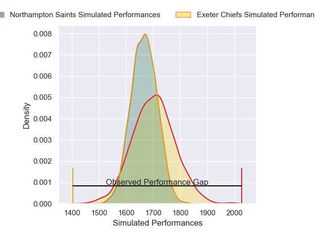
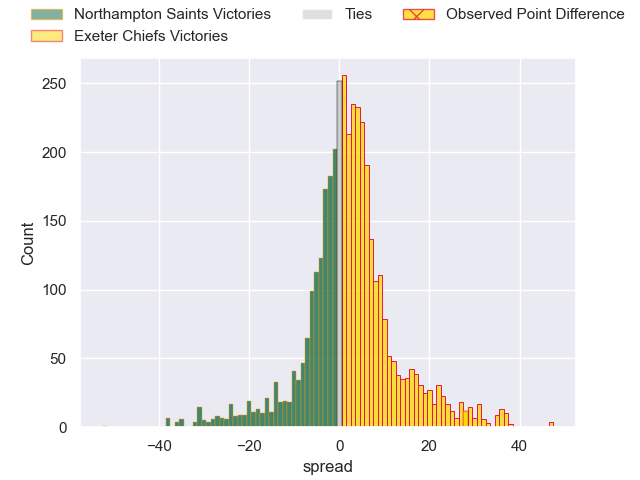
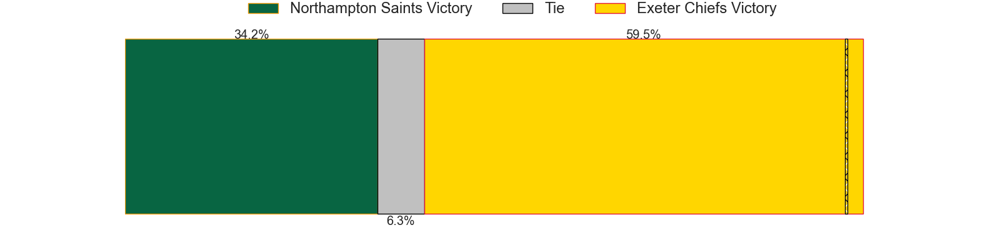
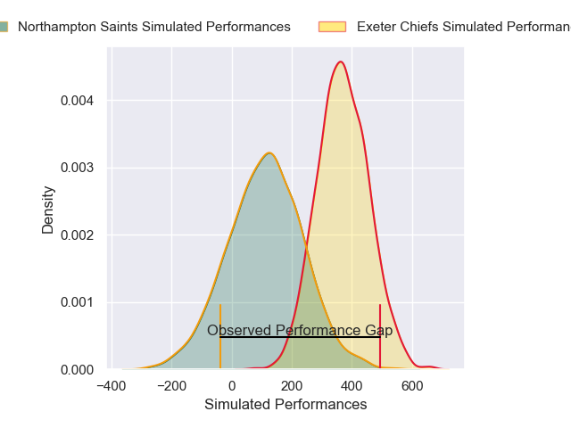
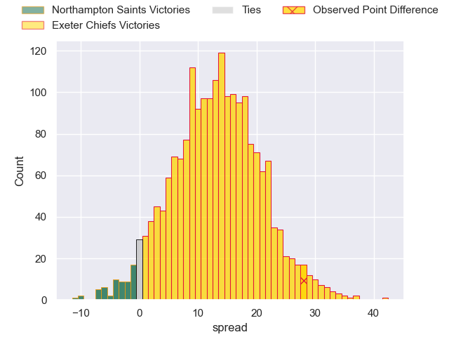
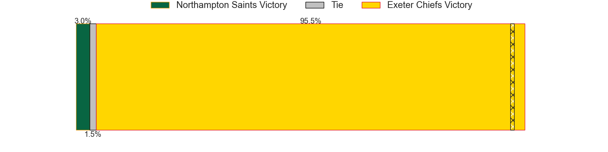

---  
layout: page  
title: Northampton Saints at Exeter Chiefs; 14-42  
date: 2025-05-11 18:00:00 -0500  
categories: "Gallagher Premiership 24/25" match review  
---
# Northampton Saints at Exeter Chiefs; 14-42

# Club Level Predictions

The first set of predictions treats a club as the smallest object, as the club develops its members, organizes a gameplan, and deploys its players as needed for each match. This club model has a prediction of 0.554, which translates to predicting Exeter Chiefs to win by 1.9.

Our Over/Under is 44.5 - and combined with the spread above, we have a predicted scoreline of 21 to 23

Each club has a rating and a rating deviation (similar to a Glicko rating), and expected performances can be generated. This allows for simulated matches and spreads like the ones below.
## Projected Performances - Club Model

## Projected Spreads - Club Model

## Projected Results - Club Model

# Player Level Predictions

Treating teams instead as an entity made up of the currently active players, I have ratings for each player in an altogether different system. These can be combined to form team ratings once teamsheets are announced, weighting starters a bit higher than the reserves. After the match is played, players can be weighted by their minutes on the field, allowing for an accurate measure of the team's composition. With these compiled team ratings, we can make predictions, measure inaccuracy, and update the individual player ratings.
## Prediction without Player Minutes: Exeter Chiefs by 16.5

Exeter Chiefs by 8.3 on a neutral pitch

## Projected Performances - Player Model

## Projected Spreads - Player Model

## Projected Results - Player Model

|   Away Minutes | Away Player         |   Away Percentile |   Number |   Home Percentile | Home Player       |   Home Minutes |
|---------------:|:--------------------|------------------:|---------:|------------------:|:------------------|---------------:|
|             78 | Tom West            |             60.58 |        1 |             98.14 | Scott Sio         |             80 |
|             80 | Henry Walker        |             88.03 |        2 |             96.48 | Jack Yeandle      |             80 |
|             49 | Elliot Millar Mills |             88.21 |        3 |             67.45 | Marcus Street     |             10 |
|             80 | Ed Prowse           |             58.63 |        4 |             21.95 | Rusiate Tuima     |             40 |
|             59 | Chunya Munga        |             62.05 |        5 |             90.83 | Dafydd Jenkins    |              0 |
|             80 | Tom Lockett         |             17.62 |        6 |             87.84 | Jacques Vermeulen |             53 |
|             78 | Fyn Brown           |             52.11 |        7 |              6.42 | Richard Capstick  |              2 |
|             54 | Angus Scott-Young   |             24.63 |        8 |             84.29 | Ethan Roots       |              2 |
|             78 | Jonny Weimann       |             27.7  |        9 |             91.19 | Stu Townsend      |             16 |
|             80 | Tom James           |              9.09 |       10 |             32.56 | Harvey Skinner    |             31 |
|             80 | William Glister     |             33.66 |       11 |             44.84 | Paul Brown-Bampoe |             78 |
|             64 | Tom Litchfield      |             64.41 |       12 |             86.65 | Will Rigg         |             80 |
|             70 | Tom Seabrook        |              4.15 |       13 |             98.79 | Henry Slade       |             80 |
|             40 | Toby Cousins        |             84.63 |       14 |             48.25 | Nick Lilley       |             26 |
|             80 | Jake Garside        |             28.09 |       15 |              2.55 | Josh Hodge        |              2 |

