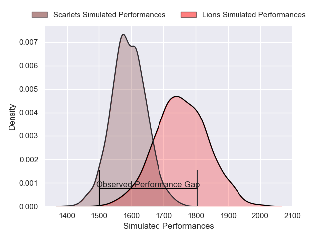
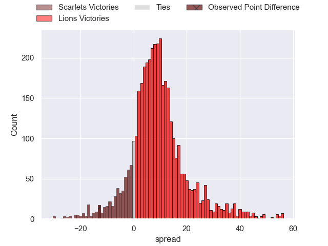
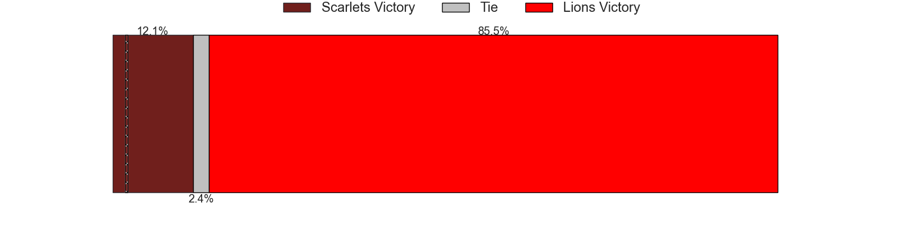
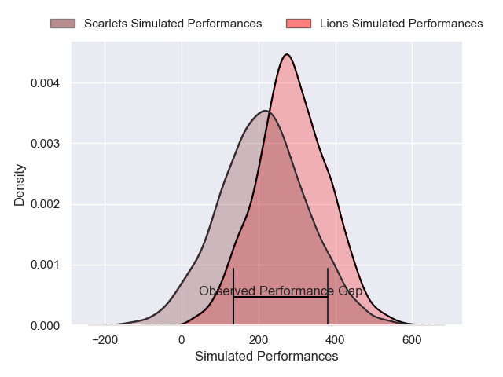
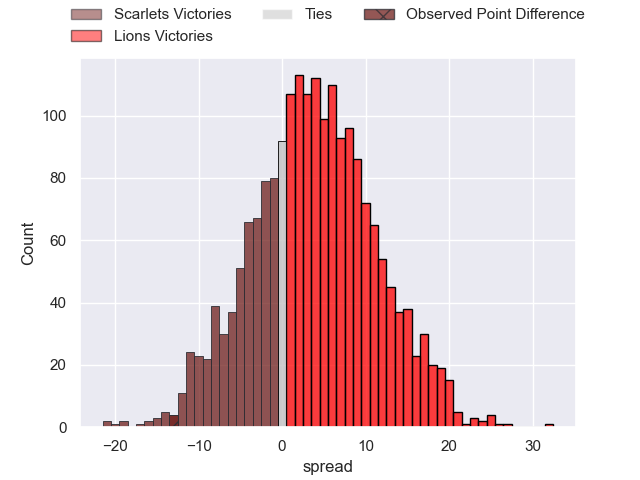
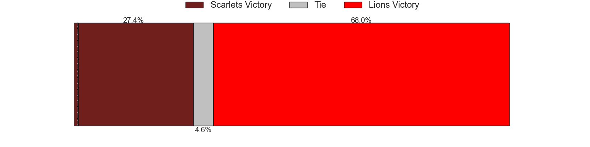

---  
layout: page  
title: Scarlets at Lions; 32-19  
date: 2025-05-11 18:00:00 -0500  
categories: "United Rugby Championship 24/25" match review  
---
# Scarlets at Lions; 32-19

# Club Level Predictions

The first set of predictions treats a club as the smallest object, as the club develops its members, organizes a gameplan, and deploys its players as needed for each match. This club model has a prediction of 0.716, which translates to predicting Lions to win by 8.1.

Our Over/Under is 61.5 - and combined with the spread above, we have a predicted scoreline of 27 to 35

Each club has a rating and a rating deviation (similar to a Glicko rating), and expected performances can be generated. This allows for simulated matches and spreads like the ones below.
## Projected Performances - Club Model

## Projected Spreads - Club Model

## Projected Results - Club Model

# Player Level Predictions

Treating teams instead as an entity made up of the currently active players, I have ratings for each player in an altogether different system. These can be combined to form team ratings once teamsheets are announced, weighting starters a bit higher than the reserves. After the match is played, players can be weighted by their minutes on the field, allowing for an accurate measure of the team's composition. With these compiled team ratings, we can make predictions, measure inaccuracy, and update the individual player ratings.
## Prediction without Player Minutes: Lions by 2.9

Scarlets by 3.4 on a neutral pitch

## Projected Performances - Player Model

## Projected Spreads - Player Model

## Projected Results - Player Model

|   Away Minutes | Away Player          |   Away Percentile |   Number |   Home Percentile | Home Player          |   Home Minutes |
|---------------:|:---------------------|------------------:|---------:|------------------:|:---------------------|---------------:|
|             36 | Alec Hepburn         |             86.91 |        1 |             67.37 | Morgan Naude         |              2 |
|             36 | Marnus van der Merwe |             94.89 |        2 |             75.7  | Jaco Visagie         |             80 |
|             14 | Henry Thomas         |             94.35 |        3 |             35.86 | Asenathi Ntlabakanye |             61 |
|             80 | Alex Craig           |             78.73 |        4 |             89.27 | Ruan Venter          |             80 |
|             55 | Sam Lousi            |             90.05 |        5 |             52.59 | Ruan Delport         |             16 |
|             27 | Vaea Fifita          |             96.07 |        6 |             77.59 | JC Pretorius         |             78 |
|             21 | Josh MacLeod         |             84.58 |        7 |             51.34 | Renzo du Plessis     |             27 |
|             66 | Taine Plumtree       |             94.27 |        8 |             12.74 | Jarod Cairns         |             64 |
|             72 | Gareth Davies        |             68.17 |        9 |             67.81 | Nico Steyn           |             64 |
|             80 | Sam Costelow         |             74.63 |       10 |              2.96 | Kade Wolhuter        |             44 |
|             80 | Ellis Mee            |             60.89 |       11 |             93.19 | Edwill van der Merwe |             64 |
|             80 | Johnny Williams      |             96.56 |       12 |             61.78 | Bronson Mills        |              0 |
|             78 | Joe Roberts          |             75.53 |       13 |             73.91 | Henco van Wyk        |              8 |
|             80 | Tom Rogers           |             36.48 |       14 |             31.81 | Richard Kriel        |             80 |
|             80 | Blair Murray         |             60.43 |       15 |             96.38 | Quan Horn            |             21 |

