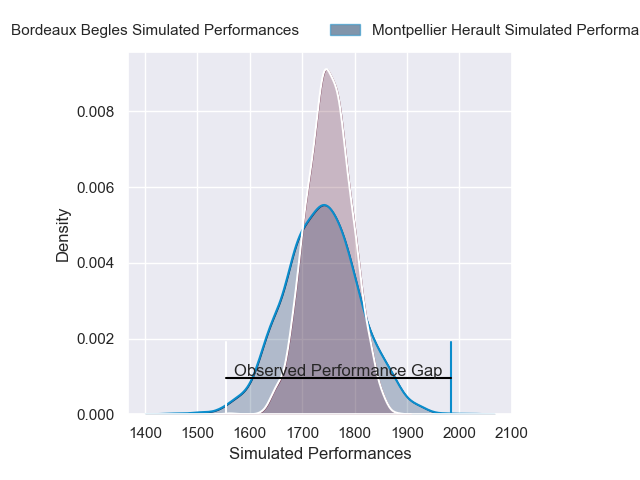
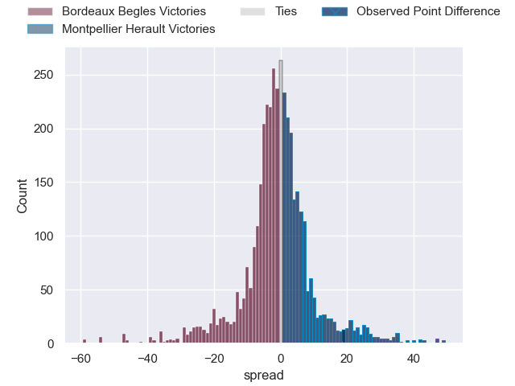
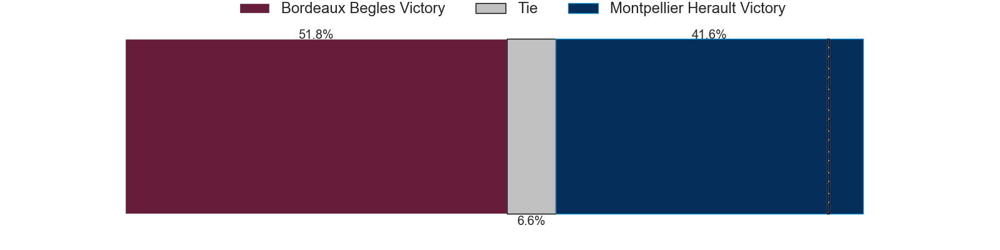
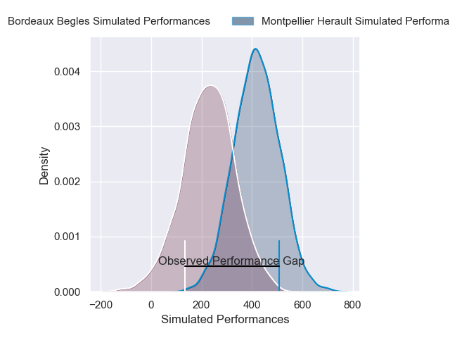
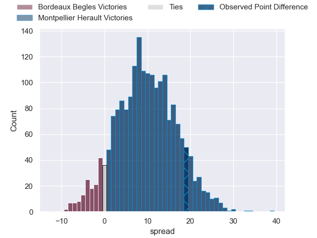
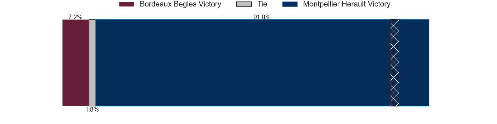

---  
layout: page  
title: Bordeaux Begles at Montpellier Herault; 27-46  
date: 2025-05-11 18:00:00 -0500  
categories: "Top 14 Orange 24/25" match review  
---
# Bordeaux Begles at Montpellier Herault; 27-46

# Club Level Predictions

The first set of predictions treats a club as the smallest object, as the club develops its members, organizes a gameplan, and deploys its players as needed for each match. This club model has a prediction of 0.482, which translates to predicting Bordeaux Begles to win by 0.6.

Our Over/Under is 56.5 - and combined with the spread above, we have a predicted scoreline of 28 to 28

Each club has a rating and a rating deviation (similar to a Glicko rating), and expected performances can be generated. This allows for simulated matches and spreads like the ones below.
## Projected Performances - Club Model

## Projected Spreads - Club Model

## Projected Results - Club Model

# Player Level Predictions

Treating teams instead as an entity made up of the currently active players, I have ratings for each player in an altogether different system. These can be combined to form team ratings once teamsheets are announced, weighting starters a bit higher than the reserves. After the match is played, players can be weighted by their minutes on the field, allowing for an accurate measure of the team's composition. With these compiled team ratings, we can make predictions, measure inaccuracy, and update the individual player ratings.
## Prediction without Player Minutes: Montpellier Herault by 13.8

Montpellier Herault by 1.6 on a neutral pitch

## Projected Performances - Player Model

## Projected Spreads - Player Model

## Projected Results - Player Model

|   Away Minutes | Away Player               |   Away Percentile |   Number |   Home Percentile | Home Player        |   Home Minutes |
|---------------:|:--------------------------|------------------:|---------:|------------------:|:-------------------|---------------:|
|             67 | Ugo Boniface              |             97.33 |        1 |             85.14 | Enzo Forletta      |             49 |
|             54 | Romain Latterrade         |             16.9  |        2 |             21.3  | Jordan Uelese      |             80 |
|             31 | Zaccharie Affane          |             62.92 |        3 |             53.55 | Mohamed Haouas     |             46 |
|              2 | Alexandre Ricard          |             91.61 |        4 |             80.29 | Florian Verhaeghe  |             49 |
|             80 | Jonny Gray                |             93.37 |        5 |             86.54 | Tyler Duguid       |             80 |
|             49 | Tiaan Jacobs              |             32.38 |        6 |             93.68 | Lenni Nouchi       |             80 |
|             80 | Temo Matiu                |             24.04 |        7 |             79.98 | Alexandre Becognee |             80 |
|             80 | Bastien Vergnes Taillefer |             84.71 |        8 |            100    | Billy Vunipola     |             34 |
|             45 | Yann Lesgourgues          |             33.81 |        9 |             74.82 | Leo Coly           |             24 |
|             80 | Joey Carbery              |             69.77 |       10 |             68.08 | Anthony Bouthier   |             31 |
|             50 | Arthur Retiere            |             97.37 |       11 |             94.75 | George Bridge      |              0 |
|             40 | Ben Tapuai                |             55.81 |       12 |             29.12 | Auguste Cadot      |              7 |
|             49 | Pablo Uberti              |             10.21 |       13 |             65.52 | Arthur Vincent     |             56 |
|             13 | Jon Echegaray             |             59.82 |       14 |             35.31 | Mael Moustin       |             24 |
|             80 | Nans Ducuing              |             91.49 |       15 |             82.34 | Joshua Moorby      |             59 |

