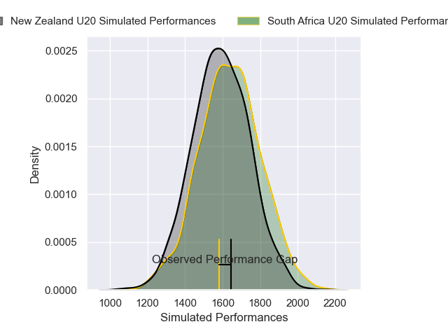
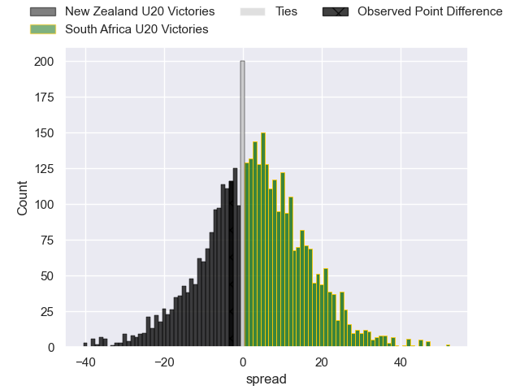

---  
layout: page  
title: New Zealand U20 at South Africa U20; 48-45  
date: 2025-05-11 18:00:00 -0500  
categories: "Rugby Championship U20 2025" match review  
---
# New Zealand U20 at South Africa U20; 48-45

# Club Level Predictions

The first set of predictions treats a club as the smallest object, as the club develops its members, organizes a gameplan, and deploys its players as needed for each match. This club model has a prediction of 0.561, which translates to predicting South Africa U20 to win by 2.4.

Our Over/Under is 55.5 - and combined with the spread above, we have a predicted scoreline of 26 to 29

Each club has a rating and a rating deviation (similar to a Glicko rating), and expected performances can be generated. This allows for simulated matches and spreads like the ones below.
## Projected Performances - Club Model

## Projected Spreads - Club Model

## Projected Results - Club Model

