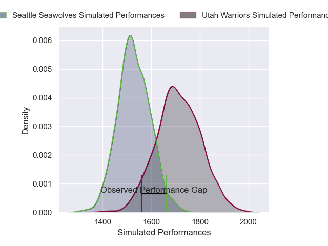
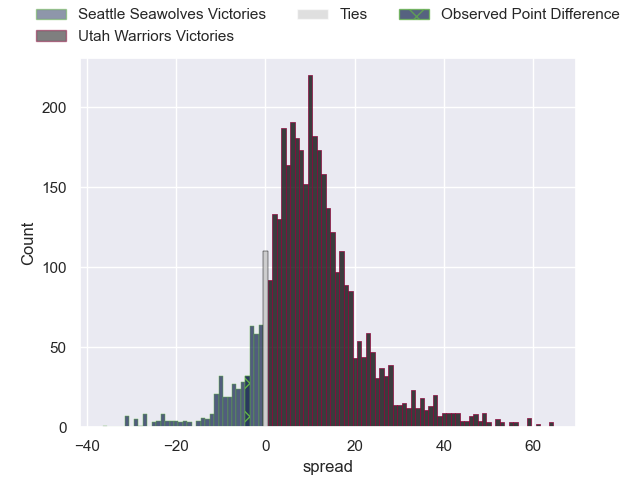
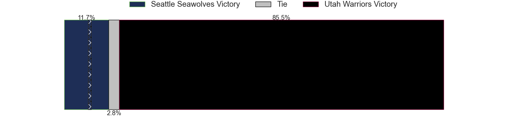
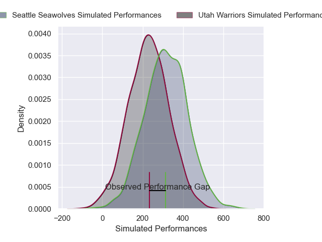
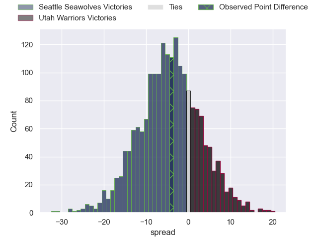
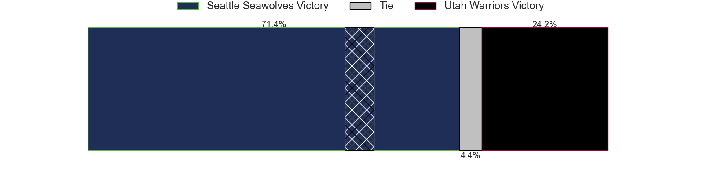

---  
layout: page  
title: Seattle Seawolves at Utah Warriors; 28-24  
date: 2025-05-13 18:00:00 -0500  
categories: "Major League Rugby 2025" match review  
---
# Seattle Seawolves at Utah Warriors; 28-24

# Club Level Predictions

The first set of predictions treats a club as the smallest object, as the club develops its members, organizes a gameplan, and deploys its players as needed for each match. This club model has a prediction of 0.74, which translates to predicting Utah Warriors to win by 9.3.

Our Over/Under is 66.5 - and combined with the spread above, we have a predicted scoreline of 28 to 38

Each club has a rating and a rating deviation (similar to a Glicko rating), and expected performances can be generated. This allows for simulated matches and spreads like the ones below.
## Projected Performances - Club Model

## Projected Spreads - Club Model

## Projected Results - Club Model

# Player Level Predictions

Treating teams instead as an entity made up of the currently active players, I have ratings for each player in an altogether different system. These can be combined to form team ratings once teamsheets are announced, weighting starters a bit higher than the reserves. After the match is played, players can be weighted by their minutes on the field, allowing for an accurate measure of the team's composition. With these compiled team ratings, we can make predictions, measure inaccuracy, and update the individual player ratings.
## Prediction without Player Minutes: Seattle Seawolves by 3.3

Seattle Seawolves by 6.6 on a neutral pitch

## Projected Performances - Player Model

## Projected Spreads - Player Model

## Projected Results - Player Model

|   Away Minutes | Away Player      |   Away Percentile |   Number |   Home Percentile | Home Player       |   Home Minutes |
|---------------:|:-----------------|------------------:|---------:|------------------:|:------------------|---------------:|
|             38 | Cameron Orr      |             74.52 |        1 |             52.71 | Aki Seiuli        |             42 |
|             15 | Dewald Kotze     |             27.66 |        2 |             86.35 | Liam Coltman      |             80 |
|             80 | Juan Pablo Zeiss |             74.1  |        3 |             74.77 | Tonga Kofe        |             80 |
|             12 | Malembe Mpofu    |             23.51 |        4 |             50.15 | Reid Watson Davis |             30 |
|             50 | Rhyno Herbst     |             95.69 |        5 |             48.29 | Matt Jensen       |             26 |
|             29 | Rhyno Herbst     |             95.69 |        5 |             48.29 | Matt Jensen       |             26 |
|             12 | Rhyno Herbst     |             95.69 |        5 |             48.29 | Matt Jensen       |             26 |
|             50 | Riekert Hattingh |             89.88 |        6 |             68.56 | Frank Lochore     |             40 |
|             63 | Charles Elton    |             86.11 |        7 |             33.13 | Kalisi Moli       |             80 |
|             68 | OJ Noa           |             90.22 |        8 |              8.43 | Lance Williams    |             59 |
|             80 | Nick Boyer       |              2.5  |        9 |             83.96 | Zion Going        |             80 |
|             21 | Rod Iona         |             20.91 |       10 |             34.78 | Joel Hodgson      |             59 |
|             34 | Toni Pulu        |             96.18 |       11 |             84.93 | Joe Mano          |             26 |
|             54 | Dan Kriel        |             56.69 |       12 |             10.55 | D'Angelo Leuila   |             80 |
|             40 | Divan Rossouw    |             14.4  |       13 |             60.04 | Cole Semu         |             50 |
|             80 | Lauina Futi      |             61.45 |       14 |             72.31 | Nic Benn          |             80 |
|             65 | Duncan Matthews  |             91.33 |       15 |             86.89 | Jordan Trainor    |             46 |

