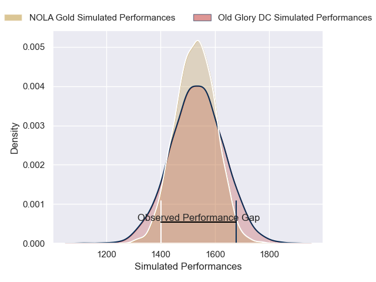
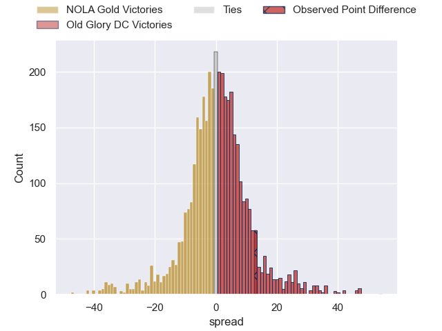
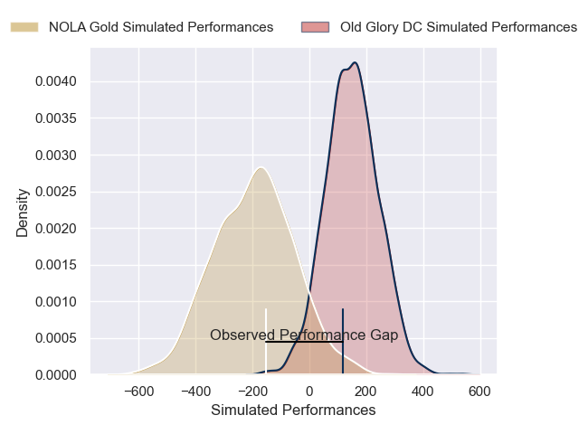
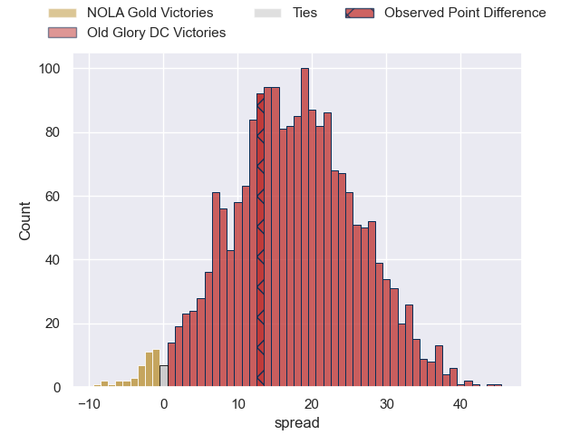

---  
layout: page  
title: NOLA Gold at Old Glory DC; 14-27  
date: 2025-05-14 18:00:00 -0500  
categories: "Major League Rugby 2025" match review  
---
# NOLA Gold at Old Glory DC; 14-27

# Club Level Predictions

The first set of predictions treats a club as the smallest object, as the club develops its members, organizes a gameplan, and deploys its players as needed for each match. This club model has a prediction of 0.508, which translates to predicting Old Glory DC to win by 0.3.

Our Over/Under is 69.5 - and combined with the spread above, we have a predicted scoreline of 34 to 35

Each club has a rating and a rating deviation (similar to a Glicko rating), and expected performances can be generated. This allows for simulated matches and spreads like the ones below.
## Projected Performances - Club Model

## Projected Spreads - Club Model

## Projected Results - Club Model

# Player Level Predictions

Treating teams instead as an entity made up of the currently active players, I have ratings for each player in an altogether different system. These can be combined to form team ratings once teamsheets are announced, weighting starters a bit higher than the reserves. After the match is played, players can be weighted by their minutes on the field, allowing for an accurate measure of the team's composition. With these compiled team ratings, we can make predictions, measure inaccuracy, and update the individual player ratings.
## Prediction without Player Minutes: Old Glory DC by 16.6

Old Glory DC by 13.7 on a neutral pitch

## Projected Performances - Player Model

## Projected Spreads - Player Model

## Projected Results - Player Model

|   Away Minutes | Away Player          |   Away Percentile |   Number |   Home Percentile | Home Player              |   Home Minutes |
|---------------:|:---------------------|------------------:|---------:|------------------:|:-------------------------|---------------:|
|             16 | Bart Vermeulen       |             53.54 |        1 |             14.9  | Jack Iscaro              |             21 |
|             80 | Alex Lopeti          |             27.13 |        2 |             65.78 | Facundo Gattas           |             30 |
|             62 | Paul Mullen          |              7.49 |        3 |              3.58 | Joe Rees                 |             67 |
|             80 | Paul Mullen          |              7.49 |        3 |              3.58 | Joe Rees                 |             67 |
|             35 | Paul Mullen          |              7.49 |        3 |              3.58 | Joe Rees                 |             67 |
|             22 | Paul Mullen          |              7.49 |        3 |              3.58 | Joe Rees                 |             67 |
|              0 | Chase Jones          |             46.52 |        4 |             94.52 | Rob Harley               |             80 |
|             76 | William Waguespack   |             77.08 |        5 |             22.43 | Tevita Naqali            |             66 |
|             22 | Moni Tonga'uiha      |              6.25 |        6 |             47.02 | Jamason Fa'anana-Schultz |             45 |
|             80 | Jonah Mau'u          |             48.02 |        7 |             25.3  | Cory Daniel              |             45 |
|             53 | Tupou Ma'afu-Afungia |             17.61 |        8 |             98.91 | Lautaro Bavaro           |             55 |
|              6 | Luke Campbell        |              2.85 |        9 |             67.38 | Connor Buckley           |             39 |
|             17 | Luke Carty           |              4.35 |       10 |              7.45 | Jason Emery              |             50 |
|             25 | Julian Roberts       |             76.03 |       11 |             55.48 | John Rizzo               |             41 |
|             80 | JP Du Plessis        |              1.22 |       12 |             10.85 | Nick Grigg               |             45 |
|             80 | Isaac Te Tamaki      |              2.54 |       13 |             85.7  | Steffan Hughes           |             58 |
|             39 | Nikolai Foliaki      |              0.68 |       14 |             25.64 | Perry Humphreys          |             58 |
|             54 | Cooper Coats         |              5.29 |       15 |             70.61 | Damien Hoyland           |             72 |

