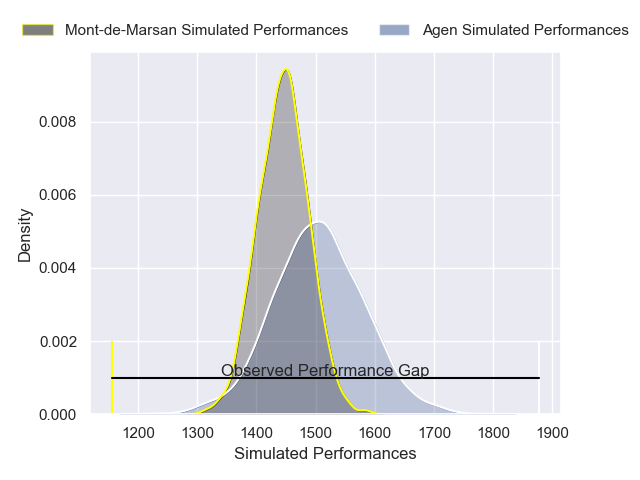
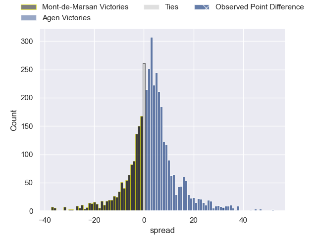
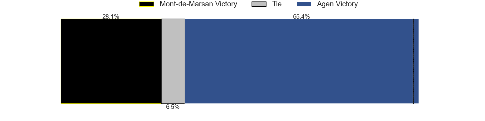
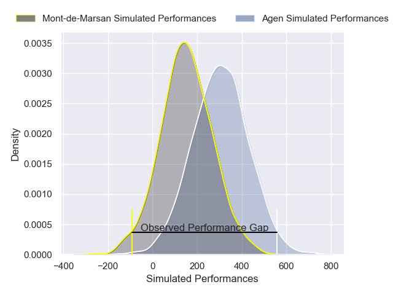
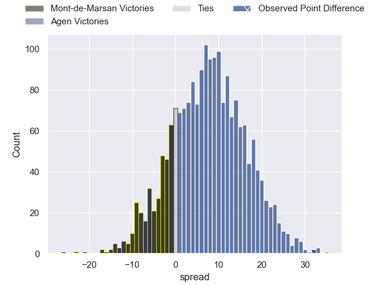
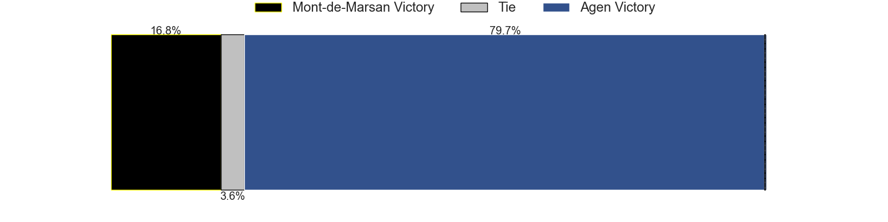

---  
layout: page  
title: Mont-de-Marsan at Agen; 13-45  
date: 2025-05-16 18:00:00 -0500  
categories: "Pro D2 24/25" match review  
---
# Mont-de-Marsan at Agen; 13-45

# Club Level Predictions

The first set of predictions treats a club as the smallest object, as the club develops its members, organizes a gameplan, and deploys its players as needed for each match. This club model has a prediction of 0.581, which translates to predicting Agen to win by 2.9.

Our Over/Under is 73.5 - and combined with the spread above, we have a predicted scoreline of 35 to 38

Each club has a rating and a rating deviation (similar to a Glicko rating), and expected performances can be generated. This allows for simulated matches and spreads like the ones below.
## Projected Performances - Club Model

## Projected Spreads - Club Model

## Projected Results - Club Model

# Player Level Predictions

Treating teams instead as an entity made up of the currently active players, I have ratings for each player in an altogether different system. These can be combined to form team ratings once teamsheets are announced, weighting starters a bit higher than the reserves. After the match is played, players can be weighted by their minutes on the field, allowing for an accurate measure of the team's composition. With these compiled team ratings, we can make predictions, measure inaccuracy, and update the individual player ratings.
## Prediction without Player Minutes: Agen by 10.3

Mont-de-Marsan by 4.0 on a neutral pitch

## Projected Performances - Player Model

## Projected Spreads - Player Model

## Projected Results - Player Model

|   Away Minutes | Away Player           |   Away Percentile |   Number |   Home Percentile | Home Player                |   Home Minutes |
|---------------:|:----------------------|------------------:|---------:|------------------:|:---------------------------|---------------:|
|           49   | Ali-Amjad Osman-Bosch |             40.38 |        1 |             69.94 | Mamuka Mstoiani            |             80 |
|           64   | Florian Dufour        |             54.96 |        2 |             87.06 | Santiago Socino            |             46 |
|           33.5 | Gheorghe Gajion       |             86.01 |        3 |             32.56 | Alex Burin                 |             71 |
|           27   | Jules Dussutour       |             65.82 |        4 |              3.82 | Evan Olmstead              |             80 |
|           16   | Myles Edwards         |              4.9  |        5 |             76.1  | William Demotte            |             80 |
|            0   | Aurélien Lafforgue    |             28.77 |        6 |             15.08 | Julien Lebian              |             80 |
|           80   | Nicolas Garrault      |             34.33 |        7 |              3.97 | Fotu Lokotui               |             80 |
|           40   | Ewan Bertheau         |              1.52 |        8 |             53.26 | Valentin Gayraud           |             62 |
|           80   | Nicolas Darquier      |             53.83 |        9 |             72.91 | Dorian Bellot              |             80 |
|           80   | Patricio Fernandez    |             60.04 |       10 |             89.23 | Franck Pourteau            |             29 |
|           80   | Pierre Sayerse        |             92.17 |       11 |             17.51 | Iban Etcheverry            |             29 |
|           27   | Baptiste Grulovic     |             42.09 |       12 |             72.41 | Kolinio Ramoka             |             34 |
|           27   | Gatien Masse          |             73.53 |       13 |             78.09 | Peyo Muscarditz            |             34 |
|           16   | Alexandre de Nardi    |             53.82 |       14 |             58.71 | Dylan Noudofinin Cazemajou |             23 |
|           64   | Théo Cortes           |             16.28 |       15 |              0.85 | Loris Tolot                |             80 |
|           46   | Luka Begic            |             62.94 |       16 |             57.79 | Lasha Macharashvili        |             51 |
|           51   | Thomas Bultel         |             39.55 |       17 |             59.57 | Matthieu Bonnet            |             80 |
|           80   | Ioane Iashagashvili   |             92.61 |       18 |             62.53 | Luca Tabarot               |             27 |
|           49   | Mattéo Lalanne        |             83.43 |       19 |             21.28 | Pierre Jouvin              |             80 |
|           49   | Albert Mataele        |             65.62 |       20 |             62.68 | Mathieu de Giovanni        |             31 |
|           49   | Aston Fortuin         |             17.43 |       21 |             63.46 | Jack Maunder               |             40 |
|           32   | Baptiste Canut        |             43.85 |       22 |            nan    | Ethan Randle               |             80 |
|           32   | Simao Bento           |             14.09 |       23 |              7.87 | Emile Dayral               |              0 |

