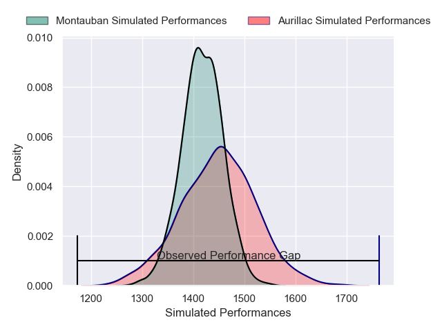
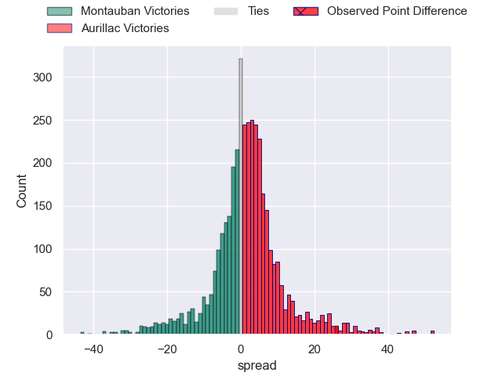
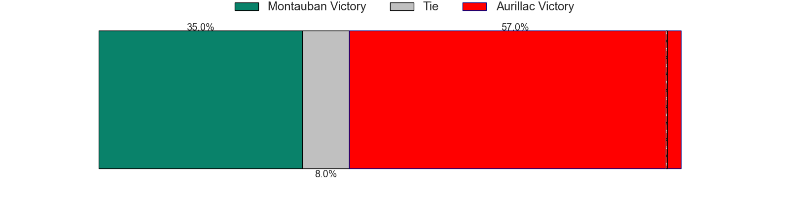
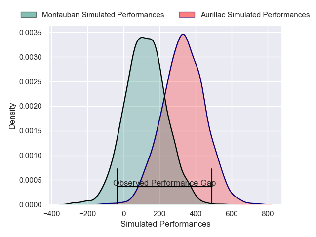
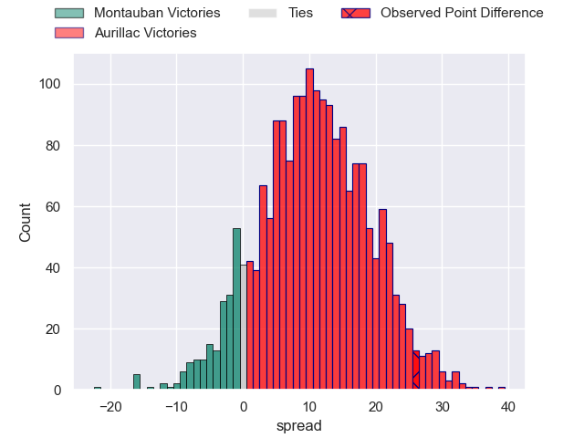
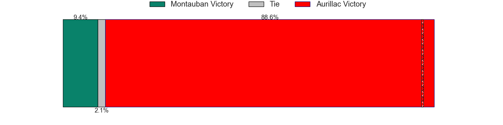

---  
layout: page  
title: Montauban at Aurillac; 10-36  
date: 2025-05-16 18:00:00 -0500  
categories: "Pro D2 24/25" match review  
---
# Montauban at Aurillac; 10-36

# Club Level Predictions

The first set of predictions treats a club as the smallest object, as the club develops its members, organizes a gameplan, and deploys its players as needed for each match. This club model has a prediction of 0.544, which translates to predicting Aurillac to win by 1.5.

Our Over/Under is 84.5 - and combined with the spread above, we have a predicted scoreline of 41 to 43

Each club has a rating and a rating deviation (similar to a Glicko rating), and expected performances can be generated. This allows for simulated matches and spreads like the ones below.
## Projected Performances - Club Model

## Projected Spreads - Club Model

## Projected Results - Club Model

# Player Level Predictions

Treating teams instead as an entity made up of the currently active players, I have ratings for each player in an altogether different system. These can be combined to form team ratings once teamsheets are announced, weighting starters a bit higher than the reserves. After the match is played, players can be weighted by their minutes on the field, allowing for an accurate measure of the team's composition. With these compiled team ratings, we can make predictions, measure inaccuracy, and update the individual player ratings.
## Prediction without Player Minutes: Aurillac by 13.8

Aurillac by 0.5 on a neutral pitch

## Projected Performances - Player Model

## Projected Spreads - Player Model

## Projected Results - Player Model

|   Away Minutes | Away Player           |   Away Percentile |   Number |   Home Percentile | Home Player           |   Home Minutes |
|---------------:|:----------------------|------------------:|---------:|------------------:|:----------------------|---------------:|
|             40 | Lucas Seyrolle        |              6.16 |        1 |             41.3  | Robert Rodgers        |             28 |
|             18 | Jeremie Maurouard     |              2.66 |        2 |             41.49 | Ronan Loughnane       |             33 |
|             61 | Luka Azariashvili     |              7.74 |        3 |             53.71 | Giorgi Kartvelishvili |             30 |
|             80 | Frank Bradshaw        |             83.25 |        4 |              1.67 | Abongile Nonkontwana  |             70 |
|             32 | Lewis Bean            |             18.71 |        5 |             41.82 | Martial Rolland       |             26 |
|             80 | Noa Kanika            |             53.47 |        6 |             82.64 | Eoghan Masterson      |             68 |
|             35 | Corentin Coularis     |             44.25 |        7 |             74.8  | Lucas Oudard          |             80 |
|             22 | Tomas Lezana          |             13.04 |        8 |             25.65 | Didier Tison          |             19 |
|             60 | Hugo Zabalza          |             18    |        9 |             76.65 | Mikheil Alania        |             80 |
|             45 | Thomas Fortunel       |             22.36 |       10 |             71.43 | Ugo Seunes            |             77 |
|             80 | Yvan Reilhac          |             56.46 |       11 |             24.07 | Simeli Yabaki         |             80 |
|             39 | Maxime Mathy          |              3.85 |       12 |             30.32 | Elijah Niko           |             50 |
|             39 | Maxime Espeut         |             59.43 |       13 |             65.42 | Karl Martin           |             59 |
|             34 | Stephane Ahmed        |             95.6  |       14 |             78.38 | Juun Pieters          |             28 |
|              0 | Thomas Larregain      |              6.55 |       15 |             33.62 | Jake Strachan         |             59 |
|             80 | Vakhtang Jintcharadze |             58.51 |       16 |            nan    | Martim Souto          |             59 |
|             34 | Thomas Bue            |             38.55 |       17 |             68.97 | Hugo Bastard          |             80 |
|             22 | Tietie Tuimauga       |             71.19 |       18 |             38.79 | Mehdi Slamani         |             32 |
|             39 | Mael Castel           |            nan    |       19 |             11.11 | Théo Cambon           |             55 |
|             79 | Jérôme Bosviel        |             89.86 |       20 |             29.73 | Gymael Jean-Jacques   |             66 |
|             65 | Victor Moreaux        |              4.51 |       21 |              7.62 | Luka Nioradze         |             64 |
|             58 | Kyllian Ringuet       |             81.94 |       22 |             33.3  | Louis Bruinsma        |             46 |
|             80 | Victor Olivier        |            nan    |       23 |            nan    | Léopold Dupas         |             32 |

