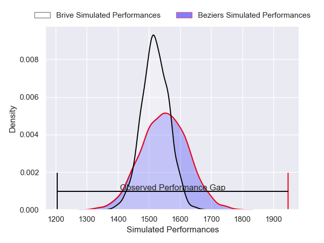
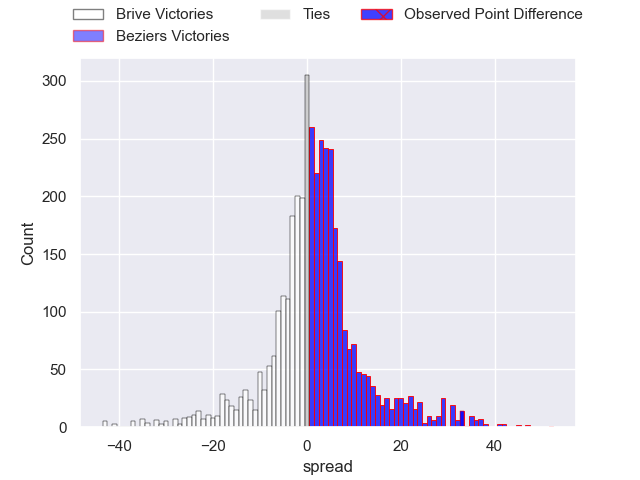
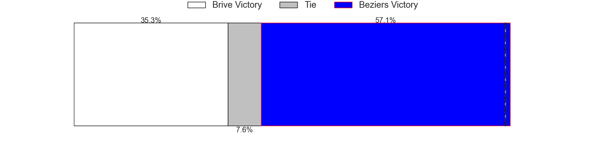
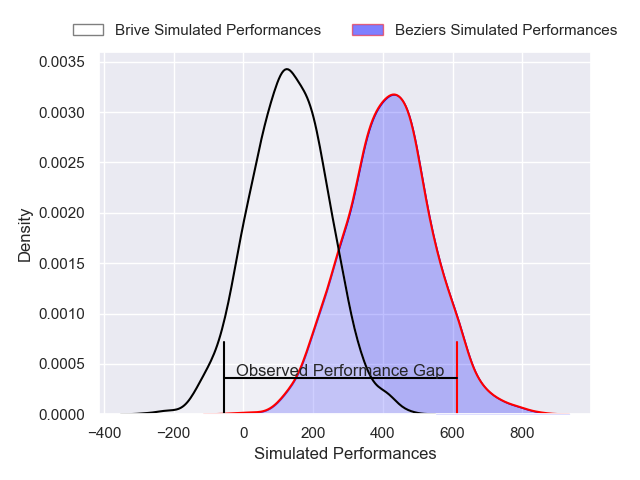
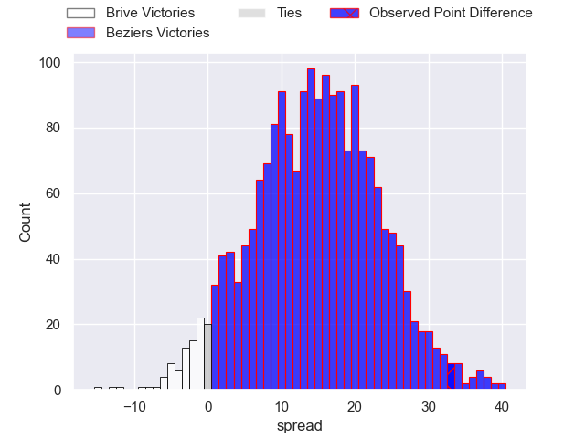
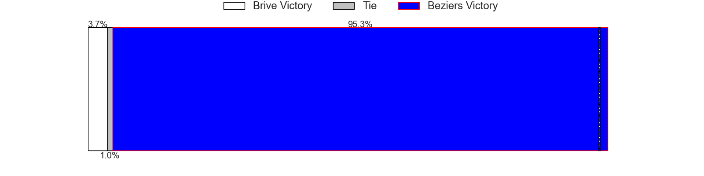

---  
layout: page  
title: Brive at Beziers; 24-57  
date: 2025-05-16 18:00:00 -0500  
categories: "Pro D2 24/25" match review  
---
# Brive at Beziers; 24-57

# Club Level Predictions

The first set of predictions treats a club as the smallest object, as the club develops its members, organizes a gameplan, and deploys its players as needed for each match. This club model has a prediction of 0.541, which translates to predicting Beziers to win by 1.5.

Our Over/Under is 56.5 - and combined with the spread above, we have a predicted scoreline of 28 to 29

Each club has a rating and a rating deviation (similar to a Glicko rating), and expected performances can be generated. This allows for simulated matches and spreads like the ones below.
## Projected Performances - Club Model

## Projected Spreads - Club Model

## Projected Results - Club Model

# Player Level Predictions

Treating teams instead as an entity made up of the currently active players, I have ratings for each player in an altogether different system. These can be combined to form team ratings once teamsheets are announced, weighting starters a bit higher than the reserves. After the match is played, players can be weighted by their minutes on the field, allowing for an accurate measure of the team's composition. With these compiled team ratings, we can make predictions, measure inaccuracy, and update the individual player ratings.
## Prediction without Player Minutes: Beziers by 14.7

Beziers by 0.4 on a neutral pitch

## Projected Performances - Player Model

## Projected Spreads - Player Model

## Projected Results - Player Model

|   Away Minutes | Away Player       |   Away Percentile |   Number |   Home Percentile | Home Player                 |   Home Minutes |
|---------------:|:------------------|------------------:|---------:|------------------:|:----------------------------|---------------:|
|             71 | Aymeric Lager     |             40.8  |        1 |              5.33 | Francisco Fernandes Moreira |             68 |
|             80 | Issam Hamel       |             68.62 |        2 |             89.89 | Jose Luis Gonzalez          |             80 |
|             12 | Henzo Kiteau      |             18.48 |        3 |             73.44 | Yannick Arroyo              |             15 |
|             30 | Matthieu Voisin   |             73.95 |        4 |             66.01 | Cam Dodson                  |             72 |
|             80 | Tevita Ratuva     |             38.49 |        5 |             49.76 | Pierre Gayraud              |              8 |
|             54 | Asaeli Tuivuaka   |             83.33 |        6 |             89.29 | Clement Doumenc             |             80 |
|             80 | Sasha Gue         |             16.17 |        7 |              8.04 | Gillian Benoy               |             48 |
|             72 | Loan Lavergne     |             28.48 |        8 |             35.43 | Baptiste Abescat-Leroy      |             48 |
|             57 | Maxime Sidobre    |             76.29 |        9 |             50.09 | Hugo Gomes Camacho          |             30 |
|             80 | Thomas Laranjeira |             68.53 |       10 |             20.08 | Hugo Aubry                  |             34 |
|             47 | Tevita Railevu    |             15.66 |       11 |             72.99 | Paul Reau                   |             80 |
|             75 | Timilai Rokoduru  |             41.18 |       12 |             85.09 | Taylor Gontineac            |             31 |
|             47 | Maxence Biasotto  |             75.76 |       13 |             92.6  | Tim Nanai-Williams          |             59 |
|             28 | Lewis Noon        |             40.31 |       14 |             10.86 | Pierre Courtaud             |             80 |
|             17 | Tom Raffy         |             36.15 |       15 |             89.64 | Gabin Lorre                 |             80 |
|             30 | Simote Moala      |            nan    |       16 |            nan    | Julien Rasamoelina          |             80 |
|             13 | David Geneste     |            nan    |       17 |             20.34 | William van Bost            |             80 |
|             32 | Renger van Eerten |             72.09 |       18 |             24.98 | Petero Taviraki Mailulu     |             67 |
|             28 | Quentin Algay     |            nan    |       19 |             65.25 | Yanis Boulassel             |             80 |
|             40 | Luka Keletaona    |            nan    |       20 |              0.2  | Shahn Eru                   |             40 |
|             28 | Paul Pimienta     |             25.96 |       21 |             45.99 | Damien Añon                 |             20 |
|             23 | Hugo Verdu        |              4.63 |       22 |             31.5  | Harry Glynn                 |             80 |
|            nan | nan               |            nan    |       23 |             32.22 | Yahnis El Maslouhi          |             80 |

