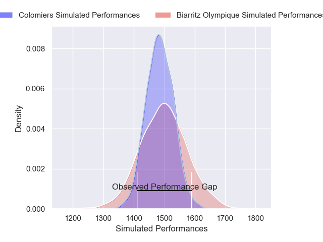
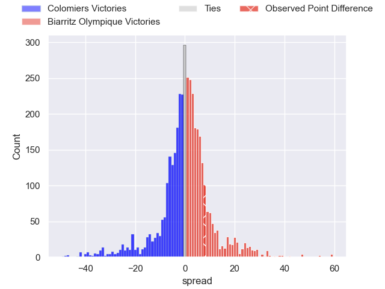
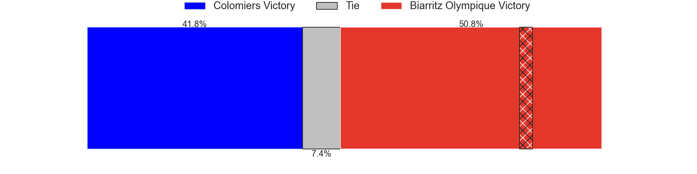
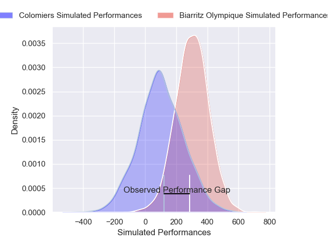
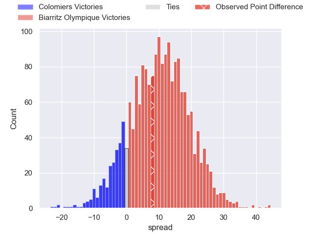
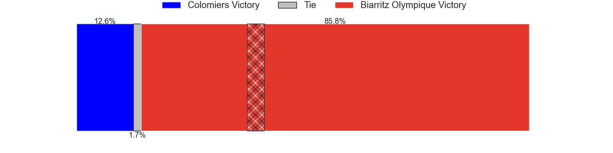

---  
layout: page  
title: Colomiers at Biarritz Olympique; 27-35  
date: 2025-05-16 18:00:00 -0500  
categories: "Pro D2 24/25" match review  
---
# Colomiers at Biarritz Olympique; 27-35

# Club Level Predictions

The first set of predictions treats a club as the smallest object, as the club develops its members, organizes a gameplan, and deploys its players as needed for each match. This club model has a prediction of 0.521, which translates to predicting Biarritz Olympique to win by 0.7.

Our Over/Under is 52.5 - and combined with the spread above, we have a predicted scoreline of 26 to 27

Each club has a rating and a rating deviation (similar to a Glicko rating), and expected performances can be generated. This allows for simulated matches and spreads like the ones below.
## Projected Performances - Club Model

## Projected Spreads - Club Model

## Projected Results - Club Model

# Player Level Predictions

Treating teams instead as an entity made up of the currently active players, I have ratings for each player in an altogether different system. These can be combined to form team ratings once teamsheets are announced, weighting starters a bit higher than the reserves. After the match is played, players can be weighted by their minutes on the field, allowing for an accurate measure of the team's composition. With these compiled team ratings, we can make predictions, measure inaccuracy, and update the individual player ratings.
## Prediction without Player Minutes: Biarritz Olympique by 12.0

Colomiers by 3.9 on a neutral pitch

## Projected Performances - Player Model

## Projected Spreads - Player Model

## Projected Results - Player Model

|   Away Minutes | Away Player      |   Away Percentile |   Number |   Home Percentile | Home Player         |   Home Minutes |
|---------------:|:-----------------|------------------:|---------:|------------------:|:--------------------|---------------:|
|             17 | Guillaume Tartas |             83.25 |        1 |             23.03 | Killian Taofifenua  |             13 |
|             10 | Thomas Larrieu   |             13.97 |        2 |             13.43 | Yohan Beheregaray   |             80 |
|             46 | Robin Bellemand  |             55.7  |        3 |              3.43 | Zakaria El Fakir    |             80 |
|             30 | Louis Descoux    |             71.19 |        4 |             20.95 | Charlie Matthews    |             56 |
|             67 | Jack Whetton     |              9.51 |        5 |             35.6  | Piula Faasalele     |             50 |
|             69 | Elliott Maurel   |             55.64 |        6 |             16.39 | Ekain Imaz Agirre   |             32 |
|             80 | Jeremy Bechu     |             61.04 |        7 |              0.98 | Aitor Hourcade      |             71 |
|             80 | Aldric Lescure   |             77.47 |        8 |             75.54 | Filimo Taofifenua   |             46 |
|             46 | Mathis Galthié   |             39.64 |        9 |             39.45 | Kerman Aurrekoetxea |             58 |
|             40 | Brett Herron     |              0.21 |       10 |             16.24 | Edgar Retiere       |             46 |
|             80 | Rayan Houari     |             48.97 |       11 |             92.08 | Mathieu Acebes      |             25 |
|             80 | Dorian Laborde   |             80.23 |       12 |              1.89 | Francois Vergnaud   |             43 |
|             80 | Baptiste Serrano |             52.79 |       13 |             64.46 | Baptiste Fariscot   |             24 |
|             68 | Enzo Salles      |             52    |       14 |              1.76 | Zach Kibirige       |             67 |
|             80 | Valentin Saurs   |              2.77 |       15 |             85.74 | Kylian Jaminet      |             34 |
|             40 | Hugo Pirlet      |             30.57 |       16 |             24.04 | Alexandre Plantier  |             48 |
|             67 | Alexis Caumel    |             65.85 |       17 |             10.91 | Pierre Pages        |              7 |
|             67 | Janse Roux       |             28.23 |       18 |             55.9  | Luteru Tolai        |             63 |
|             80 | Marco Fepulea'i  |             65.58 |       19 |            nan    | Johnny Dyer         |              9 |
|             80 | Ugo Pacome       |             64.47 |       20 |             88.51 | Enzo Selponi        |             80 |
|             80 | Gregoire Bazin   |             64.08 |       21 |             61.81 | Solomone Tukuafu    |             64 |
|             74 | Arthur Diaz      |            nan    |       22 |            nan    | Bastien Guillemin   |             56 |
|             41 | Theo Lachaud     |              2.54 |       23 |            nan    | Eliande Sanderson   |             20 |

