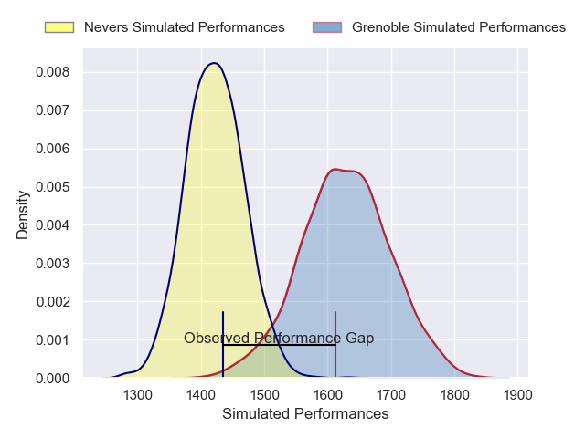
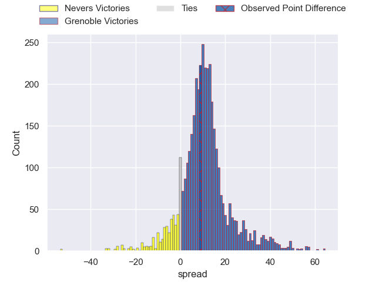
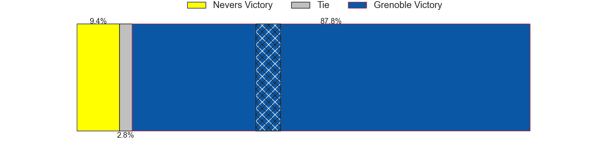
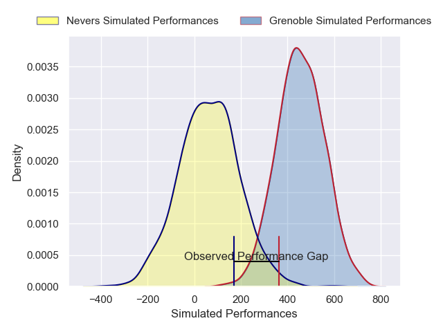
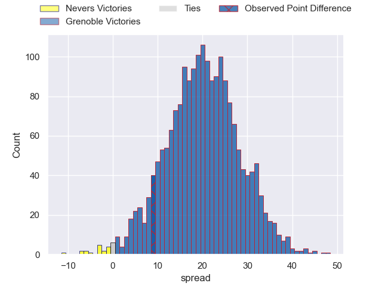
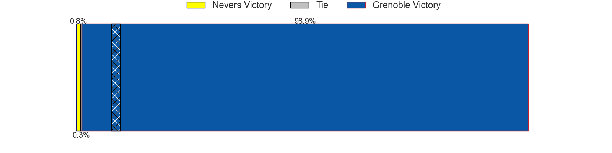

---  
layout: page  
title: Nevers at Grenoble; 42-51  
date: 2025-05-16 18:00:00 -0500  
categories: "Pro D2 24/25" match review  
---
# Nevers at Grenoble; 42-51

# Club Level Predictions

The first set of predictions treats a club as the smallest object, as the club develops its members, organizes a gameplan, and deploys its players as needed for each match. This club model has a prediction of 0.768, which translates to predicting Grenoble to win by 10.5.

Our Over/Under is 72.5 - and combined with the spread above, we have a predicted scoreline of 31 to 41

Each club has a rating and a rating deviation (similar to a Glicko rating), and expected performances can be generated. This allows for simulated matches and spreads like the ones below.
## Projected Performances - Club Model

## Projected Spreads - Club Model

## Projected Results - Club Model

# Player Level Predictions

Treating teams instead as an entity made up of the currently active players, I have ratings for each player in an altogether different system. These can be combined to form team ratings once teamsheets are announced, weighting starters a bit higher than the reserves. After the match is played, players can be weighted by their minutes on the field, allowing for an accurate measure of the team's composition. With these compiled team ratings, we can make predictions, measure inaccuracy, and update the individual player ratings.
## Prediction without Player Minutes: Grenoble by 22.9

Grenoble by 9.7 on a neutral pitch

## Projected Performances - Player Model

## Projected Spreads - Player Model

## Projected Results - Player Model

|   Away Minutes | Away Player         |   Away Percentile |   Number |   Home Percentile | Home Player        |   Home Minutes |
|---------------:|:--------------------|------------------:|---------:|------------------:|:-------------------|---------------:|
|             59 | Kamaliele Tufele    |             80.82 |        1 |             87.19 | Tommy Raynaud      |             52 |
|             70 | Efi Ma'afu          |             37.02 |        2 |             75.86 | Lilian Rossi       |              0 |
|             25 | Lasha Pkhakadze     |             14.82 |        3 |             37.52 | Cody Thomas        |             71 |
|             34 | George Smith        |             29.1  |        4 |             50.24 | Pierce Phillips    |             55 |
|             55 | Chris Gabriel       |             48.21 |        5 |             39.86 | Brandon Nansen     |             57 |
|             50 | Julien Kazubek      |             63.4  |        6 |             90.97 | Jose Madeira       |              0 |
|             24 | Mahamadou Coulibaly |             12.86 |        7 |             75.96 | Thibaut Martel     |             30 |
|             65 | Jason-Colin Fraser  |             93.78 |        8 |             30.69 | Richard Hardwick   |             25 |
|             80 | Simon Tarel         |             10.18 |        9 |             13.82 | Barnabe Couilloud  |             30 |
|             80 | Shaun Reynolds      |             20.73 |       10 |             34.83 | Sam Davies         |             10 |
|              0 | Arthur Mathiron     |             11.53 |       11 |             34.02 | Gerswin Mouton     |             60 |
|             80 | Alivereti Loaloa    |             51.63 |       12 |             63.93 | Julien Heriteau    |             50 |
|             21 | Paula Walisolio     |             18.93 |       13 |             61.09 | Romain Fusier      |             32 |
|              6 | Gabin Rocher        |             10.07 |       14 |             60.31 | Hugo Trouilloud    |             80 |
|             23 | Tom Deleuze         |             10    |       15 |             97.23 | Julien Farnoux     |             70 |
|             13 | Hugues Bastide      |             88.91 |       16 |             91.12 | Zack Gauthier      |             80 |
|             74 | Louis Chanet        |             26.72 |       17 |             67.61 | Romain Trouilloud  |             28 |
|             80 | Aselo Ikahehegi     |             65.33 |       18 |             25.77 | Mathis Sarragallet |             16 |
|             80 | Hugo Bouyssou       |              3.27 |       19 |             27.64 | Johannes Jonker    |             33 |
|             53 | Dylan Jaminet       |             15.93 |       20 |             52.18 | Thomas Lainault    |             80 |
|             40 | Ugo Vignolles       |             52.38 |       21 |             91.27 | Eric Escande       |             80 |
|             80 | Stefan Buruiana     |             59.17 |       22 |             10.04 | Marc Palmier       |             51 |
|             68 | Steven David        |             51.91 |       23 |             79.78 | Antonin Berruyer   |             27 |

