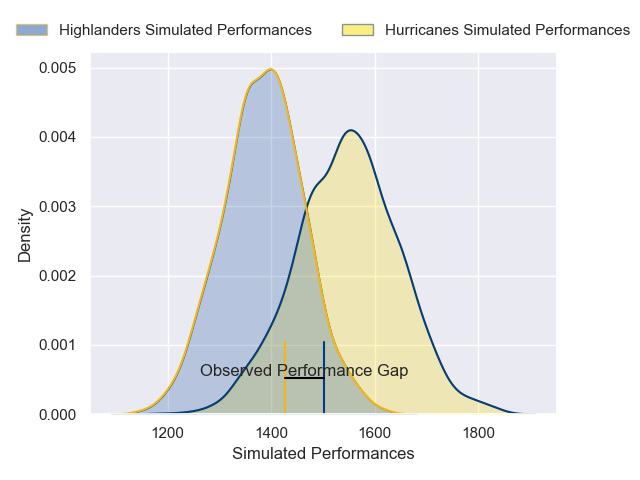
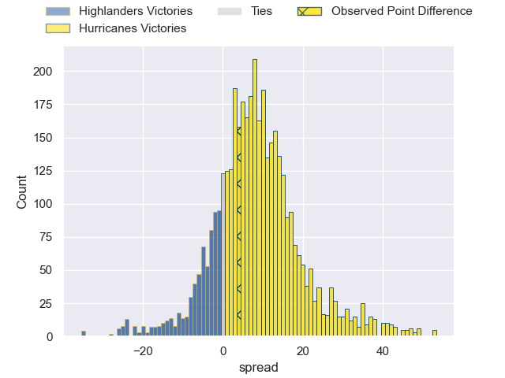
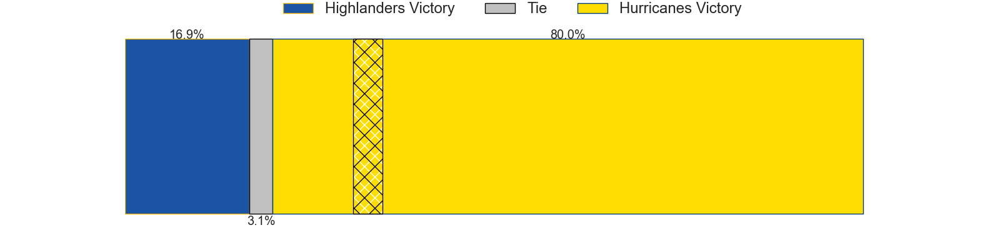
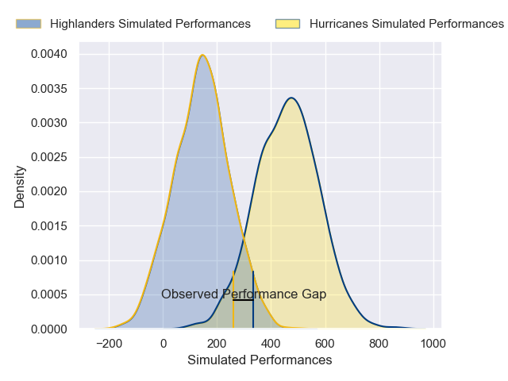
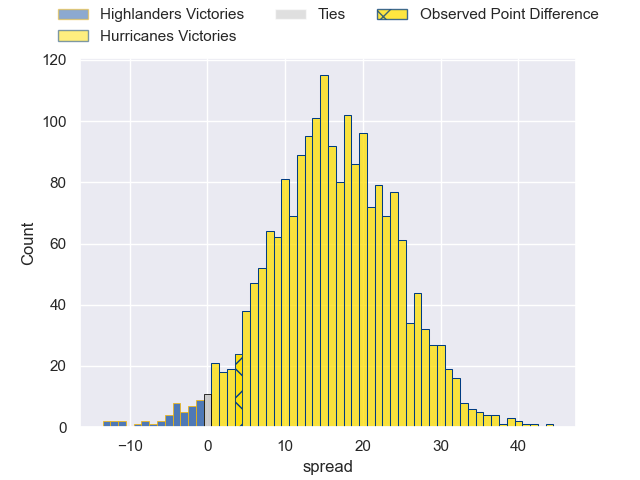
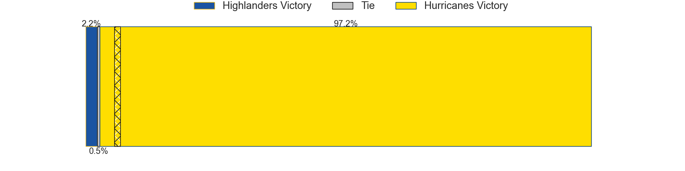

---  
layout: page  
title: Highlanders at Hurricanes; 20-24  
date: 2025-05-16 18:00:00 -0500  
categories: "Super Rugby Pacific 2025" match review  
---
# Highlanders at Hurricanes; 20-24

# Club Level Predictions

The first set of predictions treats a club as the smallest object, as the club develops its members, organizes a gameplan, and deploys its players as needed for each match. This club model has a prediction of 0.703, which translates to predicting Hurricanes to win by 7.7.

Our Over/Under is 54.5 - and combined with the spread above, we have a predicted scoreline of 23 to 31

Each club has a rating and a rating deviation (similar to a Glicko rating), and expected performances can be generated. This allows for simulated matches and spreads like the ones below.
## Projected Performances - Club Model

## Projected Spreads - Club Model

## Projected Results - Club Model

# Player Level Predictions

Treating teams instead as an entity made up of the currently active players, I have ratings for each player in an altogether different system. These can be combined to form team ratings once teamsheets are announced, weighting starters a bit higher than the reserves. After the match is played, players can be weighted by their minutes on the field, allowing for an accurate measure of the team's composition. With these compiled team ratings, we can make predictions, measure inaccuracy, and update the individual player ratings.
## Prediction without Player Minutes: Hurricanes by 16.2

Hurricanes by 8.4 on a neutral pitch

## Projected Performances - Player Model

## Projected Spreads - Player Model

## Projected Results - Player Model

|   Away Minutes | Away Player                   |   Away Percentile |   Number |   Home Percentile | Home Player          |   Home Minutes |
|---------------:|:------------------------------|------------------:|---------:|------------------:|:---------------------|---------------:|
|              0 | Ethan de Groot                |             54.91 |        1 |             97.77 | Xavier Numia         |             47 |
|             80 | Jack Taylor                   |             54.48 |        2 |             92.44 | Asafo Aumua          |             61 |
|             80 | Saula Ma'u                    |             50.52 |        3 |             68.4  | Pasilio Tosi         |             59 |
|             53 | Fabian Holland                |             84.23 |        4 |             11.61 | Zach Gallagher       |             57 |
|             80 | Mitchell Dunshea              |             96.88 |        5 |             96.32 | Isaia Walker-Leawere |             69 |
|             15 | TK Howden                     |              0.1  |        6 |             89.85 | Brad Shields         |             80 |
|             80 | Veveni Lasaqa                 |             31.24 |        7 |             97.2  | Peter Lakai          |             19 |
|             47 | Sean Withy                    |             56.75 |        8 |              0.84 | Brayden Iose         |             64 |
|             77 | Folau Fakatava                |             87.48 |        9 |             44.7  | Cam Roigard          |             22 |
|             32 | Taine Robinson                |             64.63 |       10 |             93.26 | Ruben Love           |             80 |
|             32 | Jona Nareki                   |             84.54 |       11 |             35.1  | Ngantungane Punivai  |             62 |
|             25 | Timoci Tavatavanawai          |             80.16 |       12 |             94.53 | Riley Higgins        |             68 |
|             33 | Tanielu Tele'a                |             20.85 |       13 |             96.05 | Billy Proctor        |             80 |
|             12 | Jonah Lowe                    |             80.65 |       14 |              9.58 | Bailyn Sullivan      |             80 |
|             11 | Jacob Ratumaitavuki-Kneepkens |             96.02 |       15 |             49.48 | Callum Harkin        |             12 |
|              0 | Soane Vikena                  |             89.63 |       16 |             26.89 | Raymond Tuputupu     |             63 |
|             16 | Josh Bartlett                 |             45.09 |       17 |             87.79 | Pouri Rakete-Stones  |             58 |
|             36 | Sefo Kautai                   |             20.35 |       18 |             61.45 | Tevita Mafile'o      |             64 |
|             33 | Oliver Haig                   |             74.37 |       19 |             82.81 | Hugo Plummer         |             45 |
|              0 | Michael Loft                  |             10.83 |       20 |             94.78 | Du'Plessis Kirifi    |             32 |
|             26 | Adam Lennox                   |             41.74 |       21 |              1.91 | Ere Enari            |             47 |
|             48 | Cameron Millar                |             67.58 |       22 |             20.84 | Brett Cameron        |             55 |
|             76 | Thomas Umaga-Jensen           |            nan    |       23 |             33.02 | Fehi Fineanganofo    |             18 |

