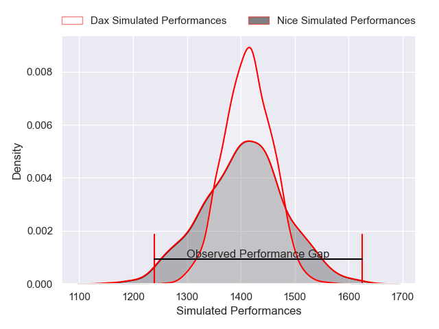
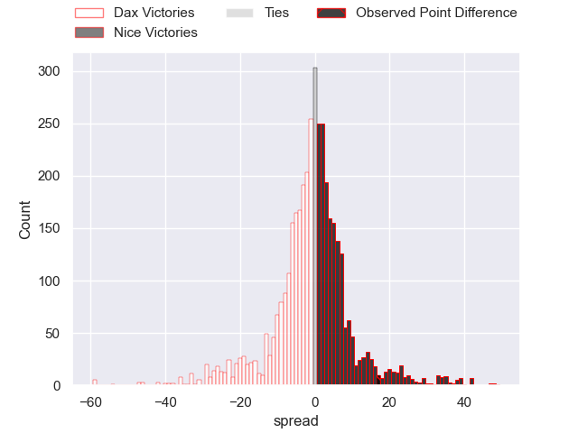
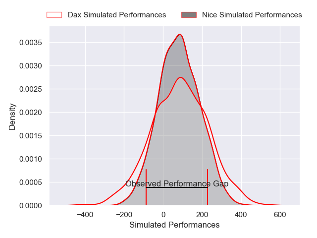
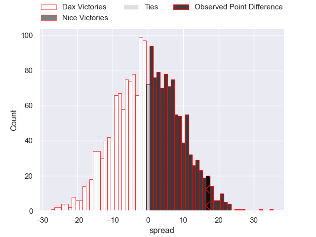
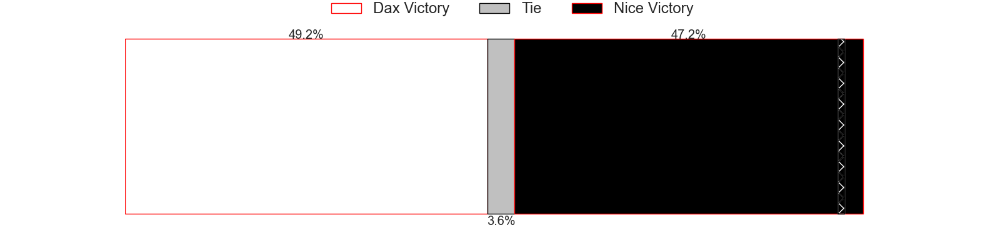

---  
layout: page  
title: Dax at Nice; 19-36  
date: 2025-05-16 18:00:00 -0500  
categories: "Pro D2 24/25" match review  
---
# Dax at Nice; 19-36

# Club Level Predictions

The first set of predictions treats a club as the smallest object, as the club develops its members, organizes a gameplan, and deploys its players as needed for each match. This club model has a prediction of 0.493, which translates to predicting Dax to win by 0.3.

Our Over/Under is 62.5 - and combined with the spread above, we have a predicted scoreline of 31 to 31

Each club has a rating and a rating deviation (similar to a Glicko rating), and expected performances can be generated. This allows for simulated matches and spreads like the ones below.
## Projected Performances - Club Model

## Projected Spreads - Club Model

## Projected Results - Club Model

# Player Level Predictions

Treating teams instead as an entity made up of the currently active players, I have ratings for each player in an altogether different system. These can be combined to form team ratings once teamsheets are announced, weighting starters a bit higher than the reserves. After the match is played, players can be weighted by their minutes on the field, allowing for an accurate measure of the team's composition. With these compiled team ratings, we can make predictions, measure inaccuracy, and update the individual player ratings.
## Prediction without Player Minutes: Dax by 0.5

Dax by 3.9 on a neutral pitch

## Projected Performances - Player Model

## Projected Spreads - Player Model

## Projected Results - Player Model

|   Away Minutes | Away Player           |   Away Percentile |   Number |   Home Percentile | Home Player              |   Home Minutes |
|---------------:|:----------------------|------------------:|---------:|------------------:|:-------------------------|---------------:|
|             80 | Louis Mary            |             37.77 |        1 |             56.28 | Sunia Vola               |             13 |
|             80 | Iban Hiriart-Urruty   |             27.77 |        2 |             11.62 | Sacha Idoumi             |             31 |
|             59 | Thibaud Dréan         |             20.35 |        3 |             12.81 | Luvuyo Pupuma            |             29 |
|             50 | Mattieu Bidau         |             45.1  |        4 |             98.45 | Tom Murday               |             19 |
|             80 | Jean-Baptiste Singer  |              3.2  |        5 |             27.16 | Martin Freytes           |             60 |
|             61 | Jean-Baptiste Barrère |              2.94 |        6 |             88.71 | Louis Suaud              |             59 |
|             24 | Malo Hannoyer         |             47.99 |        7 |              0.59 | Bastien Berenguel        |             54 |
|             14 | Ratu Nacika           |             52.79 |        8 |             23.18 | Ramiha Tarrel Tia Smiler |             21 |
|             55 | Paul Ravier           |             76.18 |        9 |             13.64 | Matéo Jeune Joly         |             65 |
|             73 | Romuald Séguy         |             26.71 |       10 |             51.71 | Flavio Asquini           |             65 |
|             80 | Viliame Tutuvili      |             16.81 |       11 |             92.96 | David Odiete             |             50 |
|             56 | Benjamin Puntous      |             12.3  |       12 |              1.79 | Alban Conduche           |             65 |
|             80 | Hugo Fourquet         |             72.66 |       13 |             60.78 | Luca Cutayar             |             80 |
|             80 | Théo Gatelier         |             73.31 |       14 |             75.76 | Corentin Penc'hoat       |             80 |
|             37 | Guillaume Bouche      |             59.57 |       15 |              5.11 | Paul Auradou             |             80 |
|             80 | Dino Casadei          |             38.27 |       16 |             82.83 | Jordan Taufua            |             80 |
|             80 | Louis Barrere         |             28.68 |       17 |             54.44 | Fabio Gonzalez           |             60 |
|             80 | David Lolohea         |             16.92 |       18 |              7.64 | Jules Solinas            |             21 |
|             25 | Étienne Loiret        |             40.45 |       19 |              2.52 | Thibault Rey             |             21 |
|             80 | Alexandre Pilati      |            nan    |       20 |             63.82 | Nicolas Ciancio          |              4 |
|             80 | Théo Tremeau          |             17.66 |       21 |              4.66 | Clément Chartier         |             23 |
|             54 | Brice Ferrer          |             29.97 |       22 |            nan    | Julien Beaufils          |             23 |
|             54 | Hugo Cerisier         |             60.68 |       23 |            nan    | nan                      |            nan |

