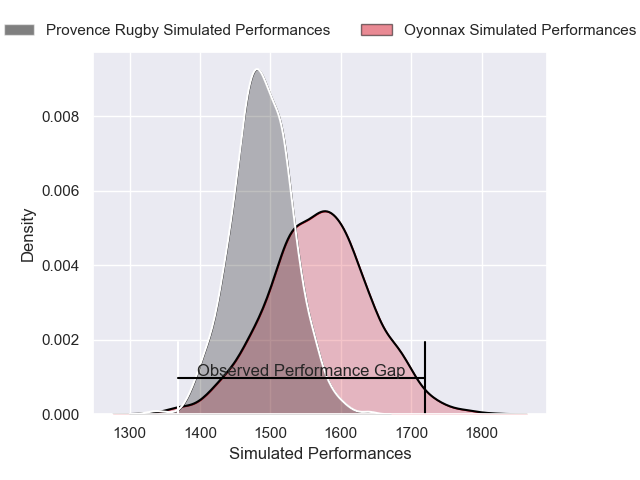
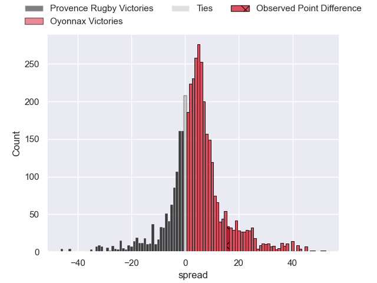
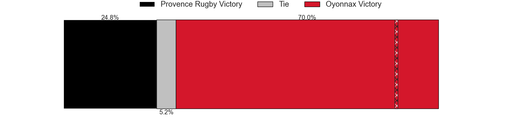
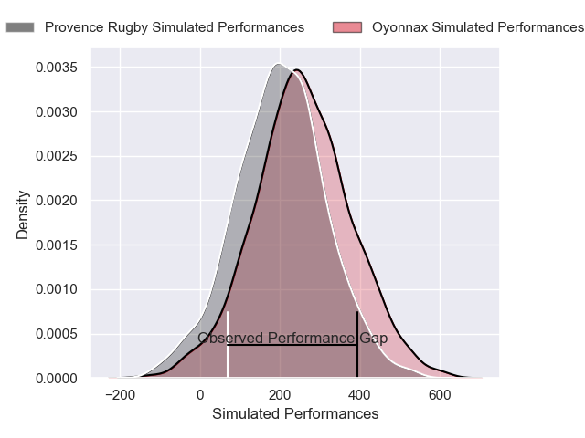
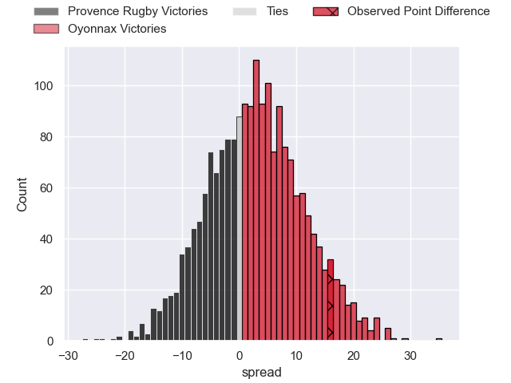
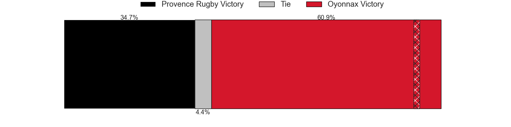

---  
layout: page  
title: Provence Rugby at Oyonnax; 31-47  
date: 2025-05-16 18:00:00 -0500  
categories: "Pro D2 24/25" match review  
---
# Provence Rugby at Oyonnax; 31-47

# Club Level Predictions

The first set of predictions treats a club as the smallest object, as the club develops its members, organizes a gameplan, and deploys its players as needed for each match. This club model has a prediction of 0.615, which translates to predicting Oyonnax to win by 4.1.

Our Over/Under is 61.5 - and combined with the spread above, we have a predicted scoreline of 29 to 33

Each club has a rating and a rating deviation (similar to a Glicko rating), and expected performances can be generated. This allows for simulated matches and spreads like the ones below.
## Projected Performances - Club Model

## Projected Spreads - Club Model

## Projected Results - Club Model

# Player Level Predictions

Treating teams instead as an entity made up of the currently active players, I have ratings for each player in an altogether different system. These can be combined to form team ratings once teamsheets are announced, weighting starters a bit higher than the reserves. After the match is played, players can be weighted by their minutes on the field, allowing for an accurate measure of the team's composition. With these compiled team ratings, we can make predictions, measure inaccuracy, and update the individual player ratings.
## Prediction without Player Minutes: Oyonnax by 2.0

Provence Rugby by 11.4 on a neutral pitch

## Projected Performances - Player Model

## Projected Spreads - Player Model

## Projected Results - Player Model

|   Away Minutes | Away Player           |   Away Percentile |   Number |   Home Percentile | Home Player        |   Home Minutes |
|---------------:|:----------------------|------------------:|---------:|------------------:|:-------------------|---------------:|
|             80 | Paul Mallez           |             76.72 |        1 |             17.76 | Adrien Bordenave   |             20 |
|             47 | Thomas Sauveterre     |             70.24 |        2 |             49.73 | Benjamin Geledan   |              6 |
|             47 | Eliott Yemsi          |             22.19 |        3 |             19.6  | Ali Oz             |             20 |
|             47 | Yannick Youyoutte     |             79.63 |        4 |             91.76 | Phoenix Battye     |             40 |
|             33 | Jérôme Dufour         |             85.16 |        5 |              0.78 | Manuel Leindekar   |             80 |
|             21 | Teimana Harrison      |             56.62 |        6 |             38.86 | Kevin Lebreton     |             80 |
|             80 | Charly Gambini        |             70.07 |        7 |             14.92 | Hugo Hermet        |             80 |
|             80 | Tornike Jalagonia     |              7.73 |        8 |             36.91 | Antoine Miquel     |             80 |
|             24 | Arthur Coville        |             13.45 |        9 |             15.64 | Vasil Lobzhanidze  |             80 |
|             29 | Jules Soulan          |             72.86 |       10 |              2.78 | Justin Bouraux     |             77 |
|             29 | Nadir Bouhedjeur      |             90.42 |       11 |             73.51 | Karim Qadiri       |             80 |
|             26 | Kaveinga Finau        |             81.91 |       12 |             15.56 | Lucas Mensa        |             67 |
|             80 | Thomas Salles         |             76.97 |       13 |             38.28 | Afusipa Taumoepeau |             25 |
|             64 | Adrien Lapegue-Lafaye |              8.02 |       14 |             77.91 | Maxime Salles      |             80 |
|             60 | Mathias Colombet      |             19.79 |       15 |             50.43 | Martin Bogado      |             27 |
|             27 | Thomas Vernet         |             68.93 |       16 |             15.32 | Hugo Fabregue      |             24 |
|             19 | Joris Cazenave        |             84.18 |       17 |             91.65 | Peniami Narisia    |             17 |
|             24 | Guillaume Piazzoli    |             78.51 |       18 |            nan    | David Odiase       |             11 |
|             21 | Baptiste Belhadj      |            nan    |       19 |             95.56 | Oli Kebble         |              7 |
|             77 | Eto Bainivalu         |             30.91 |       20 |             67.42 | Paulo Tafili       |             69 |
|             74 | Tomas Francis         |             98.66 |       21 |              2.91 | Cameron Wright     |             80 |
|             13 | Léo Drouet            |             71.28 |       22 |             73.4  | Darren Sweetnam    |             80 |
|             67 | Kapeli Pifeleti       |              8.35 |       23 |             70.09 | Chris Smith        |             80 |

