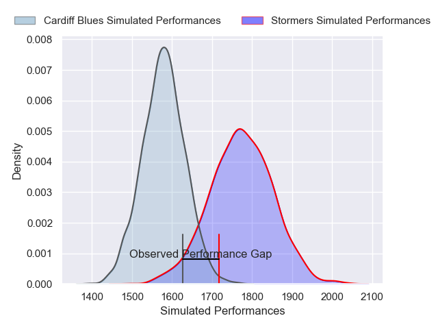
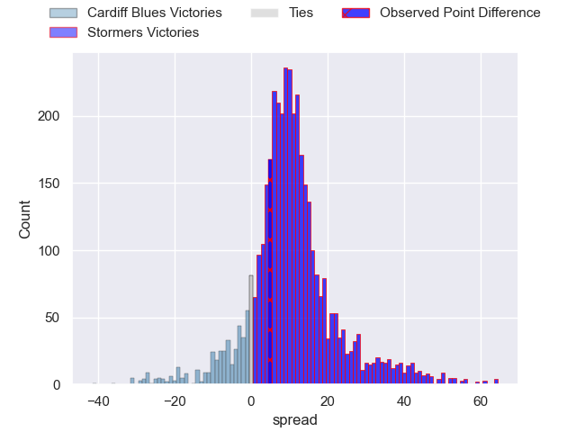
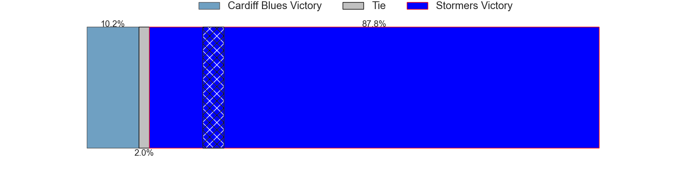
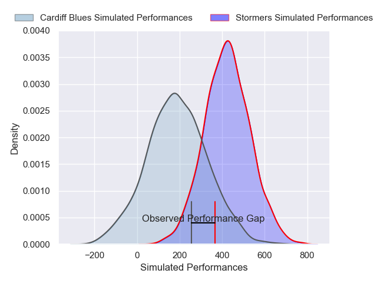
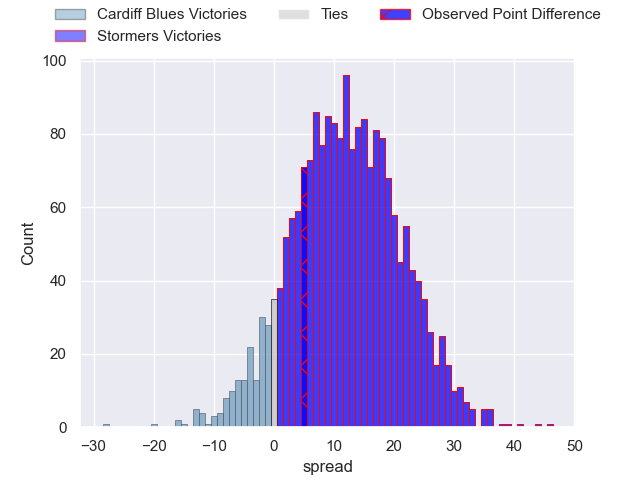
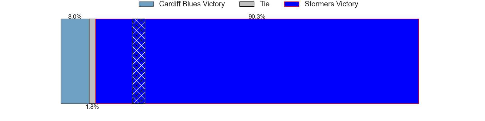

---  
layout: page  
title: Cardiff Blues at Stormers; 7-12  
date: 2025-05-16 18:00:00 -0500  
categories: "United Rugby Championship 24/25" match review  
---
# Cardiff Blues at Stormers; 7-12

# Club Level Predictions

The first set of predictions treats a club as the smallest object, as the club develops its members, organizes a gameplan, and deploys its players as needed for each match. This club model has a prediction of 0.75, which translates to predicting Stormers to win by 9.7.

Our Over/Under is 61.5 - and combined with the spread above, we have a predicted scoreline of 26 to 35

Each club has a rating and a rating deviation (similar to a Glicko rating), and expected performances can be generated. This allows for simulated matches and spreads like the ones below.
## Projected Performances - Club Model

## Projected Spreads - Club Model

## Projected Results - Club Model

# Player Level Predictions

Treating teams instead as an entity made up of the currently active players, I have ratings for each player in an altogether different system. These can be combined to form team ratings once teamsheets are announced, weighting starters a bit higher than the reserves. After the match is played, players can be weighted by their minutes on the field, allowing for an accurate measure of the team's composition. With these compiled team ratings, we can make predictions, measure inaccuracy, and update the individual player ratings.
## Prediction without Player Minutes: Stormers by 17.1

Stormers by 8.4 on a neutral pitch

## Projected Performances - Player Model

## Projected Spreads - Player Model

## Projected Results - Player Model

|   Away Minutes | Away Player        |   Away Percentile |   Number |   Home Percentile | Home Player               |   Home Minutes |
|---------------:|:-------------------|------------------:|---------:|------------------:|:--------------------------|---------------:|
|             80 | Danny Southworth   |             62.41 |        1 |             62.17 | Sti Sithole               |             25 |
|             67 | Evan Lloyd         |             21.97 |        2 |             31.11 | Joseph Dweba              |             48 |
|             54 | Keiron Assiratti   |             27.13 |        3 |             75.5  | Neethling Fouche          |             33 |
|             37 | Keiron Assiratti   |             27.13 |        3 |             75.5  | Neethling Fouche          |             33 |
|             54 | Josh McNally       |             86.59 |        4 |             82.44 | Salmaan Moerat            |             10 |
|             17 | Teddy Williams     |             13.13 |        5 |              2.55 | JD Schickerling           |             80 |
|             51 | Alun Lawrence      |             86.85 |        6 |             98.36 | Dave Ewers                |             80 |
|              7 | Alex Mann          |              4.35 |        7 |             70.89 | Louw Nel                  |             13 |
|             48 | Taulupe Faletau    |             87.13 |        8 |             12.03 | Marcel Theunissen         |             26 |
|             80 | Aled Davies        |             78.96 |        9 |             82.78 | Herschel Jantjies         |             80 |
|             74 | Callum Sheedy      |             88.21 |       10 |             58.53 | Manie Libbok              |             21 |
|             80 | Gabriel Hamer-Webb |             90.23 |       11 |             82.26 | Leolin Zas                |             70 |
|             80 | Ben Thomas         |             36.34 |       12 |             92.61 | Daniel du Plessis         |             67 |
|              0 | Harri Millard      |              4.66 |       13 |             77.23 | Wandisile Simelane        |             34 |
|             80 | Josh Adams         |             87.19 |       14 |             57.69 | Suleiman Hartzenberg      |             80 |
|             70 | Cameron Winnett    |             14.68 |       15 |             96.23 | Damian Willemse           |              0 |
|             48 | Dafydd Hughes      |             15.64 |       16 |            nan    | Scarra Ntubeni            |             70 |
|             16 | Corey Domachowski  |             85.32 |       17 |             70.71 | Vernon Matongo            |             26 |
|             44 | Rhys Litterick     |             14.45 |       18 |             19.39 | Sazi Sandi                |             26 |
|             80 | Rory Thornton      |              7.93 |       19 |             14.07 | Connor Evans              |              0 |
|             78 | James Botham       |             86.65 |       20 |            nan    | Paul De Villiers          |              6 |
|             80 | Dan Thomas         |             20.21 |       21 |             77.57 | Paul de Wet               |             10 |
|             80 | Johan Mulder       |            nan    |       22 |             73.08 | Sacha Feinberg-Mngomezulu |             80 |
|             66 | Rory Jennings      |             34.51 |       23 |             94.69 | Ben Loader                |             80 |

