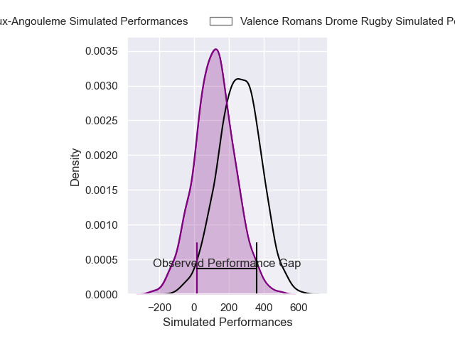
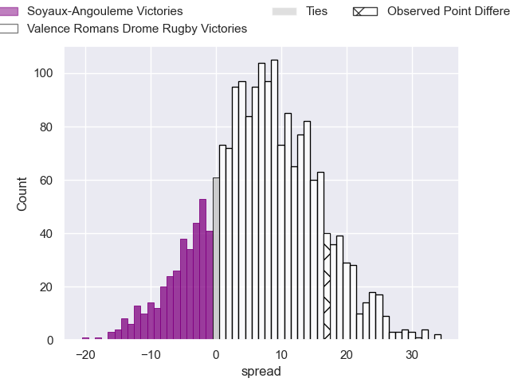
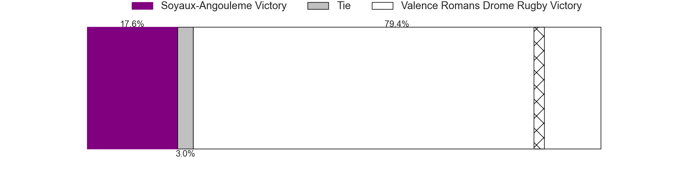

---  
layout: page  
title: Soyaux-Angouleme at Valence Romans Drome Rugby; 22-39  
date: 2025-05-16 18:00:00 -0500  
categories: "Pro D2 24/25" match review  
---
# Soyaux-Angouleme at Valence Romans Drome Rugby; 22-39

# Club Level Predictions

The first set of predictions treats a club as the smallest object, as the club develops its members, organizes a gameplan, and deploys its players as needed for each match. This club model has a prediction of 0.605, which translates to predicting Valence Romans Drome Rugby to win by 3.7.

Our Over/Under is 56.5 - and combined with the spread above, we have a predicted scoreline of 27 to 30

Each club has a rating and a rating deviation (similar to a Glicko rating), and expected performances can be generated. This allows for simulated matches and spreads like the ones below.
## Projected Performances - Club Model

## Projected Spreads - Club Model

## Projected Results - Club Model

# Player Level Predictions

Treating teams instead as an entity made up of the currently active players, I have ratings for each player in an altogether different system. These can be combined to form team ratings once teamsheets are announced, weighting starters a bit higher than the reserves. After the match is played, players can be weighted by their minutes on the field, allowing for an accurate measure of the team's composition. With these compiled team ratings, we can make predictions, measure inaccuracy, and update the individual player ratings.
## Prediction without Player Minutes: Valence Romans Drome Rugby by 6.2

Valence Romans Drome Rugby by 2.5 on a neutral pitch

## Projected Performances - Player Model

## Projected Spreads - Player Model

## Projected Results - Player Model

|   Away Minutes | Away Player        |   Away Percentile |   Number |   Home Percentile | Home Player          |   Home Minutes |
|---------------:|:-------------------|------------------:|---------:|------------------:|:---------------------|---------------:|
|             13 | Paul Tailhades     |             53.35 |        1 |             87.1  | Andrea Pontanier     |             27 |
|             18 | Rayne Barka        |             92.01 |        2 |              0.91 | Cyril Deligny        |             80 |
|             80 | Omar Dahir         |             47.65 |        3 |             42.71 | Gareth Milasinovich  |             57 |
|             62 | Matt Beukeboom     |             20.56 |        4 |             77.79 | Ryan McCauley        |             59 |
|             80 | Léo Labarthe       |             27.06 |        5 |             79.92 | Florian Goumat       |             59 |
|             67 | Clément Sentubery  |             43.08 |        6 |             78.31 | Adrien Roux          |             80 |
|             54 | Hubert Texier      |             47.2  |        7 |             45.93 | Ilia Spanderashvili  |             40 |
|             52 | Samuel Nollet      |             14.59 |        8 |             87.77 | Sven Bernat Girlando |             80 |
|             65 | Adrien Bau         |              4.73 |        9 |             87.82 | Tim Menzel           |             80 |
|             11 | Massimo Ortolan    |             10.47 |       10 |             62.39 | Lucas Meret          |             25 |
|             66 | Nathan Farissier   |             24.24 |       11 |             86.71 | Mosese Mawalu        |             25 |
|             80 | George Tilsley     |             92.32 |       12 |              9.67 | Mathieu Guillomot    |              9 |
|             80 | François Carlo Mey |             54.26 |       13 |             90.43 | Anatole Pauvert      |             65 |
|             80 | Matthys Gratien    |             68.13 |       14 |              2.54 | Owen Lane            |             72 |
|             65 | Noe Darrelatour    |             36.38 |       15 |             87.02 | Charles Bouldoire    |             20 |
|              0 | Georgy Balakarev   |             84.17 |       16 |             16.55 | Mattéo Rodor         |             50 |
|             33 | Ian Kitwanga       |             17.85 |       17 |             85.7  | Louis Marrou         |             52 |
|             23 | Patxi Bidart       |             64.43 |       18 |             71.19 | Anthony Aléo         |             80 |
|             33 | Seydou Diakité     |             23.2  |       19 |             12.12 | Éloi Massot          |             80 |
|              0 | Maxence Lemardelet |             81.77 |       20 |            nan    | Brice Humbert        |             80 |
|             80 | Lucas Zamora       |            nan    |       21 |             72.16 | Yassine Maamry       |             80 |
|             54 | Arthur Proult      |              8.31 |       22 |            nan    | Enzo Bailly          |             40 |
|             29 | Adrian Mitu        |             59.67 |       23 |             86.38 | Joris De Moura       |             55 |

