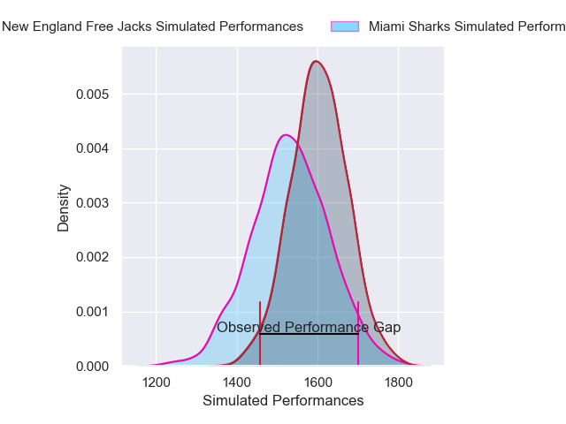
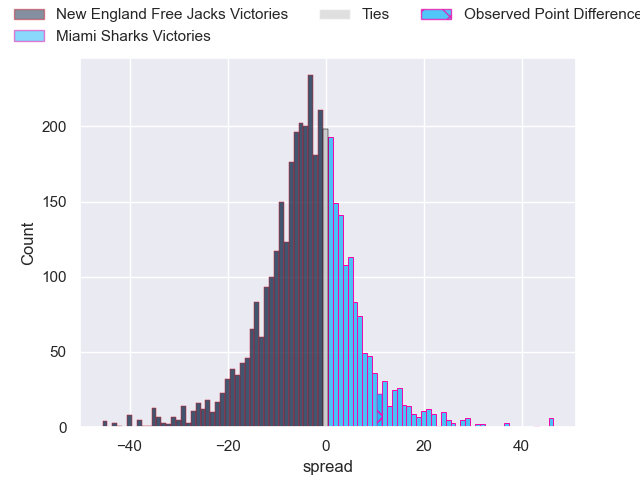
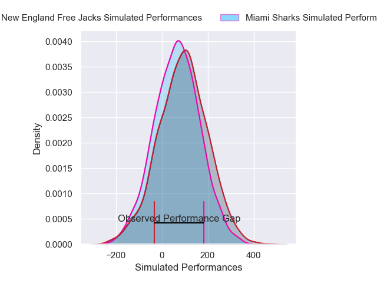
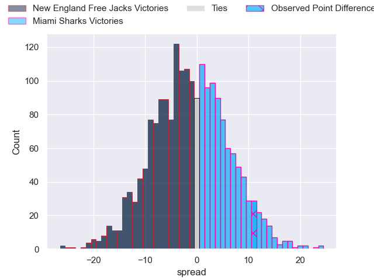

---  
layout: page  
title: New England Free Jacks at Miami Sharks; 19-30  
date: 2025-05-17 18:00:00 -0500  
categories: "Major League Rugby 2025" match review  
---
# New England Free Jacks at Miami Sharks; 19-30

# Club Level Predictions

The first set of predictions treats a club as the smallest object, as the club develops its members, organizes a gameplan, and deploys its players as needed for each match. This club model has a prediction of 0.4, which translates to predicting New England Free Jacks to win by 3.6.

Our Over/Under is 65.5 - and combined with the spread above, we have a predicted scoreline of 35 to 31

Each club has a rating and a rating deviation (similar to a Glicko rating), and expected performances can be generated. This allows for simulated matches and spreads like the ones below.
## Projected Performances - Club Model

## Projected Spreads - Club Model

## Projected Results - Club Model

# Player Level Predictions

Treating teams instead as an entity made up of the currently active players, I have ratings for each player in an altogether different system. These can be combined to form team ratings once teamsheets are announced, weighting starters a bit higher than the reserves. After the match is played, players can be weighted by their minutes on the field, allowing for an accurate measure of the team's composition. With these compiled team ratings, we can make predictions, measure inaccuracy, and update the individual player ratings.
## Prediction without Player Minutes: New England Free Jacks by 2.9

New England Free Jacks by 5.3 on a neutral pitch

## Projected Performances - Player Model

## Projected Spreads - Player Model

## Projected Results - Player Model

|   Away Minutes | Away Player          |   Away Percentile |   Number |   Home Percentile | Home Player        |   Home Minutes |
|---------------:|:---------------------|------------------:|---------:|------------------:|:-------------------|---------------:|
|             31 | Tevita Sole          |             65.28 |        1 |             12.66 | Ma'ake Muti        |             21 |
|             19 | Connal McInerney     |             85.82 |        2 |             10.46 | Kirby Myhill       |             21 |
|             80 | Kyle Steeves         |             25.23 |        3 |             65.03 | Alec McDonnell     |             19 |
|             48 | Josh Larsen          |              1.76 |        4 |             33.2  | Tomas Casares      |             29 |
|             80 | Jeronimo Gomez Vara  |             10.28 |        5 |             57.98 | Federico Gutierrez |             80 |
|             32 | Ethan Fryer          |              5.46 |        6 |              0.2  | Manuel Ardao       |             40 |
|             80 | Joe Johnston         |             67.96 |        7 |             76.69 | Benja Bonassoa     |             33 |
|             80 | Wian Conradie        |             96.09 |        8 |             66.74 | Ronan Foley        |             80 |
|             80 | John Poland          |             82    |        9 |             36.01 | Tomas Cubelli      |             59 |
|             15 | Dan Hollinshead      |              5.8  |       10 |             96.07 | Martin Elias       |             70 |
|             80 | Jack Reeves          |              3.13 |       11 |             63.21 | Josiah Morra       |              0 |
|             76 | Isaac Olson          |             27.59 |       12 |             79.31 | Tomas Cubilla      |             80 |
|              0 | Killian Coghlan      |             42.19 |       13 |              6.09 | Matias Orlando     |             65 |
|             20 | Simon-Peter Toleafoa |             38.26 |       14 |             20.94 | Marcos Young       |             80 |
|             80 | Brock Webster        |             60.68 |       15 |              7.19 | Shane O'Leary      |             59 |

