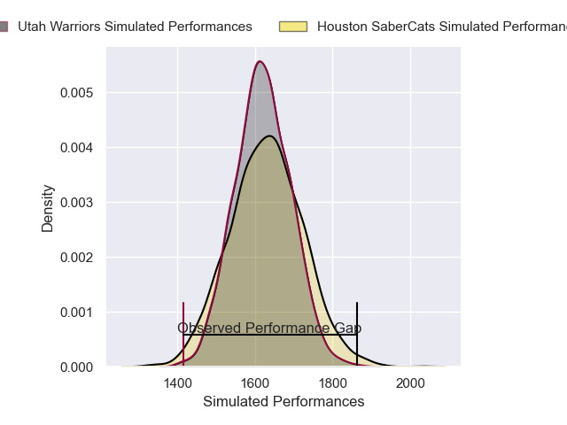
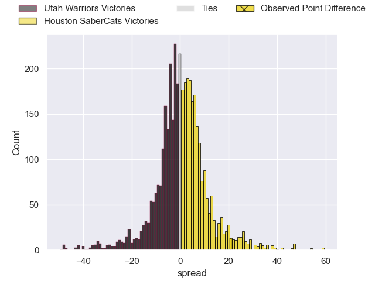
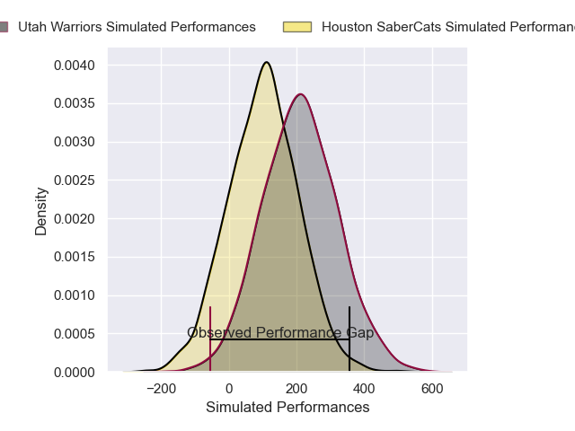
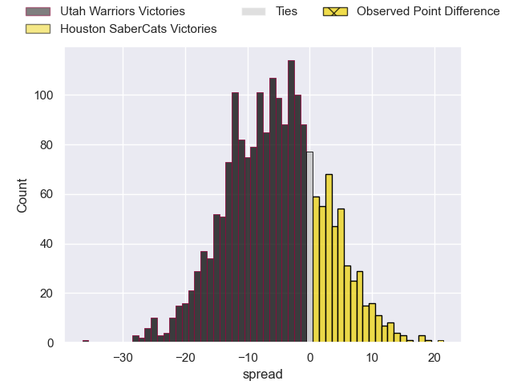

---  
layout: page  
title: Utah Warriors at Houston SaberCats; 19-40  
date: 2025-05-18 18:00:00 -0500  
categories: "Major League Rugby 2025" match review  
---
# Utah Warriors at Houston SaberCats; 19-40

# Club Level Predictions

The first set of predictions treats a club as the smallest object, as the club develops its members, organizes a gameplan, and deploys its players as needed for each match. This club model has a prediction of 0.511, which translates to predicting Houston SaberCats to win by 0.4.

Our Over/Under is 57.5 - and combined with the spread above, we have a predicted scoreline of 29 to 29

Each club has a rating and a rating deviation (similar to a Glicko rating), and expected performances can be generated. This allows for simulated matches and spreads like the ones below.
## Projected Performances - Club Model

## Projected Spreads - Club Model

## Projected Results - Club Model

# Player Level Predictions

Treating teams instead as an entity made up of the currently active players, I have ratings for each player in an altogether different system. These can be combined to form team ratings once teamsheets are announced, weighting starters a bit higher than the reserves. After the match is played, players can be weighted by their minutes on the field, allowing for an accurate measure of the team's composition. With these compiled team ratings, we can make predictions, measure inaccuracy, and update the individual player ratings.
## Prediction without Player Minutes: Utah Warriors by 5.8

Utah Warriors by 9.3 on a neutral pitch

## Projected Performances - Player Model

## Projected Spreads - Player Model

## Projected Results - Player Model

|   Away Minutes | Away Player     |   Away Percentile |   Number |   Home Percentile | Home Player        |   Home Minutes |
|---------------:|:----------------|------------------:|---------:|------------------:|:-------------------|---------------:|
|           26   | Fred Apulu      |             82.68 |        1 |             84.1  | Ezekiel Lindenmuth |             25 |
|           80   | Tuvere Vugakoto |             13.65 |        2 |             85.11 | Seth Smith         |             55 |
|           35.5 | Remsy Lemisio   |             80.1  |        3 |             89.73 | Pono Davis         |             25 |
|           64   | Frank Lochore   |             68.56 |        4 |             98.53 | Justin Basson      |             52 |
|           80   | Matt Jensen     |             48.29 |        5 |             59.35 | Nathan Den Hoedt   |              6 |
|           55   | Lance Williams  |              8.43 |        6 |             93.06 | Marno Redelinghuys |             80 |
|           25   | Kalisi Moli     |             33.13 |        7 |             19.54 | Johan Momsen       |             80 |
|           66   | Dylan Nel       |             94.35 |        8 |             86.52 | Sam Tuifua         |             74 |
|           80   | Zion Going      |             83.96 |        9 |              3.74 | Jay Renton         |             80 |
|           80   | Joel Hodgson    |             34.78 |       10 |             71.01 | Davy Coetzer       |             43 |
|           66   | Joe Mano        |             84.93 |       11 |             87.77 | Juan-Dee Oliver    |             14 |
|           80   | D'Angelo Leuila |             10.55 |       12 |             93.41 | Dominic Akina      |             80 |
|           64   | Cole Semu       |             60.04 |       13 |             76.88 | Tautalatasi Tasi   |             24 |
|           80   | Nic Benn        |             72.31 |       14 |             89.73 | Pono Davis         |             80 |
|           14   | Jordan Trainor  |             86.89 |       15 |             43.13 | Drew Wild          |             11 |

