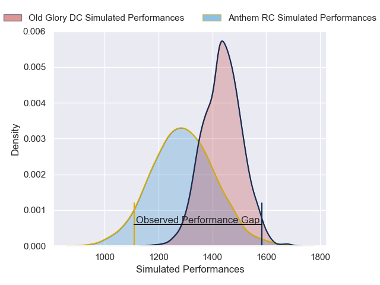
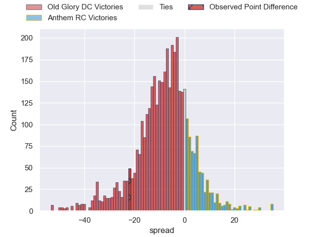
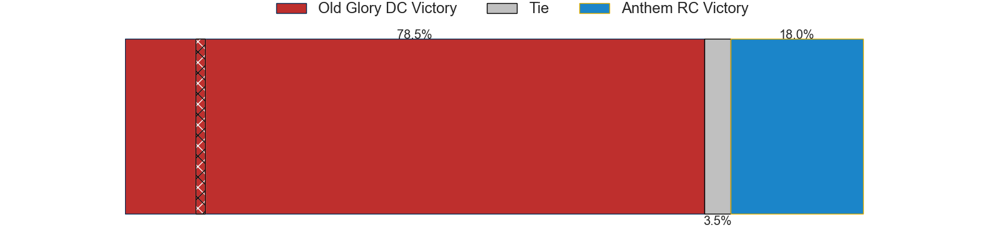
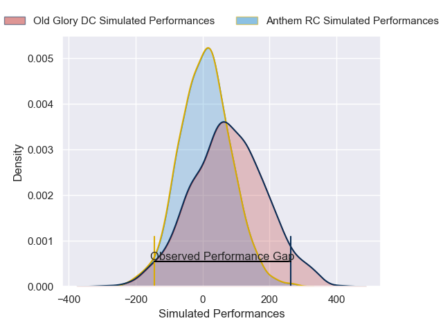
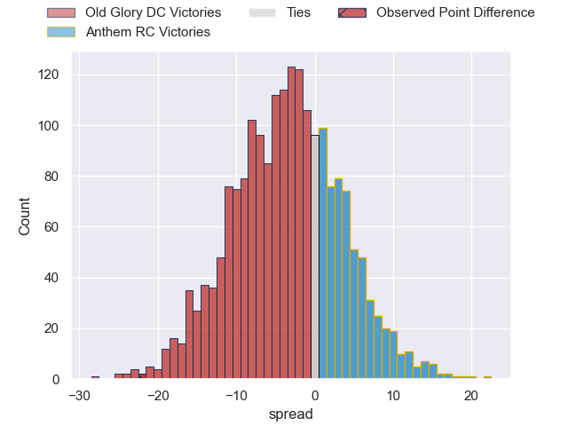

---  
layout: page  
title: Old Glory DC at Anthem RC; 41-19  
date: 2025-05-19 18:00:00 -0500  
categories: "Major League Rugby 2025" match review  
---
# Old Glory DC at Anthem RC; 41-19

# Club Level Predictions

The first set of predictions treats a club as the smallest object, as the club develops its members, organizes a gameplan, and deploys its players as needed for each match. This club model has a prediction of 0.303, which translates to predicting Old Glory DC to win by 7.4.

Our Over/Under is 52.5 - and combined with the spread above, we have a predicted scoreline of 30 to 23

Each club has a rating and a rating deviation (similar to a Glicko rating), and expected performances can be generated. This allows for simulated matches and spreads like the ones below.
## Projected Performances - Club Model

## Projected Spreads - Club Model

## Projected Results - Club Model

# Player Level Predictions

Treating teams instead as an entity made up of the currently active players, I have ratings for each player in an altogether different system. These can be combined to form team ratings once teamsheets are announced, weighting starters a bit higher than the reserves. After the match is played, players can be weighted by their minutes on the field, allowing for an accurate measure of the team's composition. With these compiled team ratings, we can make predictions, measure inaccuracy, and update the individual player ratings.
## Prediction without Player Minutes: Old Glory DC by 4.5

Old Glory DC by 6.9 on a neutral pitch

## Projected Performances - Player Model

## Projected Spreads - Player Model

## Projected Results - Player Model

|   Away Minutes | Away Player              |   Away Percentile |   Number |   Home Percentile | Home Player              |   Home Minutes |
|---------------:|:-------------------------|------------------:|---------:|------------------:|:-------------------------|---------------:|
|           80   | Jack Iscaro              |             18.43 |        1 |              3.1  | Jake Turnbull            |             29 |
|           80   | Facundo Gattas           |             71.69 |        2 |              2.72 | Connor Robinson          |             22 |
|           80   | Joe Rees                 |              3.18 |        3 |             26.63 | Alexandre Hernandez      |             62 |
|           69   | Rob Harley               |             92.43 |        4 |             28.52 | Sam Golla                |             25 |
|           56   | Tevita Naqali            |             16.29 |        5 |              6.6  | Mikey Grandy             |             80 |
|            5.5 | Jamason Fa'anana-Schultz |             19.53 |        6 |             30.42 | Alejandro Martinez Tapia |             51 |
|           80   | Cory Daniel              |             23.36 |        7 |              0.69 | Albert O'Shannessey      |             80 |
|           69   | Lautaro Bavaro           |             98.5  |        8 |              6.65 | Dylan Fortune            |             31 |
|           80   | Connor Buckley           |             72.36 |        9 |             20.36 | Karl Keane               |             16 |
|            5.5 | Jason Emery              |              2.99 |       10 |             17.52 | Cliven Loubser           |             22 |
|           31   | Axel Muller              |             87.1  |       11 |             37.54 | Corbin Smith             |             22 |
|           24   | Tommaso Boni             |              0.42 |       12 |              0.95 | Junior Gafa              |             40 |
|           80   | Steffan Hughes           |             83.7  |       13 |             29.44 | Ej Freeman               |             40 |
|           80   | Perry Humphreys          |             34.12 |       14 |             69.7  | Jason Tidwell            |             29 |
|           14   | Damien Hoyland           |             63.4  |       15 |              3.62 | Toby Fricker             |             31 |

