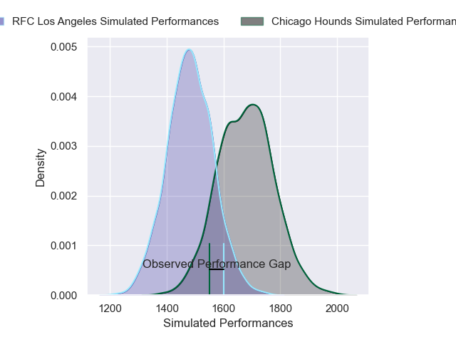
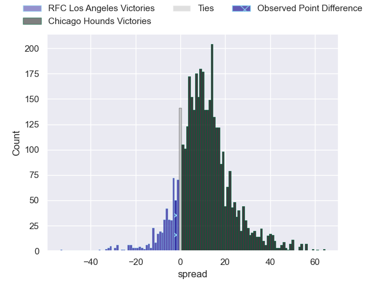
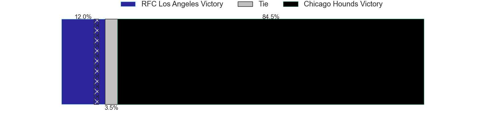
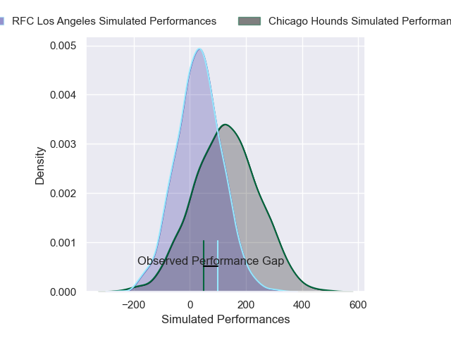
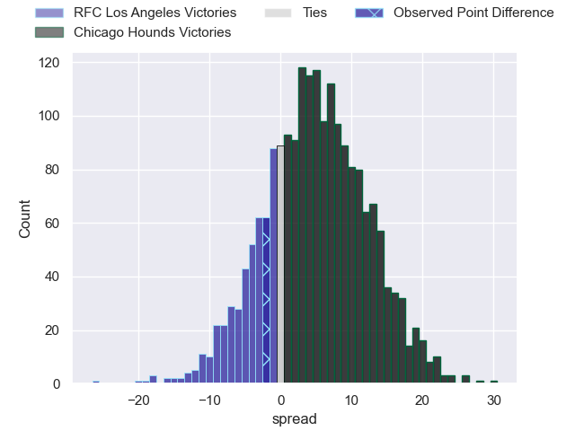
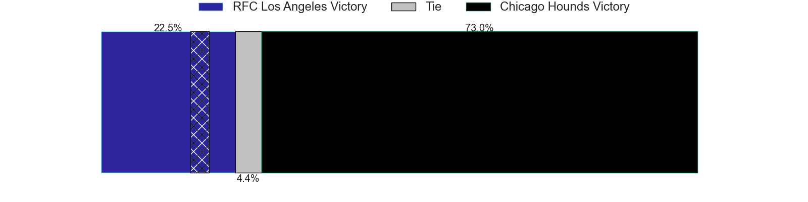

---  
layout: page  
title: RFC Los Angeles at Chicago Hounds; 26-24  
date: 2025-05-20 18:00:00 -0500  
categories: "Major League Rugby 2025" match review  
---
# RFC Los Angeles at Chicago Hounds; 26-24

# Club Level Predictions

The first set of predictions treats a club as the smallest object, as the club develops its members, organizes a gameplan, and deploys its players as needed for each match. This club model has a prediction of 0.751, which translates to predicting Chicago Hounds to win by 9.9.

Our Over/Under is 55.5 - and combined with the spread above, we have a predicted scoreline of 23 to 33

Each club has a rating and a rating deviation (similar to a Glicko rating), and expected performances can be generated. This allows for simulated matches and spreads like the ones below.
## Projected Performances - Club Model

## Projected Spreads - Club Model

## Projected Results - Club Model

# Player Level Predictions

Treating teams instead as an entity made up of the currently active players, I have ratings for each player in an altogether different system. These can be combined to form team ratings once teamsheets are announced, weighting starters a bit higher than the reserves. After the match is played, players can be weighted by their minutes on the field, allowing for an accurate measure of the team's composition. With these compiled team ratings, we can make predictions, measure inaccuracy, and update the individual player ratings.
## Prediction without Player Minutes: Chicago Hounds by 1.9

RFC Los Angeles by 0.6 on a neutral pitch

## Projected Performances - Player Model

## Projected Spreads - Player Model

## Projected Results - Player Model

|   Away Minutes | Away Player           |   Away Percentile |   Number |   Home Percentile | Home Player       |   Home Minutes |
|---------------:|:----------------------|------------------:|---------:|------------------:|:------------------|---------------:|
|             49 | Alessandro Heaney     |             67.01 |        1 |             87.59 | Faka'osi Pifeleti |             51 |
|             80 | Ben Sugars            |             16.73 |        2 |             95.2  | Dylan Fawsitt     |             57 |
|              9 | Maliu Niuafe          |             64.12 |        3 |             17.26 | Charlie Abel      |             80 |
|             27 | Jason Damm            |             10.17 |        4 |             81.15 | James Scott       |             80 |
|             31 | Jurie van Vuuren      |             92.6  |        5 |              1.88 | Mason Flesch      |             63 |
|             22 | Tim Anstee            |              5.41 |        6 |             77.25 | Conall Boomer     |             23 |
|             15 | Matt Heaton           |              0.8  |        7 |             19.44 | Maclean Jones     |             80 |
|             57 | Edward Timpson        |             75.16 |        8 |              0.64 | Lucas Rumball     |             56 |
|              5 | Gonzalo Bertranou     |             89.37 |        9 |             17.3  | Jason Higgins     |             80 |
|             22 | Christian Leali'ifano |             89.29 |       10 |              3.99 | Chris Hilsenbeck  |             52 |
|             68 | Rory van Vugt         |              3.86 |       11 |             33.56 | Peyton Wall       |             80 |
|             12 | Bill Meakes           |             95.1  |       12 |             14.51 | Ollie Devoto      |             41 |
|             76 | Nick Chan             |             62.66 |       13 |             82.08 | Bryce Campbell    |             80 |
|             49 | Andrew Coe            |             79.85 |       14 |             91.9  | Noah Brown        |             80 |
|             68 | Vaughen Isaacs        |             69.69 |       15 |              5.53 | Tim Swiel         |             80 |

