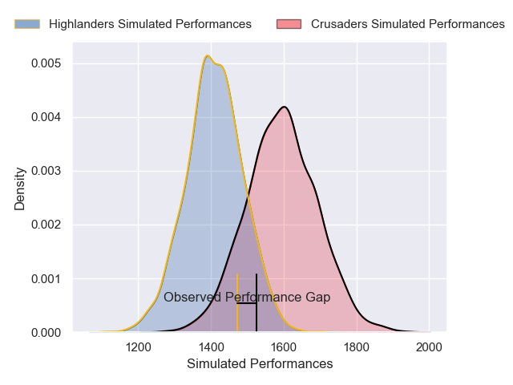
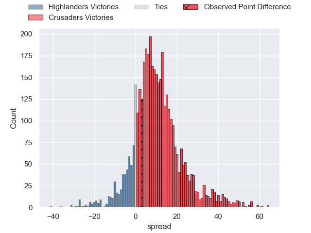
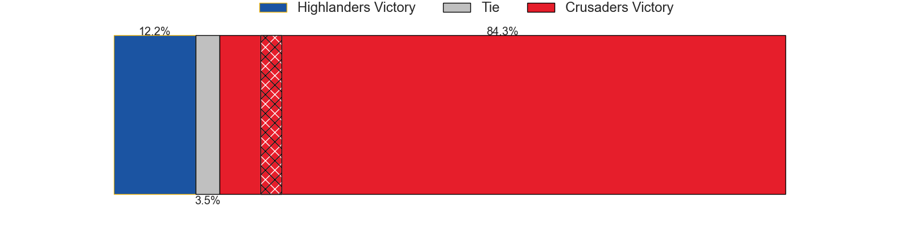
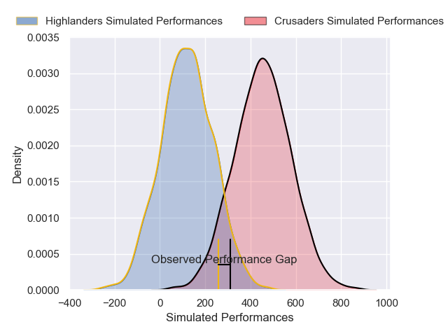
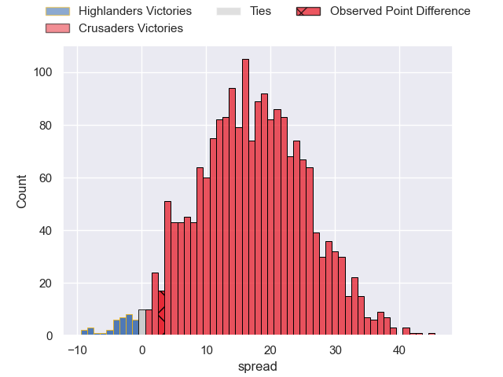

---  
layout: page  
title: Highlanders at Crusaders; 12-15  
date: 2025-05-23 18:00:00 -0500  
categories: "Super Rugby Pacific 2025" match review  
---
# Highlanders at Crusaders; 12-15

# Club Level Predictions

The first set of predictions treats a club as the smallest object, as the club develops its members, organizes a gameplan, and deploys its players as needed for each match. This club model has a prediction of 0.737, which translates to predicting Crusaders to win by 9.2.

Our Over/Under is 64.5 - and combined with the spread above, we have a predicted scoreline of 27 to 37

Each club has a rating and a rating deviation (similar to a Glicko rating), and expected performances can be generated. This allows for simulated matches and spreads like the ones below.
## Projected Performances - Club Model

## Projected Spreads - Club Model

## Projected Results - Club Model

# Player Level Predictions

Treating teams instead as an entity made up of the currently active players, I have ratings for each player in an altogether different system. These can be combined to form team ratings once teamsheets are announced, weighting starters a bit higher than the reserves. After the match is played, players can be weighted by their minutes on the field, allowing for an accurate measure of the team's composition. With these compiled team ratings, we can make predictions, measure inaccuracy, and update the individual player ratings.
## Prediction without Player Minutes: Crusaders by 16.5

Crusaders by 8.8 on a neutral pitch

## Projected Performances - Player Model

## Projected Spreads - Player Model

## Projected Results - Player Model

|   Away Minutes | Away Player                   |   Away Percentile |   Number |   Home Percentile | Home Player          |   Home Minutes |
|---------------:|:------------------------------|------------------:|---------:|------------------:|:---------------------|---------------:|
|           31   | Ethan de Groot                |             61.28 |        1 |             13.97 | George Bower         |             67 |
|           80   | Jack Taylor                   |             75.71 |        2 |             98.21 | Codie Taylor         |             80 |
|           31   | Saula Ma'u                    |             49.33 |        3 |             93.1  | Tamaiti Williams     |             26 |
|           58   | Fabian Holland                |             81.9  |        4 |             95.4  | Scott Barrett        |             46 |
|           47   | Tai Cribb                     |             65.6  |        5 |             12.4  | Jamie Hannah         |             24 |
|           23   | TK Howden                     |              0.2  |        6 |             74.83 | Cullen Grace         |             80 |
|           80   | Veveni Lasaqa                 |             28.74 |        7 |             84.44 | Tom Christie         |             28 |
|           40   | Sean Withy                    |             55.88 |        8 |             53.49 | Christian Lio-Willie |             80 |
|           80   | Folau Fakatava                |             80.15 |        9 |             88.97 | Mitchell Drummond    |             80 |
|           26   | Taine Robinson                |             71.43 |       10 |              6.49 | Rivez Reihana        |             52 |
|           34   | Taniela Filimone              |             29.51 |       11 |             29.13 | Macca Springer       |             54 |
|            0   | Timoci Tavatavanawai          |             79.5  |       12 |             92.43 | David Havili         |             29 |
|           12   | Tanielu Tele'a                |             37.33 |       13 |             87.59 | Braydon Ennor        |             33 |
|           57   | Jonah Lowe                    |             83.4  |       14 |             85.24 | Sevu Reece           |             12 |
|           31   | Jacob Ratumaitavuki-Kneepkens |             96.47 |       15 |             79.69 | Johnny McNicholl     |             80 |
|           80   | Soane Vikena                  |             77.14 |       16 |             35.71 | George Bell          |             80 |
|           80   | Josh Bartlett                 |             28.45 |       17 |            nan    | Lewis Ponini         |             49 |
|           16.5 | Sefo Kautai                   |             20.03 |       18 |            nan    | Seb Calder           |             54 |
|           40   | Michael Loft                  |             16.95 |       19 |             93.5  | Quinten Strange      |             80 |
|           40   | Will Stodart                  |            nan    |       20 |             62.04 | Corey Kellow         |             68 |
|           80   | Adam Lennox                   |             47.61 |       21 |             56.8  | Kyle Preston         |             80 |
|           31   | Cameron Millar                |             54.33 |       22 |            nan    | James O'Connor       |             80 |
|           80   | Thomas Umaga-Jensen           |            nan    |       23 |             60.57 | Dallas McLeod        |              0 |

