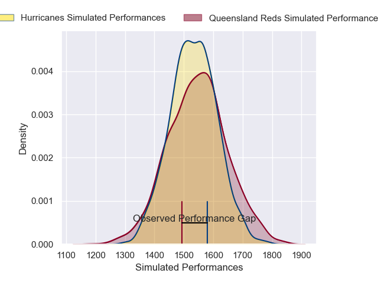
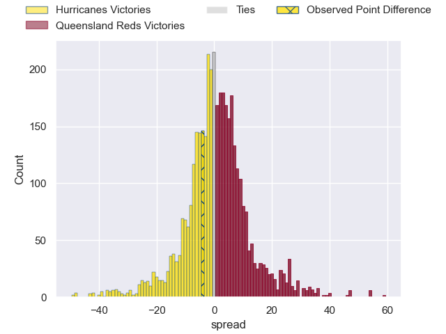
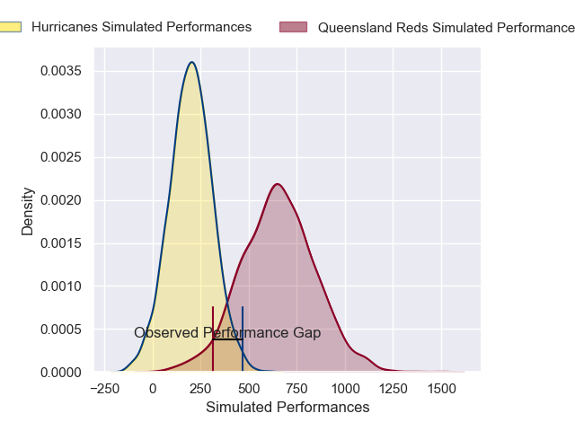
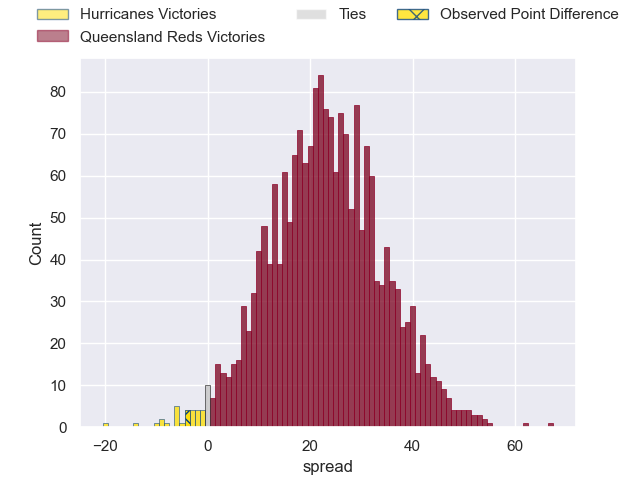
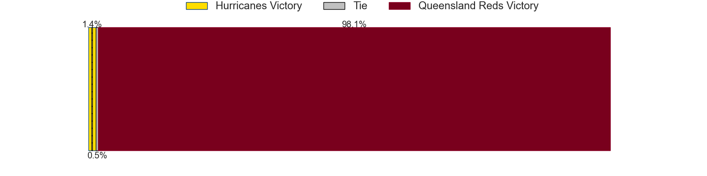

---  
layout: page  
title: Hurricanes at Queensland Reds; 31-27  
date: 2025-05-23 18:00:00 -0500  
categories: "Super Rugby Pacific 2025" match review  
---
# Hurricanes at Queensland Reds; 31-27

# Club Level Predictions

The first set of predictions treats a club as the smallest object, as the club develops its members, organizes a gameplan, and deploys its players as needed for each match. This club model has a prediction of 0.517, which translates to predicting Queensland Reds to win by 0.6.

Our Over/Under is 68.5 - and combined with the spread above, we have a predicted scoreline of 34 to 35

Each club has a rating and a rating deviation (similar to a Glicko rating), and expected performances can be generated. This allows for simulated matches and spreads like the ones below.
## Projected Performances - Club Model

## Projected Spreads - Club Model

## Projected Results - Club Model

# Player Level Predictions

Treating teams instead as an entity made up of the currently active players, I have ratings for each player in an altogether different system. These can be combined to form team ratings once teamsheets are announced, weighting starters a bit higher than the reserves. After the match is played, players can be weighted by their minutes on the field, allowing for an accurate measure of the team's composition. With these compiled team ratings, we can make predictions, measure inaccuracy, and update the individual player ratings.
## Prediction without Player Minutes: Queensland Reds by 7.1

Hurricanes by 1.1 on a neutral pitch

## Projected Performances - Player Model

## Projected Spreads - Player Model

## Projected Results - Player Model

|   Away Minutes | Away Player          |   Away Percentile |   Number |   Home Percentile | Home Player               |   Home Minutes |
|---------------:|:---------------------|------------------:|---------:|------------------:|:--------------------------|---------------:|
|              7 | Xavier Numia         |             98.99 |        1 |             49.49 | Sef Fa'agase              |           80   |
|             30 | Asafo Aumua          |             88.75 |        2 |             75.89 | Richie Asiata             |           80   |
|             33 | Tyrel Lomax          |             83.16 |        3 |             79.71 | Zane Nonggorr             |           31   |
|             49 | Zach Gallagher       |             10.5  |        4 |             17.6  | Josh Canham               |           31   |
|             22 | Isaia Walker-Leawere |             97.8  |        5 |             18.6  | Ryan Smith                |           80   |
|             26 | Brad Shields         |             91.28 |        6 |             18.63 | Joe Brial                 |           80   |
|             49 | Du'Plessis Kirifi    |             96.43 |        7 |             93.36 | Fraser McReight           |           57   |
|             70 | Peter Lakai          |             96.69 |        8 |             42.28 | Harry Wilson              |           16   |
|             70 | Peter Lakai          |             96.69 |        8 |             42.28 | Harry Wilson              |           45   |
|             70 | Peter Lakai          |             96.69 |        8 |             42.28 | Harry Wilson              |           50   |
|             70 | Peter Lakai          |             96.69 |        8 |             42.28 | Harry Wilson              |           23   |
|             70 | Peter Lakai          |             96.69 |        8 |             42.28 | Harry Wilson              |           80   |
|             70 | Peter Lakai          |             96.69 |        8 |             42.28 | Harry Wilson              |           49   |
|             70 | Peter Lakai          |             96.69 |        8 |             42.28 | Harry Wilson              |           28.5 |
|             70 | Peter Lakai          |             96.69 |        8 |             42.28 | Harry Wilson              |           64   |
|             40 | Cam Roigard          |             57.17 |        9 |             61.95 | Tate McDermott            |           80   |
|             10 | Ruben Love           |             91.56 |       10 |             78.57 | Tom Lynagh                |           54   |
|             80 | Fehi Fineanganofo    |             37.86 |       11 |             93.59 | Filipo Daugunu            |           62   |
|              0 | Peter Umaga-Jensen   |             44.27 |       12 |             67.51 | Hunter Paisami            |           80   |
|             54 | Billy Proctor        |             97.58 |       13 |             27.76 | Dre Pakeho                |           40   |
|             49 | Dan Sinkinson        |             63.79 |       14 |             47.57 | Lachie Anderson           |           16.5 |
|             80 | Callum Harkin        |             62.91 |       15 |             72.85 | Jock Campbell             |           31   |
|             13 | Raymond Tuputupu     |            nan    |       16 |            nan    | Josh Nasser               |           30   |
|             80 | Tevita Mafile'o      |             64.98 |       17 |             91.67 | Jeff Toomaga-Allen        |           23   |
|             80 | Pasilio Tosi         |            nan    |       18 |            nan    | Nick Bloomfield           |           50   |
|             17 | Hugo Plummer         |             83.7  |       19 |             94    | Angus Blyth               |           30   |
|             73 | Devan Flanders       |             90.81 |       20 |             67.28 | John Bryant               |           16   |
|             80 | Ere Enari            |              2.02 |       21 |            nan    | Kalani Thomas             |           23   |
|             34 | Brett Cameron        |             11.69 |       22 |             71.65 | Harry McLaughlin-Phillips |           80   |
|             40 | Bailyn Sullivan      |             12.2  |       23 |            nan    | Tim Ryan                  |           18   |

