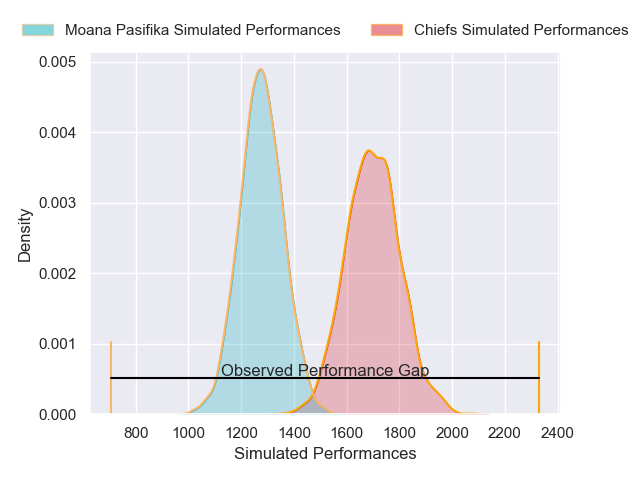
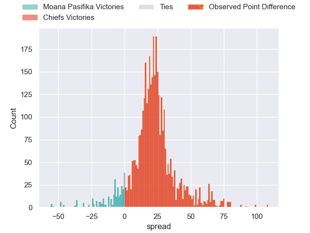
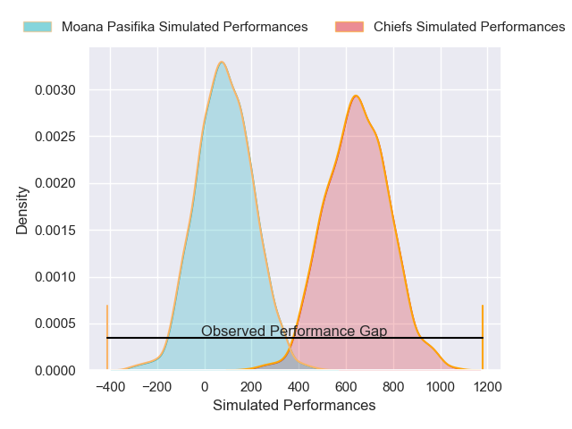
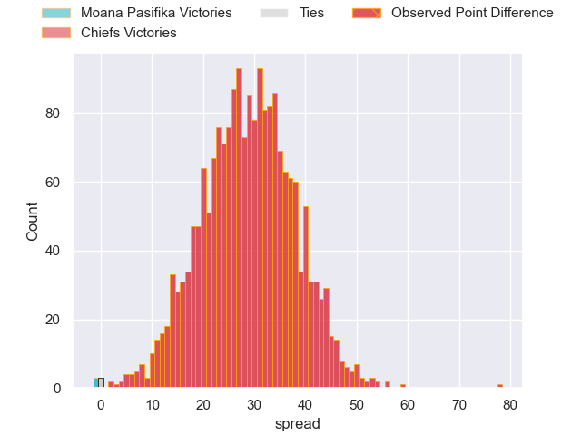

---  
layout: page  
title: Moana Pasifika at Chiefs; 7-85  
date: 2025-05-24 18:00:00 -0500  
categories: "Super Rugby Pacific 2025" match review  
---
# Moana Pasifika at Chiefs; 7-85

# Club Level Predictions

The first set of predictions treats a club as the smallest object, as the club develops its members, organizes a gameplan, and deploys its players as needed for each match. This club model has a prediction of 0.915, which translates to predicting Chiefs to win by 21.4.

Our Over/Under is 59.5 - and combined with the spread above, we have a predicted scoreline of 19 to 40

Each club has a rating and a rating deviation (similar to a Glicko rating), and expected performances can be generated. This allows for simulated matches and spreads like the ones below.
## Projected Performances - Club Model

## Projected Spreads - Club Model

## Projected Results - Club Model

# Player Level Predictions

Treating teams instead as an entity made up of the currently active players, I have ratings for each player in an altogether different system. These can be combined to form team ratings once teamsheets are announced, weighting starters a bit higher than the reserves. After the match is played, players can be weighted by their minutes on the field, allowing for an accurate measure of the team's composition. With these compiled team ratings, we can make predictions, measure inaccuracy, and update the individual player ratings.
## Prediction without Player Minutes: Chiefs by 27.4

Chiefs by 19.1 on a neutral pitch

## Projected Performances - Player Model

## Projected Spreads - Player Model

## Projected Results - Player Model

|   Away Minutes | Away Player           |   Away Percentile |   Number |   Home Percentile | Home Player         |   Home Minutes |
|---------------:|:----------------------|------------------:|---------:|------------------:|:--------------------|---------------:|
|             31 | Tito Tuipulotu        |             36.62 |        1 |             94.28 | Ollie Norris        |             80 |
|              3 | Mills Sanerivi        |             15.36 |        2 |             96.61 | Samisoni Taukei'aho |             68 |
|              0 | Feleti Sae-Ta'ufo'ou  |             28.2  |        3 |             93.69 | George Dyer         |             63 |
|             80 | Tom Savage            |             82    |        4 |             93.7  | Naitoa Ah Kuoi      |             80 |
|             21 | Sam Slade             |             11.1  |        5 |             91.3  | Tupou Vaa'i         |             59 |
|             80 | Miracle Faiilagi      |             66.01 |        6 |             88.4  | Simon Parker        |             80 |
|             34 | Ardie Savea           |             98.61 |        7 |             94.55 | Luke Jacobson       |             21 |
|             24 | Semisi Tupou Ta'eiloa |             73.53 |        8 |             81.62 | Wallace Sititi      |             68 |
|             16 | Jonathan Taumateine   |             40.81 |        9 |             82.9  | Cortez Ratima       |             34 |
|             48 | Patrick Pellegrini    |             68.18 |       10 |             95.45 | Damian McKenzie     |             21 |
|              0 | Solomon Alaimalo      |             80.29 |       11 |             51.26 | Leroy Carter        |             46 |
|             80 | Danny Toala           |              6.2  |       12 |             95.79 | Quinn Tupaea        |             40 |
|             80 | Lalomilo Lalomilo     |             56.26 |       13 |             91.38 | Daniel Rona         |             54 |
|             80 | Kyren Taumoefolau     |             20.1  |       14 |             94.17 | Emoni Narawa        |             52 |
|             48 | Tevita Ofa            |             20.97 |       15 |             89.85 | Shaun Stevenson     |             80 |
|             16 | Samiuela Moli         |              0.18 |       16 |             86.61 | Brodie McAlister    |             80 |
|             56 | Abraham Pole          |             15.15 |       17 |             99.16 | Aidan Ross          |             62 |
|             80 | Chris Apoua           |              2.27 |       18 |             30.3  | Reuben O'Neill      |             80 |
|             64 | Allan Craig           |              3.8  |       19 |             76.7  | Josh Lord           |             78 |
|             20 | Ola Tauelangi         |             20.32 |       20 |             93.46 | Samipeni Finau      |             48 |
|             59 | Melani Matavao        |             57.9  |       21 |             51.65 | Xavier Roe          |             48 |
|             20 | Jackson Garden-Bachop |              4.55 |       22 |             83.33 | Josh Jacomb         |             80 |
|             80 | Julian Savea          |             98.54 |       23 |             72.45 | Gideon Wrampling    |             80 |

