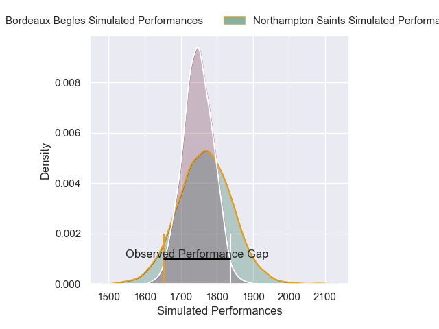
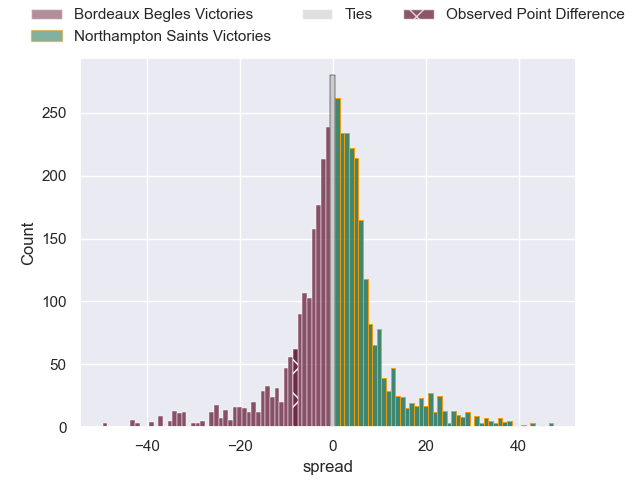
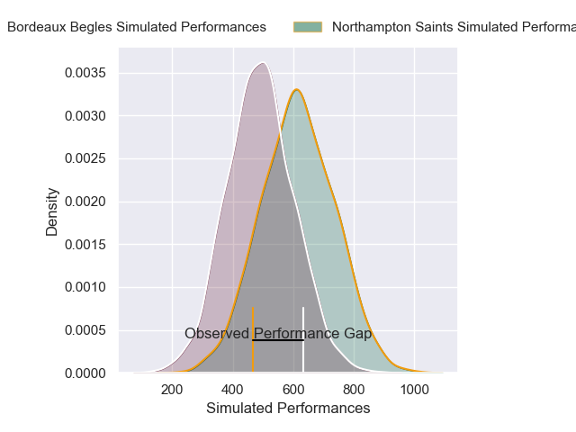
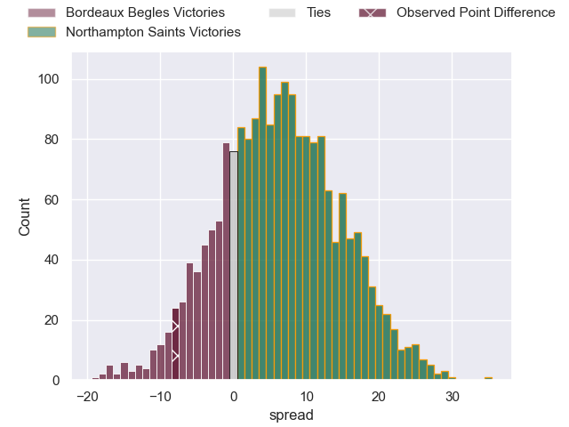
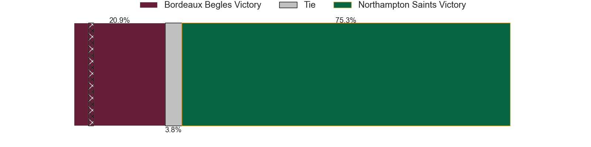

---  
layout: page  
title: Bordeaux Begles at Northampton Saints; 28-20  
date: 2025-05-24 18:00:00 -0500  
categories: "European Rugby Champions Cup 24/25" match review  
---
# Bordeaux Begles at Northampton Saints; 28-20

# Club Level Predictions

The first set of predictions treats a club as the smallest object, as the club develops its members, organizes a gameplan, and deploys its players as needed for each match. This club model has a prediction of 0.527, which translates to predicting Northampton Saints to win by 0.9.

Our Over/Under is 58.5 - and combined with the spread above, we have a predicted scoreline of 29 to 30

Each club has a rating and a rating deviation (similar to a Glicko rating), and expected performances can be generated. This allows for simulated matches and spreads like the ones below.
## Projected Performances - Club Model

## Projected Spreads - Club Model

## Projected Results - Club Model

# Player Level Predictions

Treating teams instead as an entity made up of the currently active players, I have ratings for each player in an altogether different system. These can be combined to form team ratings once teamsheets are announced, weighting starters a bit higher than the reserves. After the match is played, players can be weighted by their minutes on the field, allowing for an accurate measure of the team's composition. With these compiled team ratings, we can make predictions, measure inaccuracy, and update the individual player ratings.
## Prediction without Player Minutes: Northampton Saints by 2.6

Bordeaux Begles by 12.5 on a neutral pitch

## Projected Performances - Player Model

## Projected Spreads - Player Model

## Projected Results - Player Model

|   Away Minutes | Away Player               |   Away Percentile |   Number |   Home Percentile | Home Player         |   Home Minutes |
|---------------:|:--------------------------|------------------:|---------:|------------------:|:--------------------|---------------:|
|             80 | Jefferson Poirot          |             90.99 |        1 |             19.53 | Emmanuel Iyogun     |             50 |
|             23 | Maxime Lamothe            |             31.43 |        2 |             84.64 | Curtis Langdon      |             63 |
|             23 | Maxime Lamothe            |             31.43 |        2 |             84.64 | Curtis Langdon      |             80 |
|             70 | Sipili Falatea            |             93.18 |        3 |              0.34 | Trevor Davison      |             80 |
|             74 | Adam Coleman              |             99.3  |        4 |             97.6  | Temo Mayanavanua    |             80 |
|             80 | Cyril Cazeaux             |             95.8  |        5 |             16.1  | Tom Lockett         |             80 |
|             16 | Mahamadou Diaby           |             74.93 |        6 |              7.53 | Alex Coles          |             14 |
|             51 | Guido Petti               |             86.62 |        7 |              3.17 | Josh Kemeny         |             35 |
|              4 | Pete Samu                 |             91.54 |        8 |             93.75 | Henry Pollock       |             27 |
|             40 | Maxime Lucu               |             99.45 |        9 |             96.51 | Alex Mitchell       |             33 |
|             50 | Matthieu Jalibert         |             96.97 |       10 |             54.55 | Fin Smith           |             40 |
|             40 | Louis Bielle-Biarrey      |             85.05 |       11 |             22.72 | James Ramm          |             80 |
|             80 | Yoram Moefana             |             92.53 |       12 |             75.18 | Rory Hutchinson     |             80 |
|             35 | Nicolas Depoortere        |             90.96 |       13 |             74.13 | Fraser Dingwall     |             29 |
|             19 | Damian Penaud             |             96.5  |       14 |             95.92 | Tommy Freeman       |             27 |
|             40 | Romain Buros              |             98.9  |       15 |             97.57 | George Furbank      |             29 |
|             30 | Connor Sa                 |             33.21 |       16 |            nan    | Craig Wright        |             45 |
|             30 | Ugo Boniface              |             93.77 |       17 |             79.46 | Tarek Haffar        |             27 |
|             80 | Ben Tameifuna             |             96.72 |       18 |             90.24 | Elliot Millar Mills |             40 |
|             40 | Pierre Bochaton           |             86.12 |       19 |             62.6  | Ed Prowse           |             24 |
|             40 | Bastien Vergnes Taillefer |             85.43 |       20 |             33.82 | Angus Scott-Young   |             40 |
|             40 | Marko Gazzotti            |             71.32 |       21 |             67.1  | Tom James           |             80 |
|             40 | Arthur Retiere            |             97.77 |       22 |             66.67 | Tom Litchfield      |             40 |
|             16 | Rohan Janse van Rensburg  |             87.7  |       23 |             94.56 | Ollie Sleightholme  |             80 |

