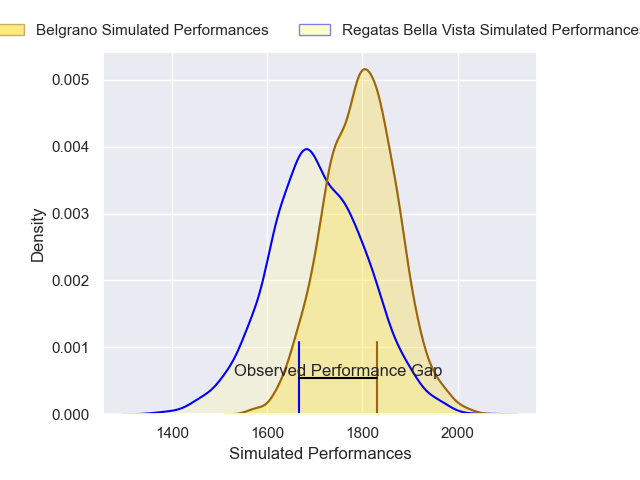
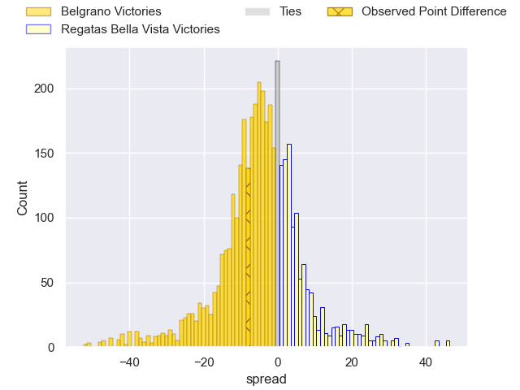
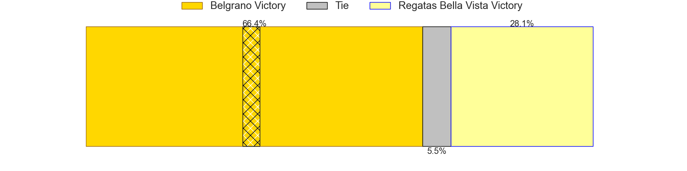
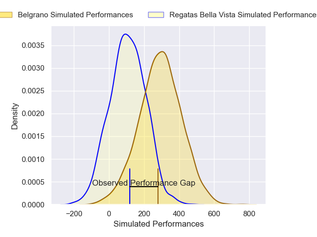
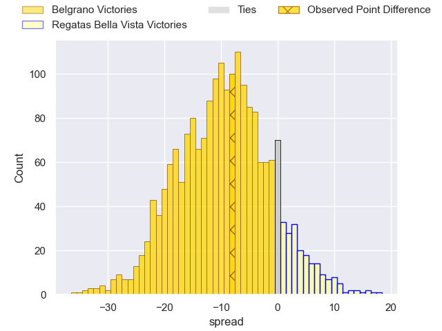
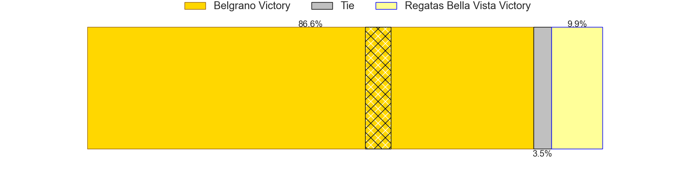

---  
layout: page  
title: Belgrano at Regatas Bella Vista; 29-21  
date: 2025-05-24 18:00:00 -0500  
categories: "URBA Top 13 2025" match review  
---
# Belgrano at Regatas Bella Vista; 29-21

# Club Level Predictions

The first set of predictions treats a club as the smallest object, as the club develops its members, organizes a gameplan, and deploys its players as needed for each match. This club model has a prediction of 0.373, which translates to predicting Belgrano to win by 4.6.

Our Over/Under is 52.5 - and combined with the spread above, we have a predicted scoreline of 28 to 24

Each club has a rating and a rating deviation (similar to a Glicko rating), and expected performances can be generated. This allows for simulated matches and spreads like the ones below.
## Projected Performances - Club Model

## Projected Spreads - Club Model

## Projected Results - Club Model

# Player Level Predictions

Treating teams instead as an entity made up of the currently active players, I have ratings for each player in an altogether different system. These can be combined to form team ratings once teamsheets are announced, weighting starters a bit higher than the reserves. After the match is played, players can be weighted by their minutes on the field, allowing for an accurate measure of the team's composition. With these compiled team ratings, we can make predictions, measure inaccuracy, and update the individual player ratings.
## Prediction without Player Minutes: Belgrano by 11.5

Belgrano by 16.9 on a neutral pitch

## Projected Performances - Player Model

## Projected Spreads - Player Model

## Projected Results - Player Model

|   Away Minutes | Away Player            |   Away Percentile |   Number |   Home Percentile | Home Player           |   Home Minutes |
|---------------:|:-----------------------|------------------:|---------:|------------------:|:----------------------|---------------:|
|             80 | Francisco Ferronato    |             96.89 |        1 |              9.43 | Tomas Barbaccia       |             80 |
|             25 | Francisco Lusarreta    |             77.5  |        2 |             25    | Marcos Camerlinckx    |             44 |
|             62 | Lisandro Garcia Dragui |             77.95 |        3 |             12.54 | Juan Gobet            |             51 |
|             19 | Mateo Gasparotti       |             72.7  |        4 |             19.5  | Valentin Sanguinetti  |             61 |
|             55 | Ramon Duggan           |             56.8  |        5 |             15.3  | Tomas Sanguinetti     |             80 |
|             19 | Augusto Vaccarino      |             88.31 |        6 |             10.6  | Lucas Gobet           |             12 |
|             80 | Julian Rebusone        |             83.45 |        7 |             26.16 | Marcos Ferro          |             34 |
|             34 | Franco Vega            |             90.07 |        8 |             48.16 | Agustin Garcia Campos |              0 |
|             80 | Theo Blaksley          |             62.5  |        9 |             10.66 | Marcos Joseph         |             60 |
|             49 | Joaquin Mihura         |             69.48 |       10 |             10.17 | Mateo Camerlinckx     |             29 |
|             80 | Ignacio Diaz           |             85.63 |       11 |             11.94 | Enrique Camerlinckx   |              6 |
|             71 | Santiago Ruzzante      |             46.37 |       12 |             42.17 | Juan Corso            |             29 |
|             52 | Tomas Etchepare        |             86.12 |       13 |             10.2  | Alejo Barrera         |              6 |
|             80 | Pedro Arana            |             59.61 |       14 |             23.59 | Francisco Pisani      |             40 |
|             80 | Juan Lando             |             94.48 |       15 |             17.22 | Cruz Camerlinckx      |              0 |
|             34 | Away Team 16           |            nan    |       16 |            nan    | Home Team 16          |             55 |
|             25 | Away Team 17           |            nan    |       17 |            nan    | Home Team 17          |             25 |
|             31 | Away Team 18           |            nan    |       18 |            nan    | Home Team 18          |             29 |
|             26 | Away Team 19           |            nan    |       19 |            nan    | Home Team 19          |             29 |
|             31 | Away Team 20           |            nan    |       20 |            nan    | Home Team 20          |             80 |
|             17 | Away Team 21           |            nan    |       21 |            nan    | Home Team 21          |             50 |
|             47 | Away Team 22           |            nan    |       22 |            nan    | Home Team 22          |             21 |
|             55 | Away Team 23           |            nan    |       23 |            nan    | Home Team 23          |             80 |

