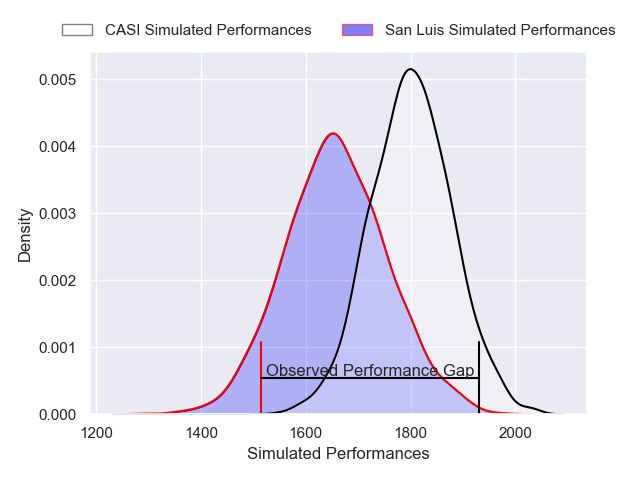
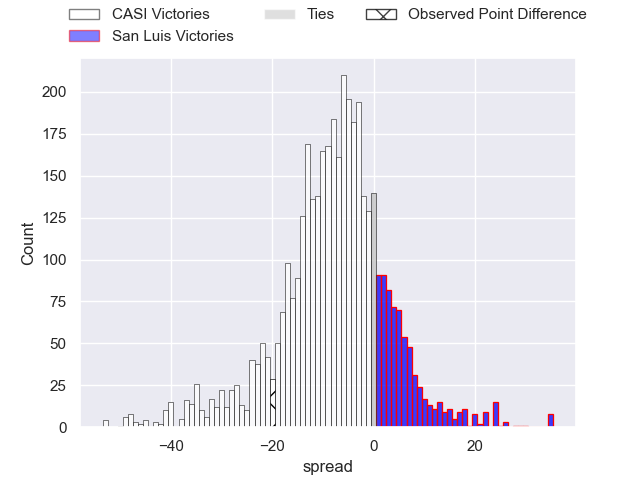
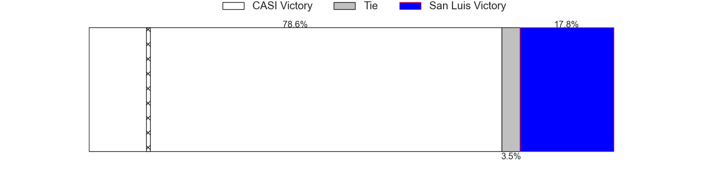
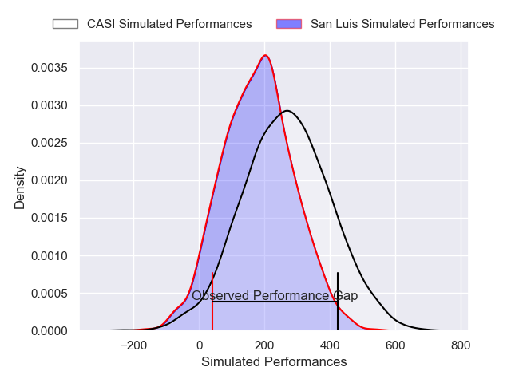
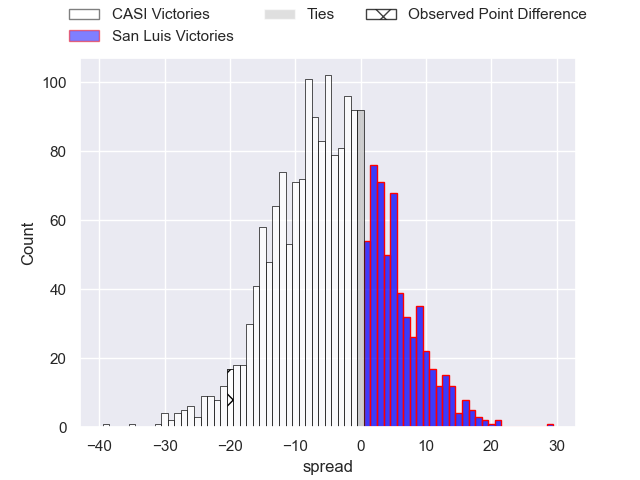
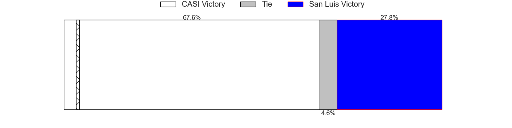

---  
layout: page  
title: CASI at San Luis; 37-17  
date: 2025-05-24 18:00:00 -0500  
categories: "URBA Top 13 2025" match review  
---
# CASI at San Luis; 37-17

# Club Level Predictions

The first set of predictions treats a club as the smallest object, as the club develops its members, organizes a gameplan, and deploys its players as needed for each match. This club model has a prediction of 0.312, which translates to predicting CASI to win by 7.1.

Our Over/Under is 73.5 - and combined with the spread above, we have a predicted scoreline of 40 to 33

Each club has a rating and a rating deviation (similar to a Glicko rating), and expected performances can be generated. This allows for simulated matches and spreads like the ones below.
## Projected Performances - Club Model

## Projected Spreads - Club Model

## Projected Results - Club Model

# Player Level Predictions

Treating teams instead as an entity made up of the currently active players, I have ratings for each player in an altogether different system. These can be combined to form team ratings once teamsheets are announced, weighting starters a bit higher than the reserves. After the match is played, players can be weighted by their minutes on the field, allowing for an accurate measure of the team's composition. With these compiled team ratings, we can make predictions, measure inaccuracy, and update the individual player ratings.
## Prediction without Player Minutes: CASI by 2.9

CASI by 9.2 on a neutral pitch

## Projected Performances - Player Model

## Projected Spreads - Player Model

## Projected Results - Player Model

|   Away Minutes | Away Player           |   Away Percentile |   Number |   Home Percentile | Home Player                |   Home Minutes |
|---------------:|:----------------------|------------------:|---------:|------------------:|:---------------------------|---------------:|
|             10 | Facundo Scaiano       |             69.36 |        1 |             14.65 | Alejo Garcia               |             67 |
|             46 | Juan Torres Obeid     |             89.64 |        2 |             41.43 | Agustin Fitzsimons Herrera |             24 |
|             80 | Juan Ignacio Rizzutti |             65.57 |        3 |             66.41 | Alexis Uvieda              |             30 |
|             80 | Salvador Ochoa        |             84.8  |        4 |             27.7  | Martin Etchanchu           |             16 |
|             46 | Ignacio Larrague      |             60.5  |        5 |             39    | Santiago Canal             |             29 |
|             19 | Ignacio Torrado       |             68.98 |        6 |             23.79 | Marco Morimanno            |              0 |
|             15 | Eugenio Sartori       |             91.38 |        7 |             22.79 | Matias Perissinotto        |             30 |
|             30 | Luis Briatore         |             80.51 |        8 |             47.06 | Agustin Torello            |             24 |
|              3 | Joaquin Sanchez       |             46.32 |        9 |             14.34 | Martin Aereboe             |             80 |
|             46 | Felipe Hileman        |             80.3  |       10 |             18.4  | Valentino Quattrocchi      |             15 |
|             61 | Tomas Phelan          |             73.69 |       11 |             15.73 | Felipe Hernandez           |             80 |
|             80 | Bruno Devoto          |             84.65 |       12 |             11.36 | Segundo Galan              |             58 |
|             80 | Benjamin Belaga       |             76.45 |       13 |             17.46 | Facundo Gibert             |             80 |
|             30 | Jeronimo Tumbarello   |             82.33 |       14 |             30.1  | Facundo Cuccolo            |             69 |
|             80 | Juan Akemeier         |             84.33 |       15 |             56.29 | Felipe Crispo              |             63 |
|             12 | Away Team 16          |            nan    |       16 |            nan    | Home Team 16               |             56 |
|             80 | Away Team 17          |            nan    |       17 |            nan    | Home Team 17               |             80 |
|             80 | Away Team 18          |            nan    |       18 |            nan    | Home Team 18               |             80 |
|             55 | Away Team 19          |            nan    |       19 |            nan    | Home Team 19               |             11 |
|             64 | Away Team 20          |            nan    |       20 |            nan    | Home Team 20               |             27 |
|             80 | Away Team 21          |            nan    |       21 |            nan    | Home Team 21               |             53 |
|             80 | Away Team 22          |            nan    |       22 |            nan    | Home Team 22               |             53 |
|             49 | Away Team 23          |            nan    |       23 |            nan    | Home Team 23               |             33 |

