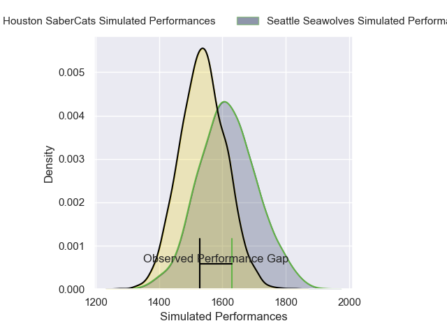
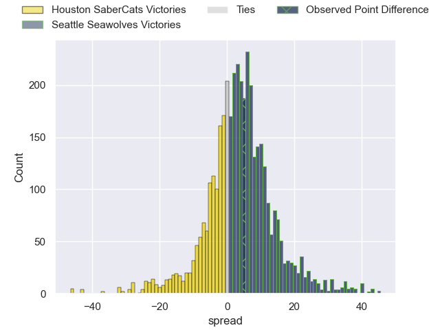
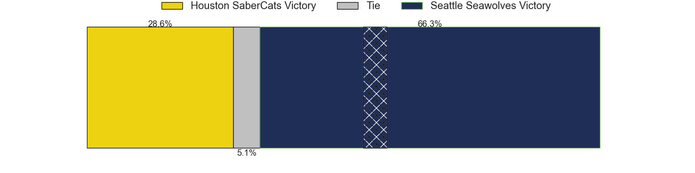
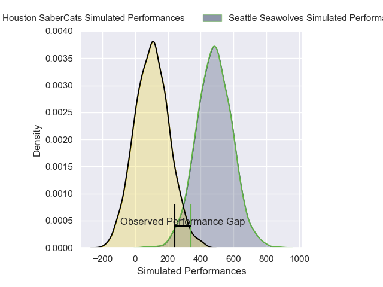
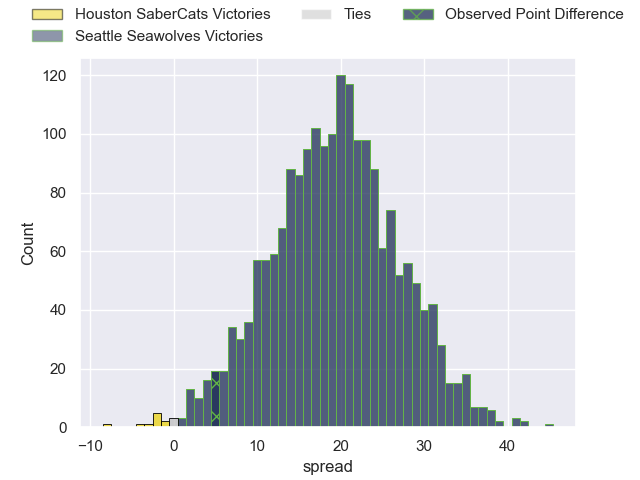
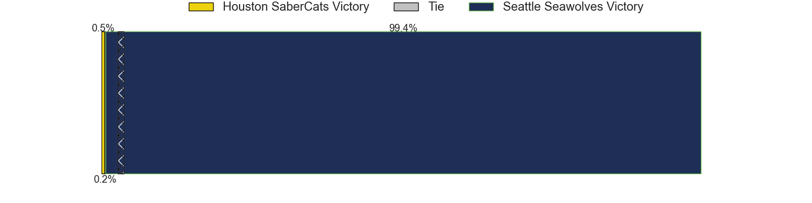

---  
layout: page  
title: Houston SaberCats at Seattle Seawolves; 9-14  
date: 2025-05-24 18:00:00 -0500  
categories: "Major League Rugby 2025" match review  
---
# Houston SaberCats at Seattle Seawolves; 9-14

# Club Level Predictions

The first set of predictions treats a club as the smallest object, as the club develops its members, organizes a gameplan, and deploys its players as needed for each match. This club model has a prediction of 0.603, which translates to predicting Seattle Seawolves to win by 3.7.

Our Over/Under is 75.5 - and combined with the spread above, we have a predicted scoreline of 36 to 40

Each club has a rating and a rating deviation (similar to a Glicko rating), and expected performances can be generated. This allows for simulated matches and spreads like the ones below.
## Projected Performances - Club Model

## Projected Spreads - Club Model

## Projected Results - Club Model

# Player Level Predictions

Treating teams instead as an entity made up of the currently active players, I have ratings for each player in an altogether different system. These can be combined to form team ratings once teamsheets are announced, weighting starters a bit higher than the reserves. After the match is played, players can be weighted by their minutes on the field, allowing for an accurate measure of the team's composition. With these compiled team ratings, we can make predictions, measure inaccuracy, and update the individual player ratings.
## Prediction without Player Minutes: Seattle Seawolves by 13.6

Seattle Seawolves by 10.0 on a neutral pitch

## Projected Performances - Player Model

## Projected Spreads - Player Model

## Projected Results - Player Model

|   Away Minutes | Away Player      |   Away Percentile |   Number |   Home Percentile | Home Player       |   Home Minutes |
|---------------:|:-----------------|------------------:|---------:|------------------:|:------------------|---------------:|
|             71 | LaRome White     |             27.36 |        1 |             60.27 | Cameron Orr       |             32 |
|             28 | Pita Anae Ah-Sue |             91.25 |        2 |             57.32 | Kerron van Vuuren |             25 |
|             80 | Pono Davis       |             77.78 |        3 |             29.63 | Juan Pablo Zeiss  |             63 |
|              5 | Justin Basson    |             97.2  |        4 |             36.6  | Siaosi Mahoni     |             27 |
|             80 | Nathan Den Hoedt |             58.8  |        5 |             81.1  | Rhyno Herbst      |             60 |
|             80 | Nathan Den Hoedt |             58.8  |        5 |             81.1  | Rhyno Herbst      |             80 |
|             80 | Nathan Den Hoedt |             58.8  |        5 |             81.1  | Rhyno Herbst      |             40 |
|             80 | Keni Nasoqeqe    |             87.51 |        6 |             83.85 | Riekert Hattingh  |             59 |
|             32 | Johan Momsen     |              4.16 |        7 |             78.69 | Charles Elton     |             17 |
|             32 | Tinashe Muchena  |             72.43 |        8 |             91.73 | OJ Noa            |             53 |
|             17 | Jay Renton       |              2.76 |        9 |              1.84 | Nick Boyer        |             80 |
|             56 | AJ Alatimu       |             72.08 |       10 |             12.55 | Rod Iona          |             12 |
|             49 | Juan-Dee Oliver  |             89.71 |       11 |             91.65 | Toni Pulu         |             28 |
|             80 | Sam Hill         |             95.16 |       12 |             25.45 | Dan Kriel         |             32 |
|             80 | Tautalatasi Tasi |             84.44 |       13 |              6.73 | Divan Rossouw     |             18 |
|             80 | Rufus McLean     |             54.17 |       14 |             11.75 | Mika Kruse        |             32 |
|             31 | Drew Wild        |             29.14 |       15 |             91.61 | Duncan Matthews   |             75 |

