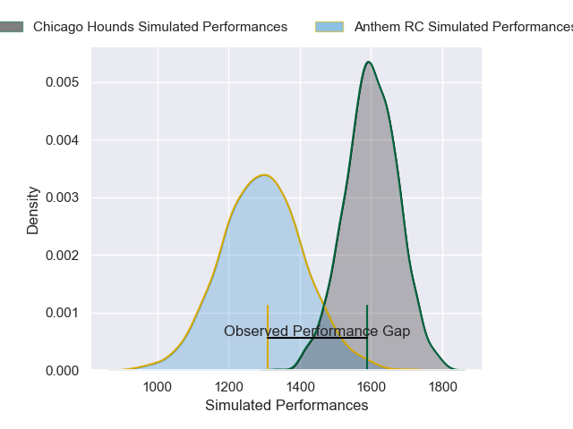
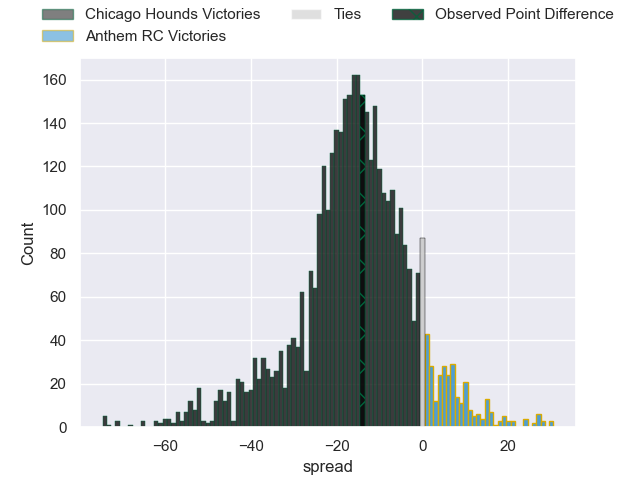
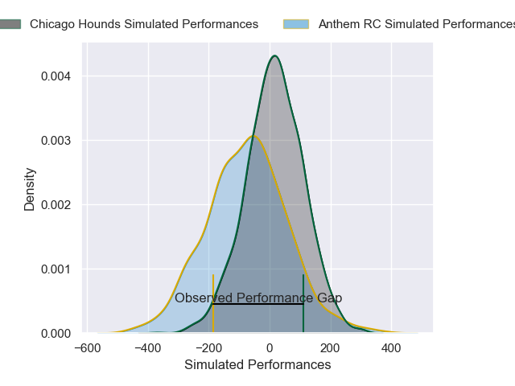
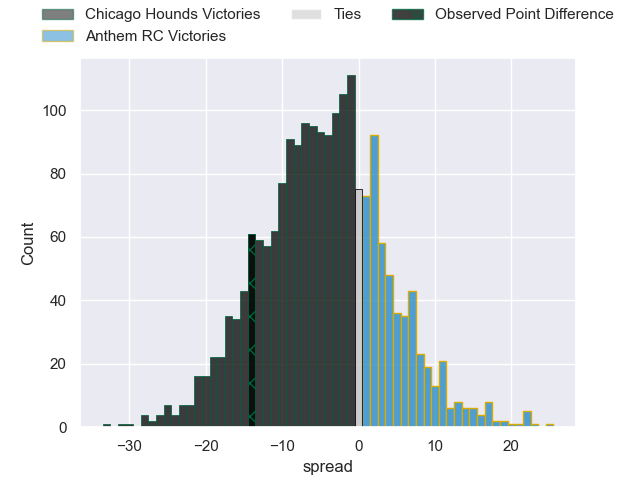

---  
layout: page  
title: Chicago Hounds at Anthem RC; 33-19  
date: 2025-05-25 18:00:00 -0500  
categories: "Major League Rugby 2025" match review  
---
# Chicago Hounds at Anthem RC; 33-19

# Club Level Predictions

The first set of predictions treats a club as the smallest object, as the club develops its members, organizes a gameplan, and deploys its players as needed for each match. This club model has a prediction of 0.151, which translates to predicting Chicago Hounds to win by 15.4.

Our Over/Under is 63.5 - and combined with the spread above, we have a predicted scoreline of 39 to 24

Each club has a rating and a rating deviation (similar to a Glicko rating), and expected performances can be generated. This allows for simulated matches and spreads like the ones below.
## Projected Performances - Club Model

## Projected Spreads - Club Model

## Projected Results - Club Model

# Player Level Predictions

Treating teams instead as an entity made up of the currently active players, I have ratings for each player in an altogether different system. These can be combined to form team ratings once teamsheets are announced, weighting starters a bit higher than the reserves. After the match is played, players can be weighted by their minutes on the field, allowing for an accurate measure of the team's composition. With these compiled team ratings, we can make predictions, measure inaccuracy, and update the individual player ratings.
## Prediction without Player Minutes: Chicago Hounds by 8.6

Chicago Hounds by 11.0 on a neutral pitch

## Projected Performances - Player Model

## Projected Spreads - Player Model

## Projected Results - Player Model

|   Away Minutes | Away Player            |   Away Percentile |   Number |   Home Percentile | Home Player              |   Home Minutes |
|---------------:|:-----------------------|------------------:|---------:|------------------:|:-------------------------|---------------:|
|             25 | Faka'osi Pifeleti      |             89.06 |        1 |              2.36 | Jake Turnbull            |           55   |
|              6 | Dylan Fawsitt          |             95.54 |        2 |              0.89 | Connor Robinson          |           80   |
|             21 | Charlie Abel           |             30.22 |        3 |              9.85 | Alexandre Hernandez      |           80   |
|             16 | James Scott            |             87.7  |        4 |             19.3  | Sam Golla                |           80   |
|             74 | Hamish Bain            |             68.6  |        5 |              6.4  | Mikey Grandy             |           64   |
|             53 | Tavius Sykora-Matthess |             48.36 |        6 |             12.98 | Alejandro Martinez Tapia |           80   |
|             51 | Maclean Jones          |             33.89 |        7 |             25.87 | Makeen Alikhan           |           66   |
|             53 | Lucas Rumball          |             10.29 |        8 |             31.07 | Graeme Pedegana          |           80   |
|             25 | Jason Higgins          |             24.82 |        9 |             13.79 | Karl Keane               |           55   |
|             80 | Chris Hilsenbeck       |              6.28 |       10 |             19.91 | Cam Gerlach              |           66   |
|             64 | Peyton Wall            |             55.15 |       11 |              2.23 | Toby Fricker             |           80   |
|             80 | Noah Flesch            |             54.26 |       12 |              2.1  | Junior Gafa              |           64   |
|             59 | Bryce Campbell         |             88.43 |       13 |              2.73 | Erich Storti             |           55   |
|             59 | Bryce Campbell         |             88.43 |       13 |              2.73 | Erich Storti             |           80   |
|             59 | Bryce Campbell         |             88.43 |       13 |              2.73 | Erich Storti             |           35.5 |
|             25 | Noah Brown             |             94.37 |       14 |             30.97 | Corbin Smith             |           25   |
|             80 | Tim Swiel              |              8.61 |       15 |             78.37 | Mitch Wilson             |           55   |

