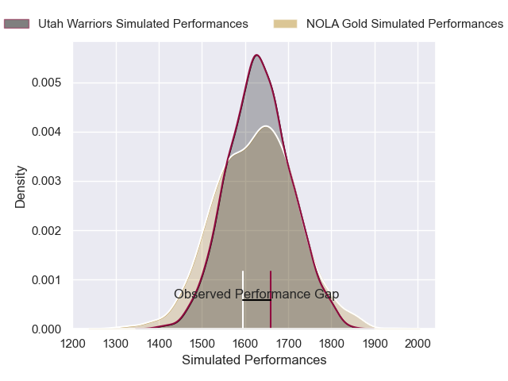
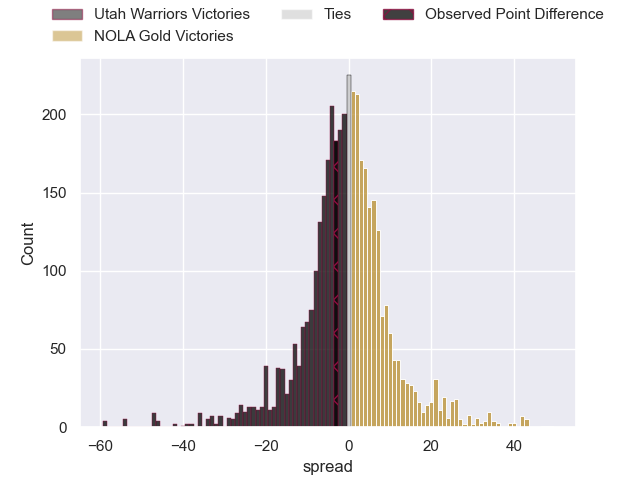
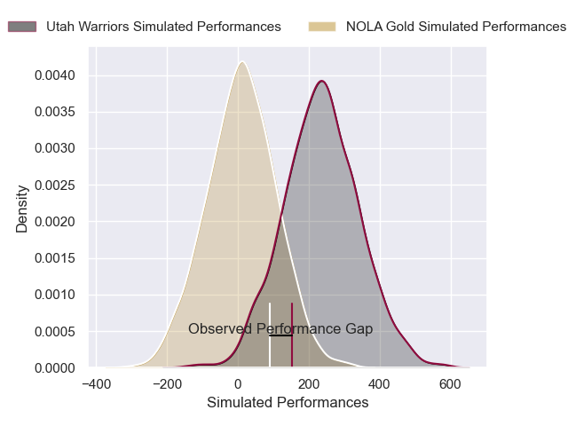
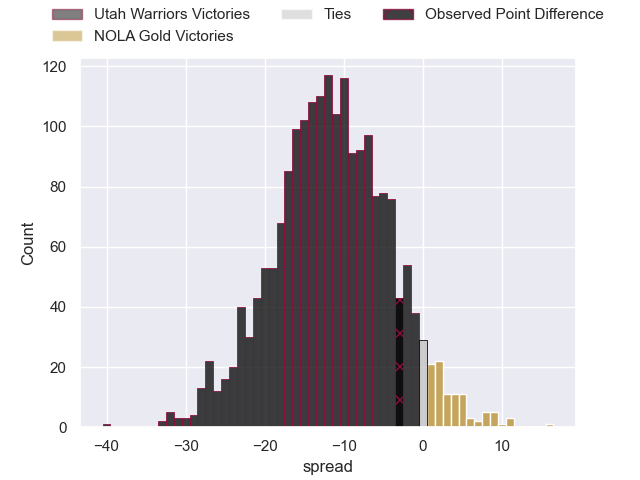

---  
layout: page  
title: Utah Warriors at NOLA Gold; 31-28  
date: 2025-05-25 18:00:00 -0500  
categories: "Major League Rugby 2025" match review  
---
# Utah Warriors at NOLA Gold; 31-28

# Club Level Predictions

The first set of predictions treats a club as the smallest object, as the club develops its members, organizes a gameplan, and deploys its players as needed for each match. This club model has a prediction of 0.485, which translates to predicting Utah Warriors to win by 0.5.

Our Over/Under is 68.5 - and combined with the spread above, we have a predicted scoreline of 35 to 34

Each club has a rating and a rating deviation (similar to a Glicko rating), and expected performances can be generated. This allows for simulated matches and spreads like the ones below.
## Projected Performances - Club Model

## Projected Spreads - Club Model

## Projected Results - Club Model

# Player Level Predictions

Treating teams instead as an entity made up of the currently active players, I have ratings for each player in an altogether different system. These can be combined to form team ratings once teamsheets are announced, weighting starters a bit higher than the reserves. After the match is played, players can be weighted by their minutes on the field, allowing for an accurate measure of the team's composition. With these compiled team ratings, we can make predictions, measure inaccuracy, and update the individual player ratings.
## Prediction without Player Minutes: Utah Warriors by 18.0

Utah Warriors by 21.4 on a neutral pitch

## Projected Performances - Player Model

## Projected Spreads - Player Model

## Projected Results - Player Model

|   Away Minutes | Away Player      |   Away Percentile |   Number |   Home Percentile | Home Player     |   Home Minutes |
|---------------:|:-----------------|------------------:|---------:|------------------:|:----------------|---------------:|
|             80 | Aki Seiuli       |             75.67 |        1 |             29.97 | Matthew Harmon  |             80 |
|             80 | Liam Coltman     |             90.54 |        2 |             46.07 | Alex Lopeti     |             80 |
|             32 | Tonga Kofe       |             81.06 |        3 |              5.22 | Paul Mullen     |             18 |
|             32 | Tonga Kofe       |             81.06 |        3 |              5.22 | Paul Mullen     |             27 |
|             32 | Tonga Kofe       |             81.06 |        3 |              5.22 | Paul Mullen     |             29 |
|             80 | Frank Lochore    |             70.9  |        4 |             44.4  | Chase Jones     |             19 |
|             11 | Matt Jensen      |             31.5  |        5 |             58.2  | Jay Tuivaiti    |             26 |
|              8 | Bailey Wilson    |             71.85 |        6 |              7.43 | Cam Dolan       |             27 |
|             40 | Kalisi Moli      |             33.7  |        7 |              5.65 | Moni Tonga'uiha |             17 |
|             35 | Dylan Nel        |             96.32 |        8 |             74.08 | Jonah Mau'u     |             45 |
|             80 | Zion Going       |             85.11 |        9 |              4.6  | Luke Campbell   |             31 |
|             40 | Joel Hodgson     |             22.73 |       10 |              4.11 | Luke Carty      |             40 |
|             80 | Joe Mano         |             91.26 |       11 |             78.93 | Ed Fidow        |             80 |
|             49 | Paul Lasike      |             12.83 |       12 |              2.63 | Nikolai Foliaki |             59 |
|             80 | Cole Semu        |             44.58 |       13 |              3.58 | Isaac Te Tamaki |             53 |
|             68 | Nolan Tuamoheloa |              5.24 |       14 |              6.02 | Harley Wheeler  |             80 |
|             80 | Nic Benn         |             75.28 |       15 |              6.62 | Cooper Coats    |             69 |

