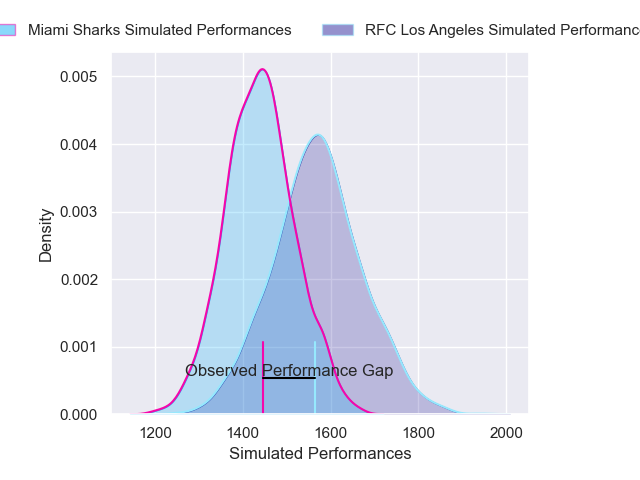
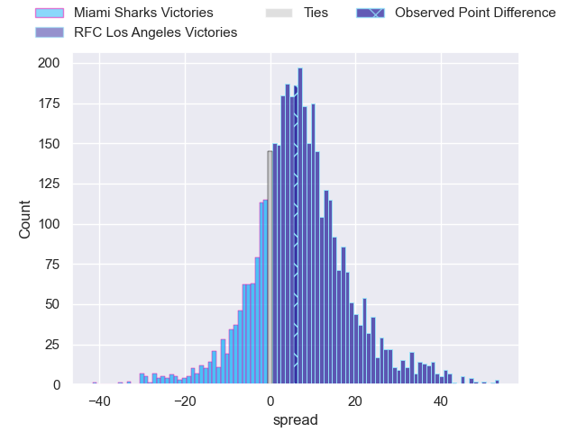
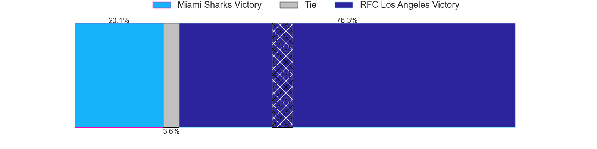
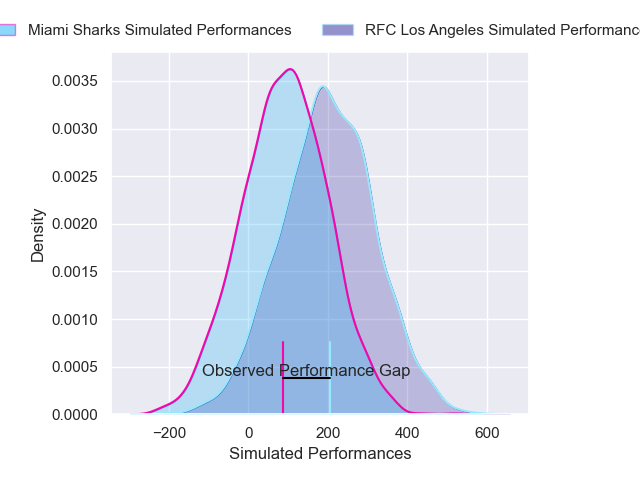
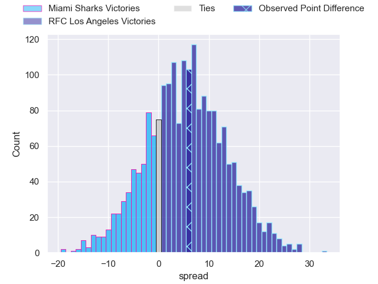
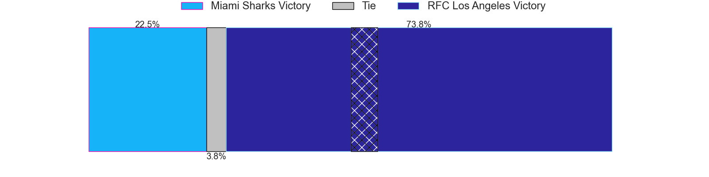

---  
layout: page  
title: Miami Sharks at RFC Los Angeles; 20-26  
date: 2025-05-26 18:00:00 -0500  
categories: "Major League Rugby 2025" match review  
---
# Miami Sharks at RFC Los Angeles; 20-26

# Club Level Predictions

The first set of predictions treats a club as the smallest object, as the club develops its members, organizes a gameplan, and deploys its players as needed for each match. This club model has a prediction of 0.676, which translates to predicting RFC Los Angeles to win by 6.6.

Our Over/Under is 83.5 - and combined with the spread above, we have a predicted scoreline of 39 to 45

Each club has a rating and a rating deviation (similar to a Glicko rating), and expected performances can be generated. This allows for simulated matches and spreads like the ones below.
## Projected Performances - Club Model

## Projected Spreads - Club Model

## Projected Results - Club Model

# Player Level Predictions

Treating teams instead as an entity made up of the currently active players, I have ratings for each player in an altogether different system. These can be combined to form team ratings once teamsheets are announced, weighting starters a bit higher than the reserves. After the match is played, players can be weighted by their minutes on the field, allowing for an accurate measure of the team's composition. With these compiled team ratings, we can make predictions, measure inaccuracy, and update the individual player ratings.
## Prediction without Player Minutes: RFC Los Angeles by 1.7

Miami Sharks by 0.7 on a neutral pitch

## Projected Performances - Player Model

## Projected Spreads - Player Model

## Projected Results - Player Model

|   Away Minutes | Away Player      |   Away Percentile |   Number |   Home Percentile | Home Player           |   Home Minutes |
|---------------:|:-----------------|------------------:|---------:|------------------:|:----------------------|---------------:|
|           80   | Ma'ake Muti      |             15.99 |        1 |             55.98 | Alessandro Heaney     |             16 |
|           49   | Sean McNulty     |             29.46 |        2 |             13.93 | Ben Sugars            |             20 |
|           26   | Alec McDonnell   |             31.57 |        3 |             66.5  | Maliu Niuafe          |             26 |
|           80   | Tomas Casares    |             19.9  |        4 |              8.3  | Jason Damm            |             40 |
|           49   | Mauro Rebussone  |             72.4  |        5 |             91.8  | Jurie van Vuuren      |             23 |
|           62   | Tomas Bekerman   |             70.07 |        6 |              3.47 | Tim Anstee            |             31 |
|           57   | Benja Bonassoa   |             75.82 |        7 |              0.59 | Matt Heaton           |             54 |
|           80   | Marques Fuala'au |             76.65 |        8 |             97.98 | Semi Kunatani         |             80 |
|           55   | Tomas Inciarte   |             86.76 |        9 |             58.82 | Tas Smith             |             21 |
|           57   | Martin Elias     |             95.24 |       10 |             87.66 | Christian Leali'ifano |             80 |
|           60   | Josiah Morra     |             78.16 |       11 |              2.82 | Rory van Vugt         |             55 |
|           40   | Santiago Videla  |             74.45 |       12 |             96    | Bill Meakes           |             80 |
|           12   | Matias Orlando   |             11.78 |       13 |             54.99 | Nick Chan             |             60 |
|           28.5 | Tomas Malanos    |             82.14 |       14 |             76.12 | Andrew Coe            |             80 |
|           80   | Shane O'Leary    |              6.84 |       15 |             69.09 | Vaughen Isaacs        |             80 |
|           25   | Kirby Myhill     |             10    |       16 |             83.44 | Reece MacDonald       |             20 |
|           23   | Manuel Ardao     |              1.49 |       17 |             25.5  | Lucas Bur             |             80 |
|           23   | Tau Koloamatangi |              8.42 |       18 |            nan    | Franco van den Berg   |             25 |
|           28.5 | Tomas Cubilla    |             80.86 |       19 |             55.71 | Ben Strang            |             80 |
|           19   | Guiseppe du Toit |              7.05 |       20 |             90    | Reegan O'Gorman       |             67 |
|           25   | Rick Rose        |             37.5  |       21 |            nan    | Timmy Ohlwein         |             80 |
|           31   | Alex Tucci       |            nan    |       22 |            nan    | Matt Anticev          |             32 |
|           35.5 | Marcos Young     |             34.76 |       23 |            nan    | Danny Christensen     |             32 |

