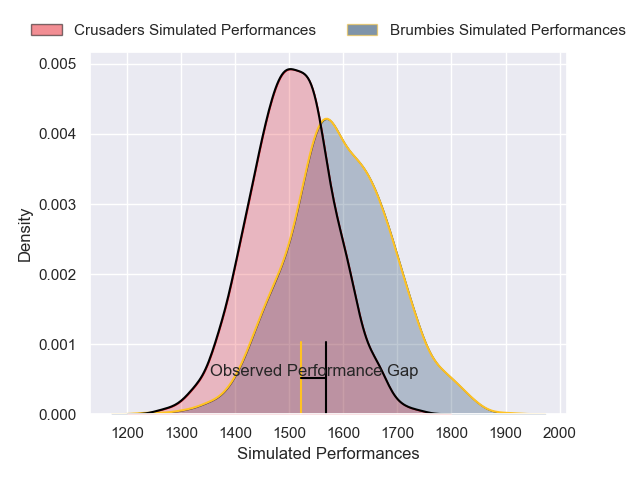
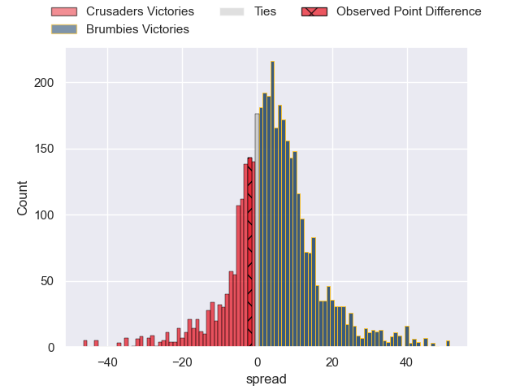
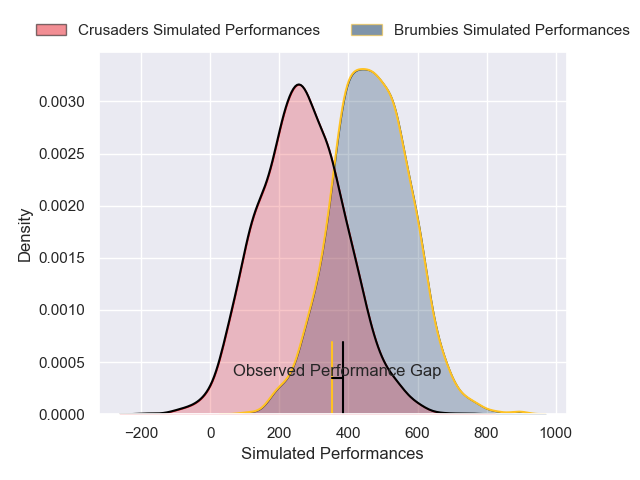
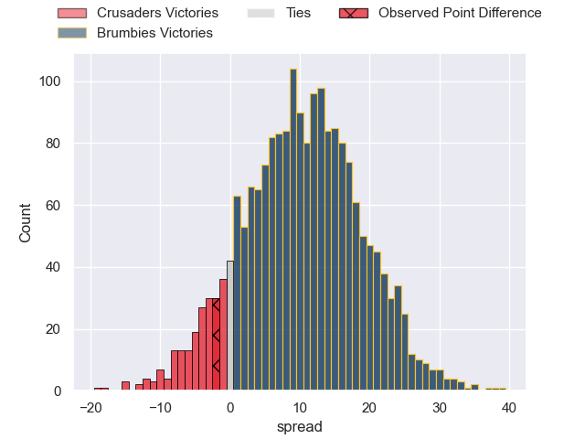

---  
layout: page  
title: Crusaders at Brumbies; 33-31  
date: 2025-05-30 18:00:00 -0500  
categories: "Super Rugby Pacific 2025" match review  
---
# Crusaders at Brumbies; 33-31

# Club Level Predictions

The first set of predictions treats a club as the smallest object, as the club develops its members, organizes a gameplan, and deploys its players as needed for each match. This club model has a prediction of 0.62, which translates to predicting Brumbies to win by 4.4.

Our Over/Under is 63.5 - and combined with the spread above, we have a predicted scoreline of 30 to 34

Each club has a rating and a rating deviation (similar to a Glicko rating), and expected performances can be generated. This allows for simulated matches and spreads like the ones below.
## Projected Performances - Club Model

## Projected Spreads - Club Model

## Projected Results - Club Model

# Player Level Predictions

Treating teams instead as an entity made up of the currently active players, I have ratings for each player in an altogether different system. These can be combined to form team ratings once teamsheets are announced, weighting starters a bit higher than the reserves. After the match is played, players can be weighted by their minutes on the field, allowing for an accurate measure of the team's composition. With these compiled team ratings, we can make predictions, measure inaccuracy, and update the individual player ratings.
## Prediction without Player Minutes: Brumbies by 10.2

Brumbies by 1.7 on a neutral pitch

## Projected Performances - Player Model

## Projected Spreads - Player Model

## Projected Results - Player Model

|   Away Minutes | Away Player          |   Away Percentile |   Number |   Home Percentile | Home Player         |   Home Minutes |
|---------------:|:---------------------|------------------:|---------:|------------------:|:--------------------|---------------:|
|             70 | George Bower         |             13.97 |        1 |             88.72 | James Slipper       |             47 |
|             70 | George Bower         |             13.97 |        1 |             88.72 | James Slipper       |             80 |
|             26 | Codie Taylor         |             98.21 |        2 |             71.43 | Billy Pollard       |             34 |
|             41 | Tamaiti Williams     |             93.1  |        3 |             39.98 | Feao Fotuaika       |             26 |
|             69 | Scott Barrett        |             95.4  |        4 |             46.2  | Nick Frost          |             30 |
|             62 | Antonio Shalfoon     |             18.9  |        5 |             71.2  | Tom Hooper          |             80 |
|              0 | Ethan Blackadder     |             97.72 |        6 |             96.93 | Rob Valetini        |             59 |
|             12 | Tom Christie         |             84.44 |        7 |             67.49 | Rory Scott          |             28 |
|             30 | Christian Lio-Willie |             53.49 |        8 |             58.09 | Tuaina Taii Tualima |             80 |
|             54 | Noah Hotham          |             84.74 |        9 |             78.68 | Ryan Lonergan       |             65 |
|             80 | Rivez Reihana        |              6.49 |       10 |             81.17 | Noah Lolesio        |             41 |
|             55 | Sevu Reece           |             85.24 |       11 |             40.58 | Corey Toole         |             80 |
|             75 | Dallas McLeod        |             60.57 |       12 |             26.71 | David Feliuai       |             30 |
|             80 | Levi Aumua           |             87.8  |       13 |             77.71 | Len Ikitau          |             27 |
|             18 | Chay Fihaki          |             23.4  |       14 |             94.27 | Andy Muirhead       |             61 |
|             80 | Johnny McNicholl     |             79.69 |       15 |             73.73 | Tom Wright          |             30 |
|             80 | George Bell          |             35.71 |       16 |            nan    | Lachlan Lonergan    |             56 |
|             15 | Lewis Ponini         |            nan    |       17 |            nan    | Lington Ieli        |             46 |
|             78 | Seb Calder           |            nan    |       18 |            nan    | Rhys Van Nek        |             52 |
|             34 | Tahlor Cahill        |            nan    |       19 |            nan    | Lachlan Shaw        |             64 |
|             50 | Corey Kellow         |             62.04 |       20 |            nan    | Luke Reimer         |             30 |
|             68 | Kyle Preston         |             56.8  |       21 |            nan    | Harrison Goddard    |             39 |
|             80 | James O'Connor       |            nan    |       22 |            nan    | Declan Meredith     |             33 |
|             65 | Braydon Ennor        |             87.59 |       23 |            nan    | Ollie Sapsford      |             16 |

