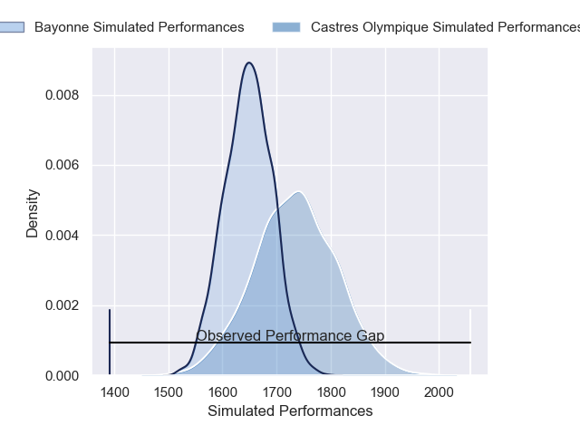
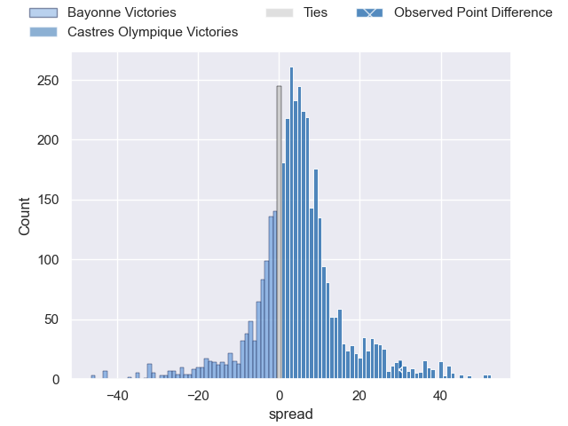
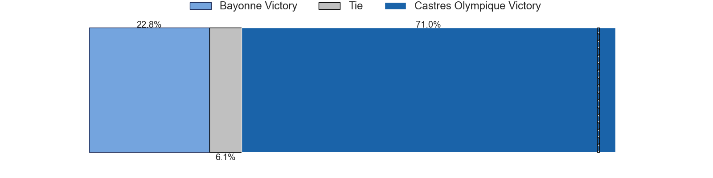
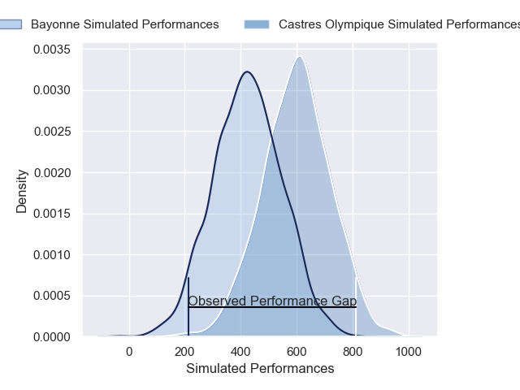
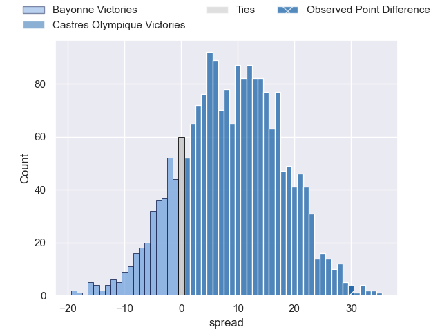
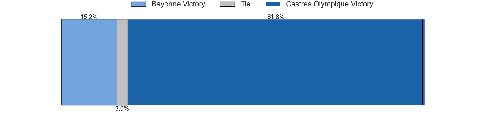

---  
layout: page  
title: Bayonne at Castres Olympique; 3-33  
date: 2025-05-31 18:00:00 -0500  
categories: "Top 14 Orange 24/25" match review  
---
# Bayonne at Castres Olympique; 3-33

# Club Level Predictions

The first set of predictions treats a club as the smallest object, as the club develops its members, organizes a gameplan, and deploys its players as needed for each match. This club model has a prediction of 0.625, which translates to predicting Castres Olympique to win by 4.5.

Our Over/Under is 43.5 - and combined with the spread above, we have a predicted scoreline of 19 to 24

Each club has a rating and a rating deviation (similar to a Glicko rating), and expected performances can be generated. This allows for simulated matches and spreads like the ones below.
## Projected Performances - Club Model

## Projected Spreads - Club Model

## Projected Results - Club Model

# Player Level Predictions

Treating teams instead as an entity made up of the currently active players, I have ratings for each player in an altogether different system. These can be combined to form team ratings once teamsheets are announced, weighting starters a bit higher than the reserves. After the match is played, players can be weighted by their minutes on the field, allowing for an accurate measure of the team's composition. With these compiled team ratings, we can make predictions, measure inaccuracy, and update the individual player ratings.
## Prediction without Player Minutes: Castres Olympique by 6.3

Bayonne by 8.0 on a neutral pitch

## Projected Performances - Player Model

## Projected Spreads - Player Model

## Projected Results - Player Model

|   Away Minutes | Away Player             |   Away Percentile |   Number |   Home Percentile | Home Player          |   Home Minutes |
|---------------:|:------------------------|------------------:|---------:|------------------:|:---------------------|---------------:|
|             67 | Swan Cormenier          |             48.67 |        1 |             56.65 | Quentin Walcker      |             24 |
|             80 | Lucas Martin            |             95.73 |        2 |             82.56 | Gaetan Barlot        |             48 |
|             49 | Luke Tagi               |             65.07 |        3 |             41.49 | Nicolas Corato       |             44 |
|             80 | Arthur Iturria          |             56.14 |        4 |             22.88 | Guillaume Ducat      |             31 |
|             31 | Alex Moon               |             98.11 |        5 |             90.56 | Florent Vanverberghe |             80 |
|             80 | Rodrigo Bruni           |             99.79 |        6 |             45.46 | Mathieu Babillot     |             52 |
|             10 | Esteban Capilla         |             17.62 |        7 |             89.77 | Baptiste Delaporte   |             56 |
|             32 | Giovanni Habel-Kueffner |             91.15 |        8 |             35.8  | Abraham Papali'i     |             46 |
|             80 | Maxime Machenaud        |             96.36 |        9 |             72.99 | Santiago Arata       |             59 |
|             63 | Joris Segonds           |             70.16 |       10 |             87.02 | Louis Le Brun        |             80 |
|             80 | Arnaud Erbinartegaray   |             18.16 |       11 |             91.22 | Remy Baget           |             56 |
|             80 | Manu Tuilagi            |             99.78 |       12 |             96.08 | Jack Goodhue         |             56 |
|             63 | Guillaume Martocq       |             17.92 |       13 |             69.99 | Vilimoni Botitu      |             80 |
|             22 | Xan Mousques            |             82.95 |       14 |             78.91 | Nathanael Hulleu     |             49 |
|             17 | Xan Mousques            |             82.95 |       14 |             78.91 | Nathanael Hulleu     |             49 |
|              0 | Tom Spring              |             17.23 |       15 |             72.13 | Julien Dumora        |             49 |
|             15 | Facundo Bosch           |             91.28 |       16 |            nan    | Loris Zarantonello   |              5 |
|             31 | Andy Bordelai           |             92.55 |       17 |             84.75 | Antoine Tichit       |             80 |
|             27 | Baptiste Chouzenoux     |             91.61 |       18 |             97.9  | Leone Nakarawa       |             70 |
|             40 | Remi Bourdeau           |             94.3  |       19 |             44.83 | Baptiste Cope        |             55 |
|             76 | Guillaume Rouet         |             24.9  |       20 |             77.59 | Jeremy Fernandez     |             80 |
|              4 | Federico Mori           |            nan    |       21 |             19.37 | Adrien Seguret       |             80 |
|             13 | Federico Mori           |            nan    |       21 |             19.37 | Adrien Seguret       |             80 |
|             27 | Cheikh Tiberghien       |             19.36 |       22 |             67.66 | Theo Chabouni        |             49 |
|             60 | Pieter Scholtz          |              5.5  |       23 |             86.7  | Levan Chilachava     |             53 |

