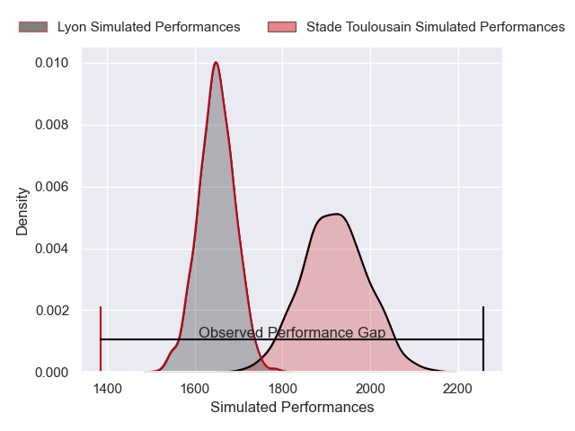
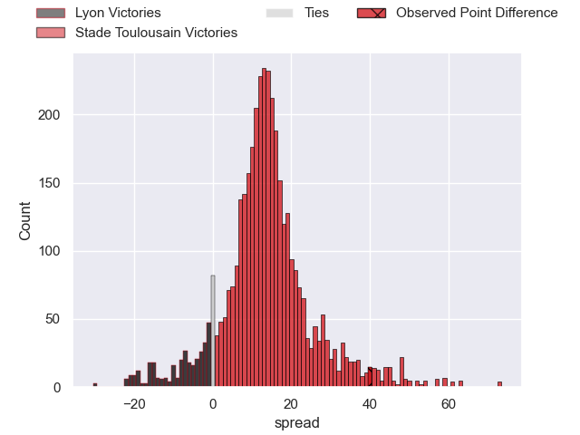
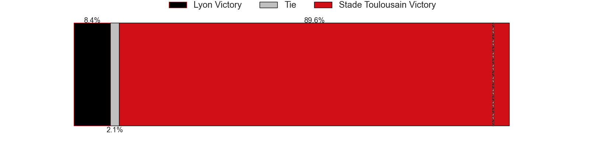
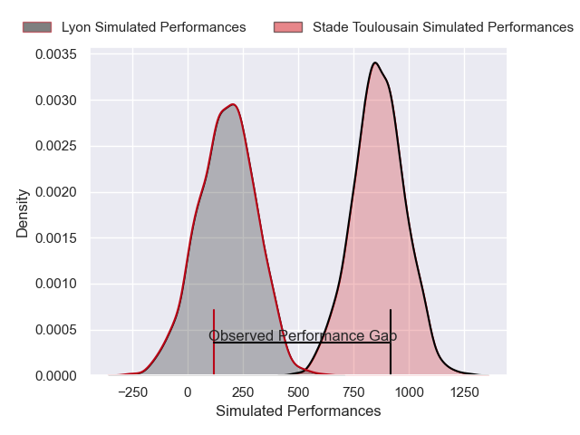
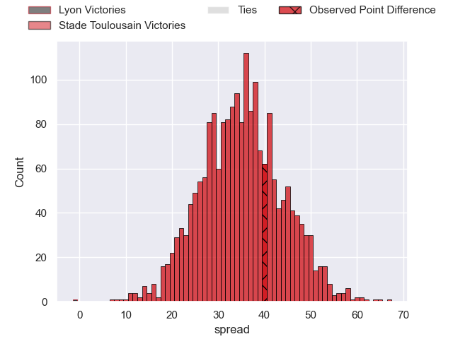
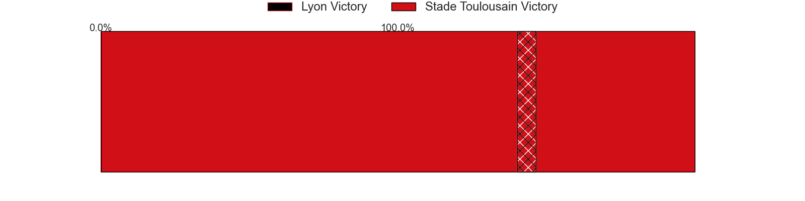

---  
layout: page  
title: Lyon at Stade Toulousain; 3-43  
date: 2025-06-01 18:00:00 -0500  
categories: "Top 14 Orange 24/25" match review  
---
# Lyon at Stade Toulousain; 3-43

# Club Level Predictions

The first set of predictions treats a club as the smallest object, as the club develops its members, organizes a gameplan, and deploys its players as needed for each match. This club model has a prediction of 0.825, which translates to predicting Stade Toulousain to win by 13.6.

Our Over/Under is 59.5 - and combined with the spread above, we have a predicted scoreline of 23 to 37

Each club has a rating and a rating deviation (similar to a Glicko rating), and expected performances can be generated. This allows for simulated matches and spreads like the ones below.
## Projected Performances - Club Model

## Projected Spreads - Club Model

## Projected Results - Club Model

# Player Level Predictions

Treating teams instead as an entity made up of the currently active players, I have ratings for each player in an altogether different system. These can be combined to form team ratings once teamsheets are announced, weighting starters a bit higher than the reserves. After the match is played, players can be weighted by their minutes on the field, allowing for an accurate measure of the team's composition. With these compiled team ratings, we can make predictions, measure inaccuracy, and update the individual player ratings.
## Prediction without Player Minutes: Stade Toulousain by 40.2

Stade Toulousain by 27.4 on a neutral pitch

## Projected Performances - Player Model

## Projected Spreads - Player Model

## Projected Results - Player Model

|   Away Minutes | Away Player          |   Away Percentile |   Number |   Home Percentile | Home Player         |   Home Minutes |
|---------------:|:---------------------|------------------:|---------:|------------------:|:--------------------|---------------:|
|             40 | Jerome Rey           |             18.53 |        1 |             36.35 | Rodrigue Neti       |           21   |
|             40 | Guillaume Marchand   |             22.45 |        2 |             99.63 | Julien Marchand     |           31   |
|             16 | Irakli Aptsiauri     |             83.87 |        3 |             87.77 | Joel Merkler        |           80   |
|             80 | Killian Geraci       |             26.02 |        4 |             92.97 | Joshua Brennan      |           21   |
|             30 | Tomas Lavanini       |             87.09 |        5 |             94.96 | Thibaud Flament     |           40   |
|             80 | Steeve Blanc-Mappaz  |             10.34 |        6 |             97.05 | Francois Cros       |           53   |
|             80 | Liam Allen           |             74.58 |        7 |             96.94 | Jack Willis         |           45   |
|             40 | Maxime Gouzou        |             18.11 |        8 |            100    | Anthony Jelonch     |           31   |
|             80 | Martin Page-Relo     |             73.18 |        9 |             65.13 | Paul Graou          |           67   |
|             40 | Martin Meliande      |              3.42 |       10 |             97.04 | Romain Ntamack      |           13   |
|             80 | Monty Ioane          |             95.26 |       11 |             98.69 | Juan Cruz Mallia    |           80   |
|             58 | Theo Millet          |             70.88 |       12 |             60.92 | Santiago Chocobares |           72   |
|             80 | Alfred Parisien      |             46.92 |       13 |             79.17 | Paul Costes         |           80   |
|             40 | Ethan Dumortier      |             32.8  |       14 |             97.78 | Ange Capuozzo       |           49   |
|             53 | Alexandre Tchaptchet |             37.66 |       15 |             97.02 | Thomas Ramos        |           80   |
|             22 | Camille Chat         |             91.84 |       16 |             84.42 | Guillaume Cramont   |           48   |
|             25 | Wayan de Benedittis  |            nan    |       17 |             97.61 | Cyril Baille        |           40   |
|             40 | Theo William         |              9.7  |       18 |             78.49 | Clement Verge       |           80   |
|             80 | Felix Lambey         |             81.01 |       19 |            nan    | Alban Placines      |           67   |
|              7 | Charlie Cassang      |             87.55 |       20 |             94.86 | Alexandre Roumat    |           29.5 |
|             55 | Leo Berdeu           |             78.59 |       21 |             98.28 | Matthis Lebel       |           80   |
|             73 | Thibaut Regard       |             46.14 |       22 |             53.64 | Pita Ahki           |           53   |
|             80 | Ave Jonathan Maalo   |            nan    |       23 |             96.99 | Dorian Aldegheri    |           80   |

