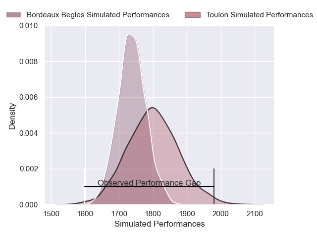
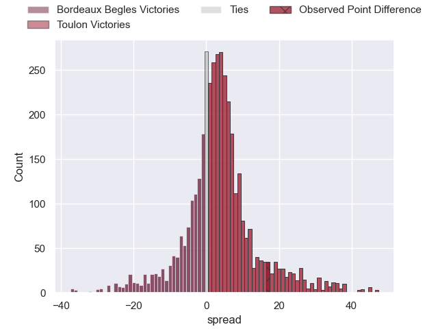
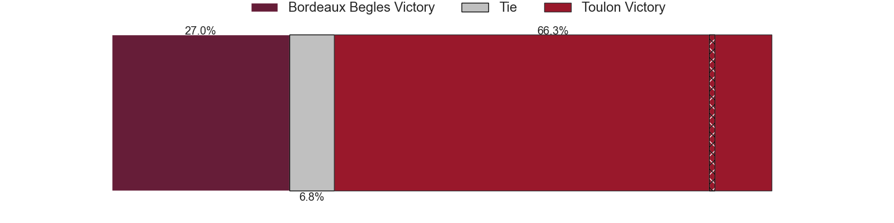
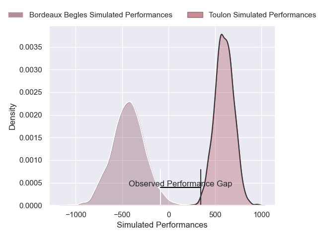
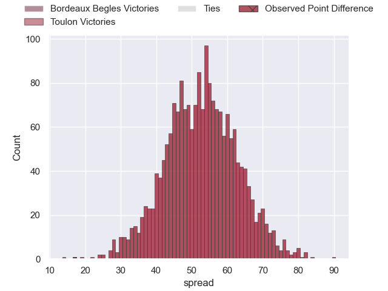

---  
layout: page  
title: Bordeaux Begles at Toulon; 10-27  
date: 2025-06-01 18:00:00 -0500  
categories: "Top 14 Orange 24/25" match review  
---
# Bordeaux Begles at Toulon; 10-27

# Club Level Predictions

The first set of predictions treats a club as the smallest object, as the club develops its members, organizes a gameplan, and deploys its players as needed for each match. This club model has a prediction of 0.588, which translates to predicting Toulon to win by 3.1.

Our Over/Under is 49.5 - and combined with the spread above, we have a predicted scoreline of 23 to 26

Each club has a rating and a rating deviation (similar to a Glicko rating), and expected performances can be generated. This allows for simulated matches and spreads like the ones below.
## Projected Performances - Club Model

## Projected Spreads - Club Model

## Projected Results - Club Model

# Player Level Predictions

Treating teams instead as an entity made up of the currently active players, I have ratings for each player in an altogether different system. These can be combined to form team ratings once teamsheets are announced, weighting starters a bit higher than the reserves. After the match is played, players can be weighted by their minutes on the field, allowing for an accurate measure of the team's composition. With these compiled team ratings, we can make predictions, measure inaccuracy, and update the individual player ratings.
## Prediction without Player Minutes: Toulon by 36.8

Toulon by 25.2 on a neutral pitch

## Projected Performances - Player Model

## Projected Spreads - Player Model

## Projected Results - Player Model

|   Away Minutes | Away Player               |   Away Percentile |   Number |   Home Percentile | Home Player            |   Home Minutes |
|---------------:|:--------------------------|------------------:|---------:|------------------:|:-----------------------|---------------:|
|              0 | Ugo Boniface              |             90.16 |        1 |             98.4  | Jean-Baptiste Gros     |             80 |
|             52 | Connor Sa                 |             10.95 |        2 |             78.85 | Teddy Baubigny         |             50 |
|             50 | Ben Tameifuna             |             97.25 |        3 |             90.96 | Kyle Sinckler          |             49 |
|             80 | Jonny Gray                |             94.54 |        4 |             55.82 | Matthias Halagahu      |             64 |
|             58 | Adam Coleman              |             98.95 |        5 |             81.32 | David Ribbans          |             40 |
|              0 | Bastien Vergnes Taillefer |             81.54 |        6 |             83.44 | Matteo Le Corvec       |             80 |
|             28 | Pierre Bochaton           |             92.41 |        7 |             86.6  | Esteban Abadie         |             24 |
|             80 | Tevita Tatafu             |              4.73 |        8 |             92.18 | Facundo Isa            |             14 |
|             29 | Tevita Tatafu             |              4.73 |        8 |             92.18 | Facundo Isa            |             14 |
|             23 | Tevita Tatafu             |              4.73 |        8 |             92.18 | Facundo Isa            |             14 |
|             80 | Yann Lesgourgues          |              7.85 |        9 |             98.08 | Baptiste Serin         |             16 |
|             60 | Joey Carbery              |             58.09 |       10 |             87.7  | Enzo Herve             |              3 |
|             51 | Enzo Reybier              |             74.27 |       11 |             95.36 | Gabin Villiere         |             80 |
|             80 | Rohan Janse van Rensburg  |             92.39 |       12 |             28.22 | Jeremy Sinzelle        |             80 |
|             66 | Yoram Moefana             |             93.95 |       13 |             95.97 | Leicester Fainga'anuku |             80 |
|             70 | Pablo Uberti              |              4.84 |       14 |             93.14 | Jiuta Wainiqolo        |             35 |
|             22 | Jon Echegaray             |              4.89 |       15 |             93.4  | Melvyn Jaminet         |             40 |
|             58 | Jon Echegaray             |              4.89 |       15 |             93.4  | Melvyn Jaminet         |             40 |
|             56 | Jon Echegaray             |              4.89 |       15 |             93.4  | Melvyn Jaminet         |             40 |
|             80 | Jon Echegaray             |              4.89 |       15 |             93.4  | Melvyn Jaminet         |             40 |
|             23 | Romain Latterrade         |             17.44 |       16 |             90.91 | Mickael Ivaldi         |             20 |
|             80 | Toma'akino Taufa          |            nan    |       17 |             44.5  | Daniel Brennan         |             20 |
|             80 | Cyril Cazeaux             |             93.28 |       18 |             71.14 | Brian Alainu'uese      |              0 |
|             55 | Temo Matiu                |              5.91 |       19 |             68.99 | Lewis Ludlam           |             27 |
|             74 | Marko Gazzotti            |            nan    |       20 |             57.45 | Marius Domon           |             10 |
|             22 | Arthur Retiere            |             94.35 |       21 |             95.4  | Ben White              |             27 |
|             40 | Ben Tapuai                |             52.52 |       22 |             74.57 | Seta Tuicuvu           |              0 |
|             80 | Zaccharie Affane          |            nan    |       23 |             95.21 | Emerick Setiano        |             80 |

