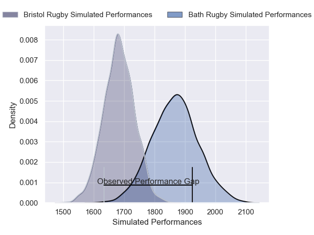
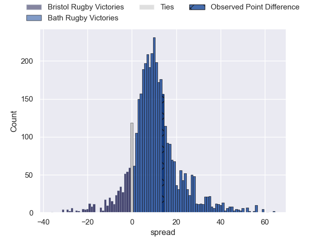
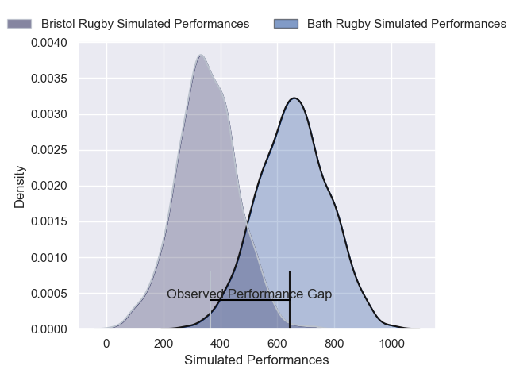
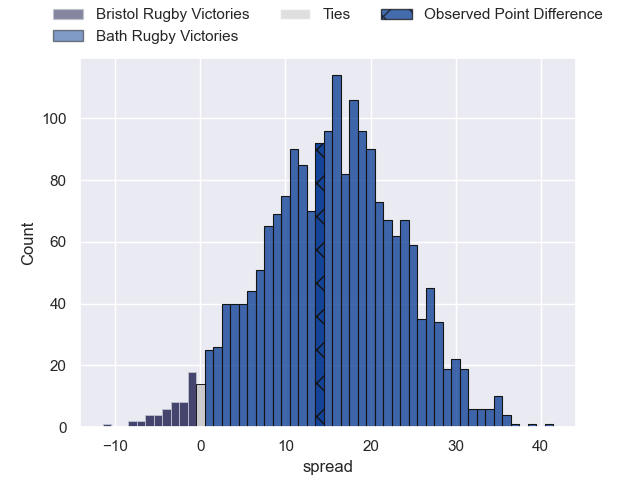

---  
layout: page  
title: Bristol Rugby at Bath Rugby; 20-34  
date: 2025-06-06 18:00:00 -0500  
categories: "Gallagher Premiership 24/25" match review  
---
# Bristol Rugby at Bath Rugby; 20-34

# Club Level Predictions

The first set of predictions treats a club as the smallest object, as the club develops its members, organizes a gameplan, and deploys its players as needed for each match. This club model has a prediction of 0.741, which translates to predicting Bath Rugby to win by 9.2.

Our Over/Under is 64.5 - and combined with the spread above, we have a predicted scoreline of 28 to 37

Each club has a rating and a rating deviation (similar to a Glicko rating), and expected performances can be generated. This allows for simulated matches and spreads like the ones below.
## Projected Performances - Club Model

## Projected Spreads - Club Model

## Projected Results - Club Model

# Player Level Predictions

Treating teams instead as an entity made up of the currently active players, I have ratings for each player in an altogether different system. These can be combined to form team ratings once teamsheets are announced, weighting starters a bit higher than the reserves. After the match is played, players can be weighted by their minutes on the field, allowing for an accurate measure of the team's composition. With these compiled team ratings, we can make predictions, measure inaccuracy, and update the individual player ratings.
## Prediction without Player Minutes: Bath Rugby by 11.9

Bristol Rugby by 2.3 on a neutral pitch

## Projected Performances - Player Model

## Projected Spreads - Player Model

## Projected Results - Player Model

|   Away Minutes | Away Player                |   Away Percentile |   Number |   Home Percentile | Home Player      |   Home Minutes |
|---------------:|:---------------------------|------------------:|---------:|------------------:|:-----------------|---------------:|
|             50 | Ellis Genge                |             81.67 |        1 |             96.23 | Beno Obano       |              0 |
|             31 | Gabriel Oghre              |             77.97 |        2 |             98.12 | Tom Dunn         |             58 |
|             15 | George Kloska              |             86.79 |        3 |             58.13 | Will Stuart      |             64 |
|             24 | James Dun                  |             93.14 |        4 |             94.62 | Quinn Roux       |             80 |
|             24 | Joe Batley                 |             90.93 |        5 |             78.9  | Charlie Ewels    |             80 |
|             16 | Steven Luatua              |             99.36 |        6 |             83.49 | Ted Hill         |             74 |
|             21 | Fitz Harding               |             98.07 |        7 |             14.04 | Guy Pepper       |             78 |
|             80 | Viliame Mata               |             45.87 |        8 |             91.94 | Alfie Barbeary   |             21 |
|             50 | Harry Randall              |             96.72 |        9 |             85.14 | Ben Spencer      |             12 |
|             22 | AJ MacGinty                |             89.95 |       10 |             99.32 | Finn Russell     |             22 |
|             72 | Gabriel Ibitoye            |             97.48 |       11 |             43.07 | Will Muir        |             80 |
|             65 | James Williams             |             88.11 |       12 |             41.34 | Cameron Redpath  |             49 |
|             80 | Benhard Janse van Rensburg |             94.22 |       13 |             96.49 | Max Ojomoh       |             56 |
|             58 | Kalaveti Ravouvou          |             77.94 |       14 |             96.01 | Joe Cokanasiga   |             80 |
|             46 | Noah Heward                |             85.11 |       15 |             11.78 | Tom de Glanville |             80 |
|             21 | Harry Thacker              |             64.41 |       16 |             70.24 | Niall Annett     |             65 |
|             40 | Jake Woolmore              |             97.04 |       17 |             85.98 | Francois van Wyk |             14 |
|             30 | Max Lahiff                 |             32.08 |       18 |             99.19 | Thomas du Toit   |             40 |
|              6 | Pedro Rubiolo              |              9.81 |       19 |             94.41 | Ross Molony      |             26 |
|              2 | Santiago Grondona          |             85.96 |       20 |             98.76 | Miles Reid       |             29 |
|             24 | Kieran Marmion             |             85.33 |       21 |             93.63 | Tom Carr-Smith   |             56 |
|             80 | Harry Byrne                |             90.41 |       22 |             78.08 | Ciaran Donoghue  |             80 |
|             80 | Jack Bates                 |              9.87 |       23 |             28.72 | Josh Bayliss     |             80 |

