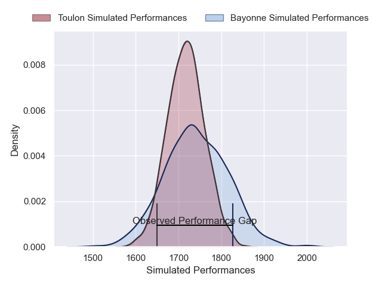
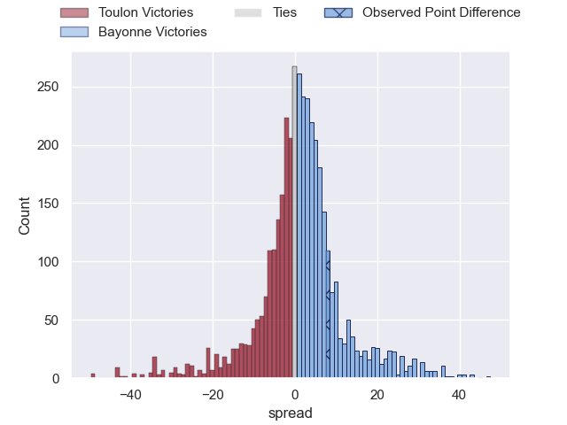
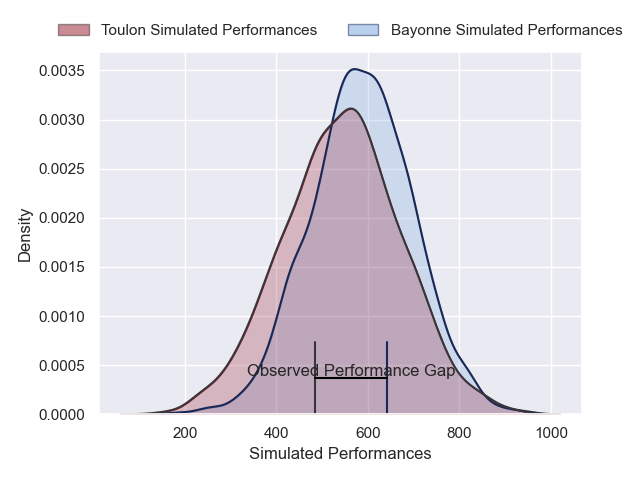
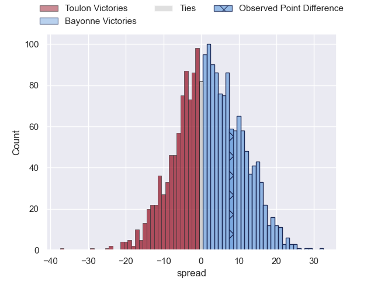

---  
layout: page  
title: Toulon at Bayonne; 10-18  
date: 2025-06-07 18:00:00 -0500  
categories: "Top 14 Orange 24/25" match review  
---
# Toulon at Bayonne; 10-18

# Club Level Predictions

The first set of predictions treats a club as the smallest object, as the club develops its members, organizes a gameplan, and deploys its players as needed for each match. This club model has a prediction of 0.533, which translates to predicting Bayonne to win by 1.2.

Our Over/Under is 56.5 - and combined with the spread above, we have a predicted scoreline of 28 to 29

Each club has a rating and a rating deviation (similar to a Glicko rating), and expected performances can be generated. This allows for simulated matches and spreads like the ones below.
## Projected Performances - Club Model

## Projected Spreads - Club Model

## Projected Results - Club Model

# Player Level Predictions

Treating teams instead as an entity made up of the currently active players, I have ratings for each player in an altogether different system. These can be combined to form team ratings once teamsheets are announced, weighting starters a bit higher than the reserves. After the match is played, players can be weighted by their minutes on the field, allowing for an accurate measure of the team's composition. With these compiled team ratings, we can make predictions, measure inaccuracy, and update the individual player ratings.
## Prediction without Player Minutes: Bayonne by 7.2

Toulon by 6.2 on a neutral pitch

## Projected Performances - Player Model

## Projected Spreads - Player Model

## Projected Results - Player Model

|   Away Minutes | Away Player            |   Away Percentile |   Number |   Home Percentile | Home Player             |   Home Minutes |
|---------------:|:-----------------------|------------------:|---------:|------------------:|:------------------------|---------------:|
|             53 | Dany Priso             |             93.26 |        1 |             63.7  | Swan Cormenier          |             57 |
|             53 | Mickael Ivaldi         |             89.45 |        2 |             91.34 | Facundo Bosch           |             27 |
|             57 | Beka Gigashvili        |             70.08 |        3 |             51.84 | Luke Tagi               |             51 |
|             30 | David Ribbans          |             77.43 |        4 |             64.87 | Arthur Iturria          |             23 |
|              8 | Matthias Halagahu      |             59.39 |        5 |             98.31 | Alex Moon               |             27 |
|             33 | Lewis Ludlam           |             61.63 |        6 |             99.79 | Rodrigo Bruni           |             60 |
|             80 | Jules Coulon           |             82.85 |        7 |             91.96 | Baptiste Chouzenoux     |             53 |
|             33 | Facundo Isa            |             92.15 |        8 |             66.94 | Uzair Cassiem           |             33 |
|             80 | Ben White              |             95.17 |        9 |             26.64 | Guillaume Rouet         |             40 |
|             51 | Paolo Garbisi          |             76.71 |       10 |             75.11 | Joris Segonds           |             67 |
|             33 | Gabin Villiere         |             96.43 |       11 |             21.01 | Mateo Carreras          |             80 |
|             61 | Ma'a Nonu              |             85.96 |       12 |             99.89 | Manu Tuilagi            |             60 |
|             80 | Leicester Fainga'anuku |             96.04 |       13 |             60.36 | Sireli Maqala           |             57 |
|             58 | Jiuta Wainiqolo        |             93.49 |       14 |             18.28 | Tom Spring              |             80 |
|             58 | Melvyn Jaminet         |             93.78 |       15 |             18    | Cheikh Tiberghien       |             47 |
|             80 | Teddy Baubigny         |             81.54 |       16 |             96.42 | Lucas Martin            |             29 |
|             33 | Jean-Baptiste Gros     |             98.11 |       17 |            nan    | Pierre Castillon        |             27 |
|             74 | Swan Rebbadj           |            nan    |       18 |             83.28 | Baptiste Heguy          |             80 |
|             17 | Matteo Le Corvec       |             87.57 |       19 |             92.36 | Giovanni Habel-Kueffner |             27 |
|             80 | Marius Domon           |             57.33 |       20 |             96.91 | Maxime Machenaud        |             80 |
|             80 | Baptiste Serin         |             98.07 |       21 |             82.65 | Camille Lopez           |             80 |
|             80 | Seta Tuicuvu           |             76.16 |       22 |             23.53 | Arnaud Erbinartegaray   |             33 |
|             80 | Kyle Sinckler          |             91.46 |       23 |              5.57 | Pieter Scholtz          |             64 |

