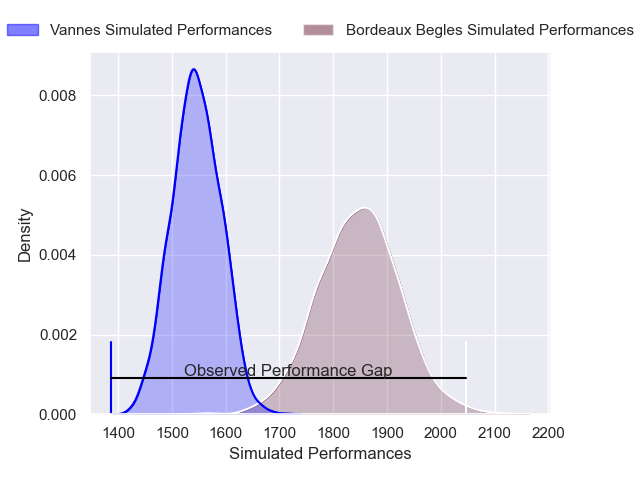
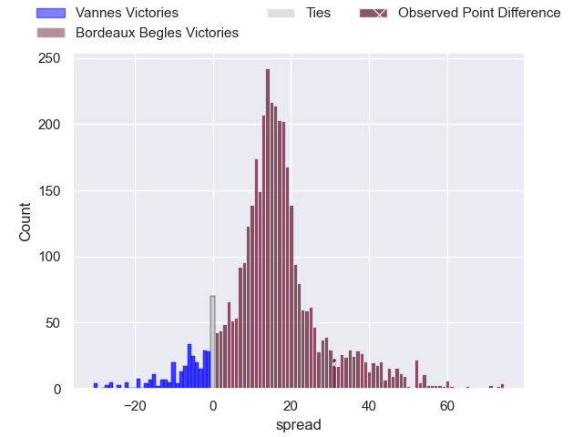
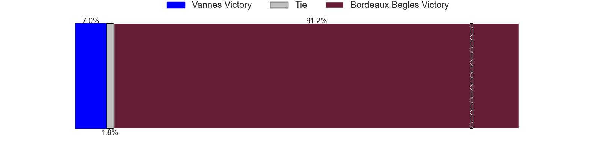
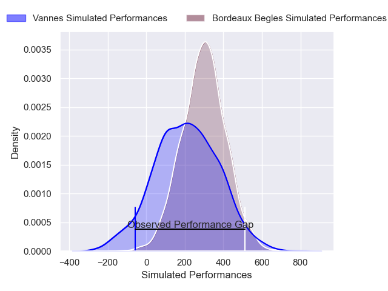
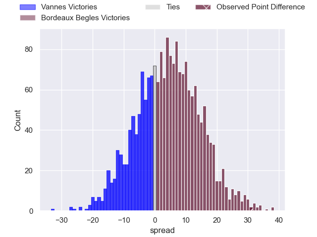

---  
layout: page  
title: Vannes at Bordeaux Begles; 28-59  
date: 2025-06-07 18:00:00 -0500  
categories: "Top 14 Orange 24/25" match review  
---
# Vannes at Bordeaux Begles; 28-59

# Club Level Predictions

The first set of predictions treats a club as the smallest object, as the club develops its members, organizes a gameplan, and deploys its players as needed for each match. This club model has a prediction of 0.85, which translates to predicting Bordeaux Begles to win by 15.2.

Our Over/Under is 71.5 - and combined with the spread above, we have a predicted scoreline of 28 to 43

Each club has a rating and a rating deviation (similar to a Glicko rating), and expected performances can be generated. This allows for simulated matches and spreads like the ones below.
## Projected Performances - Club Model

## Projected Spreads - Club Model

## Projected Results - Club Model

# Player Level Predictions

Treating teams instead as an entity made up of the currently active players, I have ratings for each player in an altogether different system. These can be combined to form team ratings once teamsheets are announced, weighting starters a bit higher than the reserves. After the match is played, players can be weighted by their minutes on the field, allowing for an accurate measure of the team's composition. With these compiled team ratings, we can make predictions, measure inaccuracy, and update the individual player ratings.
## Prediction without Player Minutes: Bordeaux Begles by 15.4

Bordeaux Begles by 3.6 on a neutral pitch

## Projected Performances - Player Model

## Projected Spreads - Player Model

## Projected Results - Player Model

|   Away Minutes | Away Player         |   Away Percentile |   Number |   Home Percentile | Home Player              |   Home Minutes |
|---------------:|:--------------------|------------------:|---------:|------------------:|:-------------------------|---------------:|
|             80 | Mako Vunipola       |            100    |        1 |             29.22 | Matis Perchaud           |           59   |
|             80 | Theo Beziat         |             44.89 |        2 |             58.52 | Maxime Lamothe           |           29.5 |
|              7 | Santiago Medrano    |              8.17 |        3 |             97.04 | Ben Tameifuna            |           49   |
|             80 | Santiago Medrano    |              8.17 |        3 |             97.04 | Ben Tameifuna            |           49   |
|             68 | Santiago Medrano    |              8.17 |        3 |             97.04 | Ben Tameifuna            |           49   |
|             22 | Santiago Medrano    |              8.17 |        3 |             97.04 | Ben Tameifuna            |           49   |
|             80 | Eric Marks          |              9.7  |        4 |             98.85 | Adam Coleman             |           48   |
|              0 | Sione Kalamafoni    |             42.86 |        5 |             92.08 | Cyril Cazeaux            |           14   |
|             67 | Joe Edwards         |             93.34 |        6 |             44.93 | Marko Gazzotti           |           22   |
|             80 | Francisco Gorrissen |             97.46 |        7 |             67.55 | Guido Petti              |           30   |
|             30 | Leon Boulier        |             29.47 |        8 |             91.16 | Pete Samu                |           14   |
|             30 | Michael Ruru        |             94.44 |        9 |              9.58 | Yann Lesgourgues         |           56   |
|             15 | Maxime Lafage       |             92.24 |       10 |             96.8  | Matthieu Jalibert        |           56   |
|             50 | Filipo Nakosi       |             58.08 |       11 |             88.72 | Louis Bielle-Biarrey     |            0   |
|             80 | Pierre Boudehent    |             51.98 |       12 |             89.01 | Rohan Janse van Rensburg |           21   |
|             67 | Robin Taccola       |             76.67 |       13 |             82.56 | Nicolas Depoortere       |           72   |
|             56 | Romaric Camou       |             73.85 |       14 |             95.51 | Damian Penaud            |           31   |
|             66 | Paul Surano         |             35.89 |       15 |             87.09 | Nans Ducuing             |           13   |
|              7 | Cyril Blanchard     |            nan    |       16 |             17.05 | Romain Latterrade        |           24   |
|             80 | Thomas Moukoro      |            nan    |       17 |            nan    | Florian Baquey           |           18   |
|             41 | Jesse Parete        |             10.36 |       18 |             91.66 | Pierre Bochaton          |           67   |
|             80 | John Porch          |            nan    |       19 |             20.63 | Tevita Tatafu            |           21   |
|             80 | John Porch          |            nan    |       19 |             20.63 | Tevita Tatafu            |           80   |
|             80 | John Porch          |            nan    |       19 |             20.63 | Tevita Tatafu            |           24   |
|             80 | Karl Chateau        |            nan    |       20 |             95.31 | Arthur Retiere           |           80   |
|             80 | Stephen Varney      |              1.53 |       21 |             67.58 | Joey Carbery             |           66   |
|             58 | Jean Cotarmanac'h   |             53.2  |       22 |             94    | Yoram Moefana            |            8   |
|             34 | Phil Kite           |            nan    |       23 |            nan    | Toma'akino Taufa         |           80   |

