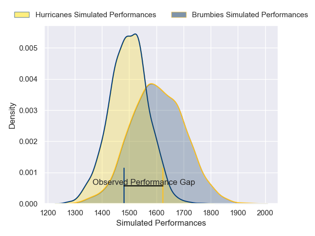
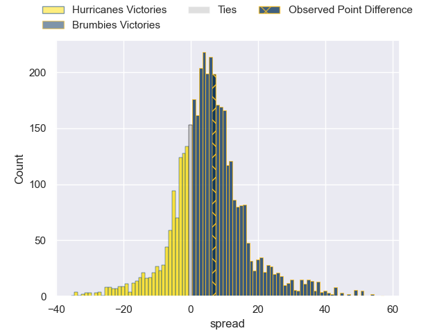
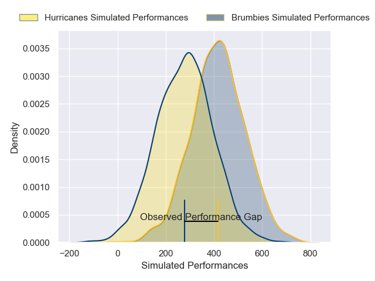
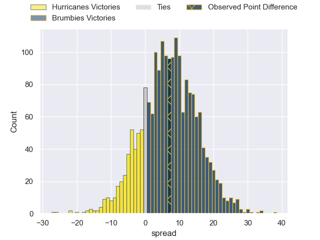

---  
layout: page  
title: Hurricanes at Brumbies; 28-35  
date: 2025-06-07 18:00:00 -0500  
categories: "Super Rugby Pacific 2025" match review  
---
# Hurricanes at Brumbies; 28-35

# Club Level Predictions

The first set of predictions treats a club as the smallest object, as the club develops its members, organizes a gameplan, and deploys its players as needed for each match. This club model has a prediction of 0.653, which translates to predicting Brumbies to win by 5.6.

Our Over/Under is 55.5 - and combined with the spread above, we have a predicted scoreline of 25 to 30

Each club has a rating and a rating deviation (similar to a Glicko rating), and expected performances can be generated. This allows for simulated matches and spreads like the ones below.
## Projected Performances - Club Model

## Projected Spreads - Club Model

## Projected Results - Club Model

# Player Level Predictions

Treating teams instead as an entity made up of the currently active players, I have ratings for each player in an altogether different system. These can be combined to form team ratings once teamsheets are announced, weighting starters a bit higher than the reserves. After the match is played, players can be weighted by their minutes on the field, allowing for an accurate measure of the team's composition. With these compiled team ratings, we can make predictions, measure inaccuracy, and update the individual player ratings.
## Prediction without Player Minutes: Brumbies by 8.1

Hurricanes by 0.3 on a neutral pitch

## Projected Performances - Player Model

## Projected Spreads - Player Model

## Projected Results - Player Model

|   Away Minutes | Away Player         |   Away Percentile |   Number |   Home Percentile | Home Player         |   Home Minutes |
|---------------:|:--------------------|------------------:|---------:|------------------:|:--------------------|---------------:|
|           80   | Xavier Numia        |             98.38 |        1 |             91.73 | James Slipper       |             80 |
|           21   | Jacob Devery        |             87.19 |        2 |             76.65 | Billy Pollard       |             68 |
|           15   | Tyrel Lomax         |             84.1  |        3 |             95.42 | Allan Alaalatoa     |              7 |
|           24   | Zach Gallagher      |             10.65 |        4 |             47.36 | Nick Frost          |             50 |
|           24   | Caleb Delany        |             64.24 |        5 |             73    | Tom Hooper          |              7 |
|           80   | Devan Flanders      |             92.39 |        6 |             97.64 | Rob Valetini        |             30 |
|           18   | Du'Plessis Kirifi   |             94    |        7 |             61.2  | Rory Scott          |             80 |
|           62   | Peter Lakai         |             96.9  |        8 |             77.27 | Tuaina Taii Tualima |             41 |
|           80   | Cam Roigard         |             76.83 |        9 |             92.47 | Ryan Lonergan       |             22 |
|           80   | Brett Cameron       |             20.55 |       10 |             81.51 | Noah Lolesio        |             80 |
|           66   | Fehi Fineanganofo   |             33.51 |       11 |             73.95 | Corey Toole         |             68 |
|           80   | Peter Umaga-Jensen  |             46.32 |       12 |             33.98 | David Feliuai       |             22 |
|           66   | Billy Proctor       |             96.94 |       13 |             77.69 | Len Ikitau          |             80 |
|           56   | Bailyn Sullivan     |             59.98 |       14 |             93.8  | Andy Muirhead       |             58 |
|           24   | Ruben Love          |             93.11 |       15 |             57.11 | Tom Wright          |              0 |
|           31   | Raymond Tuputupu    |            nan    |       16 |            nan    | Lachlan Lonergan    |             30 |
|           24.5 | Tevita Mafile'o     |             72.96 |       17 |            nan    | Lington Ieli        |             30 |
|           49   | Pasilio Tosi        |            nan    |       18 |             62.17 | Feao Fotuaika       |             80 |
|           14   | Hugo Plummer        |             84.6  |       19 |             51.05 | Lachlan Shaw        |             30 |
|           18   | Brad Shields        |             78.99 |       20 |             55.2  | Luke Reimer         |              8 |
|           14   | Ere Enari           |              2.9  |       21 |            nan    | Harrison Goddard    |             67 |
|           67   | Ngantungane Punivai |            nan    |       22 |            nan    | Jack Debreczeni     |             34 |
|           62   | Callum Harkin       |             20.89 |       23 |             86.52 | Ollie Sapsford      |             67 |

