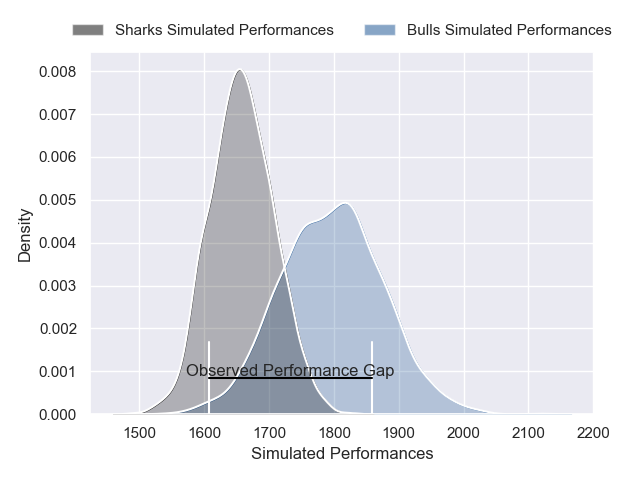
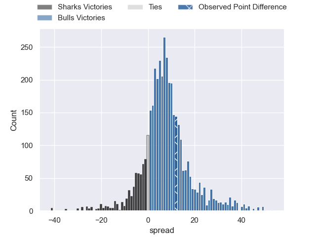
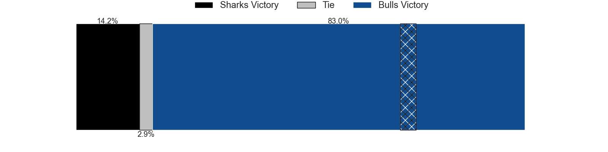
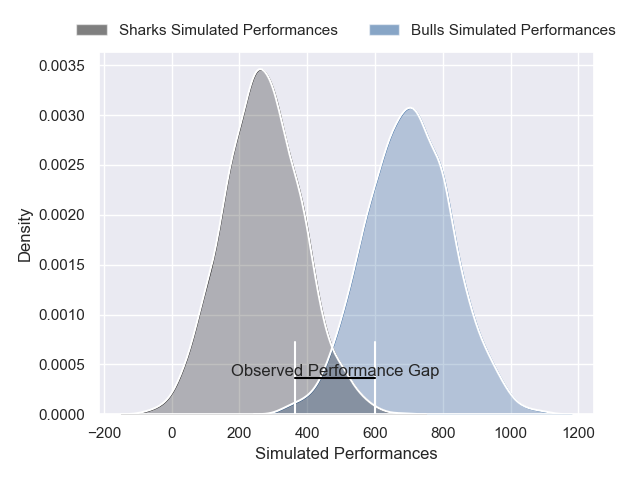
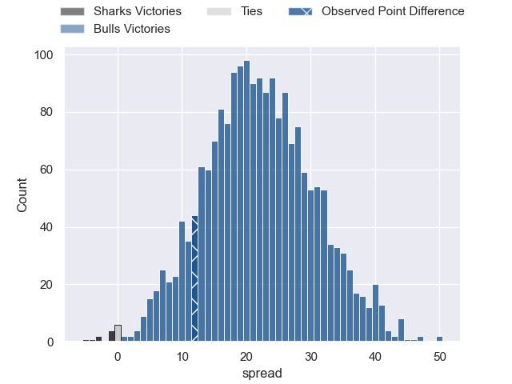

---  
layout: page  
title: Sharks at Bulls; 13-25  
date: 2025-06-07 18:00:00 -0500  
categories: "United Rugby Championship 24/25" match review  
---
# Sharks at Bulls; 13-25

# Club Level Predictions

The first set of predictions treats a club as the smallest object, as the club develops its members, organizes a gameplan, and deploys its players as needed for each match. This club model has a prediction of 0.684, which translates to predicting Bulls to win by 6.8.

Our Over/Under is 46.5 - and combined with the spread above, we have a predicted scoreline of 20 to 26

Each club has a rating and a rating deviation (similar to a Glicko rating), and expected performances can be generated. This allows for simulated matches and spreads like the ones below.
## Projected Performances - Club Model

## Projected Spreads - Club Model

## Projected Results - Club Model

# Player Level Predictions

Treating teams instead as an entity made up of the currently active players, I have ratings for each player in an altogether different system. These can be combined to form team ratings once teamsheets are announced, weighting starters a bit higher than the reserves. After the match is played, players can be weighted by their minutes on the field, allowing for an accurate measure of the team's composition. With these compiled team ratings, we can make predictions, measure inaccuracy, and update the individual player ratings.
## Prediction without Player Minutes: Bulls by 22.2

Bulls by 13.8 on a neutral pitch

## Projected Performances - Player Model

## Projected Spreads - Player Model

## Projected Results - Player Model

|   Away Minutes | Away Player       |   Away Percentile |   Number |   Home Percentile | Home Player         |   Home Minutes |
|---------------:|:------------------|------------------:|---------:|------------------:|:--------------------|---------------:|
|             70 | Ox Nche           |             99.57 |        1 |             29.74 | Jan-Hendrik Wessels |             80 |
|             16 | Bongi Mbonambi    |             92.23 |        2 |             93.75 | Johan Grobbelaar    |              0 |
|             80 | Vincent Koch      |             78.17 |        3 |             99.22 | Wilco Louw          |             24 |
|             17 | Corne Rahl        |             12.72 |        4 |             97.29 | Cobus Wiese         |             60 |
|             17 | Emile van Heerden |             19.19 |        5 |             13.87 | JF van Heerden      |             16 |
|             17 | James Venter      |             17.55 |        6 |             99.05 | Marcell Coetzee     |             31 |
|             33 | Vincent Tshituka  |             79.07 |        7 |             93.23 | Ruan Nortje         |             24 |
|             19 | Siya Kolisi       |             85.26 |        8 |             78.11 | Cameron Hanekom     |             80 |
|             61 | Jaden Hendrikse   |             86.97 |        9 |             94.64 | Embrose Papier      |             80 |
|             29 | Jordan Hendrikse  |             73.06 |       10 |             65.75 | Johan Goosen        |             80 |
|             56 | Makazole Mapimpi  |             99    |       11 |             96.91 | Sebastian de Klerk  |             80 |
|             57 | Andre Esterhuizen |             98.07 |       12 |             97.17 | Harold Vorster      |             36 |
|             66 | Lukhanyo Am       |             87.09 |       13 |             90.71 | David Kriel         |             80 |
|             80 | Ethan Hooker      |             60.98 |       14 |             99.9  | Canan Moodie        |             49 |
|             46 | Aphelele Fassi    |             90.37 |       15 |             98.91 | Willie le Roux      |             61 |
|             64 | Fez Mbatha        |             81.25 |       16 |             96.97 | Akker van der Merwe |             31 |
|             80 | Ntuthuko Mchunu   |              1.65 |       17 |             73.13 | Alulutho Tshakweni  |             80 |
|             40 | Hanro Jacobs      |            nan    |       18 |             83.3  | Mornay Smith        |             56 |
|             49 | Deon Slabbert     |             87.84 |       19 |             93.87 | Jannes Kirsten      |             64 |
|             56 | Phepsi Buthelezi  |             27.8  |       20 |             90.38 | Marco van Staden    |             63 |
|             80 | Emmanuel Tshituka |             28.65 |       21 |             93.87 | Zak Burger          |             63 |
|             21 | Bradley Davids    |             64.37 |       22 |             67.81 | Keagan Johannes     |             80 |
|             24 | Yaw Penxe         |              3.99 |       23 |             78.56 | Devon Williams      |             59 |

