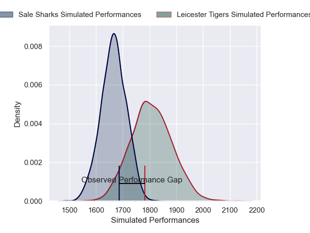
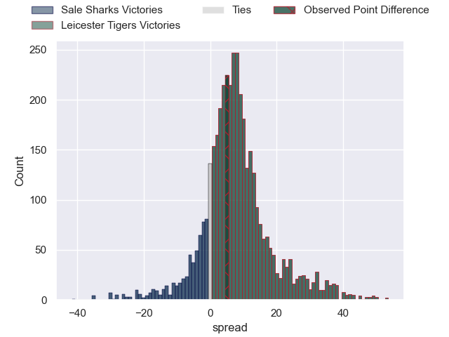
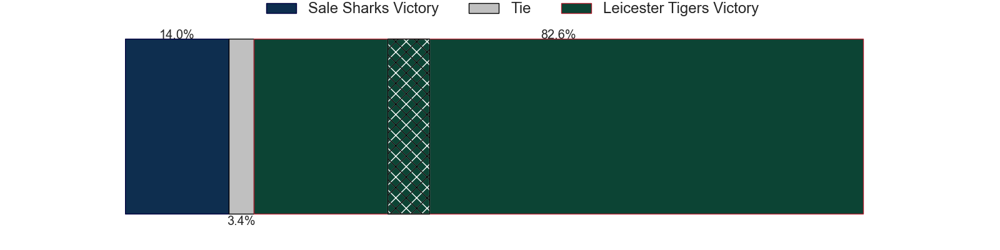
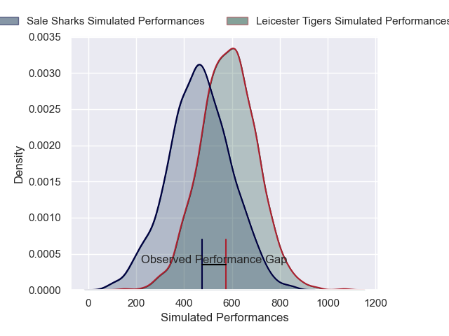
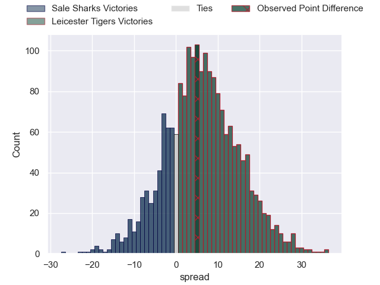
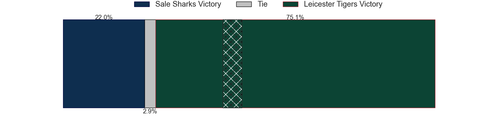

---  
layout: page  
title: Sale Sharks at Leicester Tigers; 16-21  
date: 2025-06-07 18:00:00 -0500  
categories: "Gallagher Premiership 24/25" match review  
---
# Sale Sharks at Leicester Tigers; 16-21

# Club Level Predictions

The first set of predictions treats a club as the smallest object, as the club develops its members, organizes a gameplan, and deploys its players as needed for each match. This club model has a prediction of 0.691, which translates to predicting Leicester Tigers to win by 7.1.

Our Over/Under is 57.5 - and combined with the spread above, we have a predicted scoreline of 25 to 32

Each club has a rating and a rating deviation (similar to a Glicko rating), and expected performances can be generated. This allows for simulated matches and spreads like the ones below.
## Projected Performances - Club Model

## Projected Spreads - Club Model

## Projected Results - Club Model

# Player Level Predictions

Treating teams instead as an entity made up of the currently active players, I have ratings for each player in an altogether different system. These can be combined to form team ratings once teamsheets are announced, weighting starters a bit higher than the reserves. After the match is played, players can be weighted by their minutes on the field, allowing for an accurate measure of the team's composition. With these compiled team ratings, we can make predictions, measure inaccuracy, and update the individual player ratings.
## Prediction without Player Minutes: Leicester Tigers by 7.9

Sale Sharks by 7.6 on a neutral pitch

## Projected Performances - Player Model

## Projected Spreads - Player Model

## Projected Results - Player Model

|   Away Minutes | Away Player          |   Away Percentile |   Number |   Home Percentile | Home Player           |   Home Minutes |
|---------------:|:---------------------|------------------:|---------:|------------------:|:----------------------|---------------:|
|             80 | Bevan Rodd           |             91.2  |        1 |             78.22 | Nicky Smith           |             80 |
|             80 | Luke Cowan-Dickie    |             99.05 |        2 |             90.3  | Julian Montoya        |             65 |
|              8 | Asher Opoku-Fordjour |             91.02 |        3 |             96.89 | Joe Heyes             |             56 |
|             27 | Ernst van Rhyn       |             92.71 |        4 |             81.63 | Cameron Henderson     |             80 |
|             80 | Jonny Hill           |             13.31 |        5 |             87.12 | Ollie Chessum         |             29 |
|             80 | Tom Curry            |             86.7  |        6 |             89.47 | Hanro Liebenberg      |             80 |
|             18 | Ben Curry            |             68.94 |        7 |             85.43 | Tommy Reffell         |              2 |
|             64 | Jean-Luc du Preez    |             99.79 |        8 |             52.26 | Olly Cracknell        |              0 |
|             69 | Raffi Quirke         |             81.45 |        9 |             74.57 | Jack van Poortvliet   |             74 |
|             53 | George Ford          |             95.21 |       10 |             91.32 | Handre Pollard        |             78 |
|             78 | Arron Reed           |             97.25 |       11 |             84.62 | Ollie Hassell-Collins |             21 |
|             49 | Rekeiti Ma'asi-White |             12.43 |       12 |             79.13 | Joseph Woodward       |             14 |
|             56 | Robert du Preez      |             88.24 |       13 |             58.05 | Solomone Kata         |             40 |
|             80 | Robert du Preez      |             88.24 |       13 |             58.05 | Solomone Kata         |             40 |
|              0 | Tom Roebuck          |             73.73 |       14 |             12.93 | Adam Radwan           |             58 |
|             80 | Joe Carpenter        |             12.08 |       15 |              8.5  | Freddie Steward       |             80 |
|             78 | Tadgh McElroy        |             22.43 |       16 |             65.78 | Charlie Clare         |             12 |
|             11 | Simon McIntyre       |             94.84 |       17 |             94.76 | James Cronin          |             56 |
|             24 | WillGriff John       |            nan    |       18 |             20.27 | Dan Cole              |             80 |
|              0 | Ben Bamber           |             39.28 |       19 |             92.18 | Matt Rogerson         |             49 |
|             53 | Daniel du Preez      |            nan    |       20 |             83.4  | Emeka Ilione          |             64 |
|             62 | Gus Warr             |             62.91 |       21 |             74.95 | Ben Youngs            |             22 |
|              2 | Luke James           |             78.75 |       22 |             23.52 | Ben Volavola          |             26 |
|             16 | Tom O'Flaherty       |             96.64 |       23 |             37.74 | Izaia Perese          |             80 |

