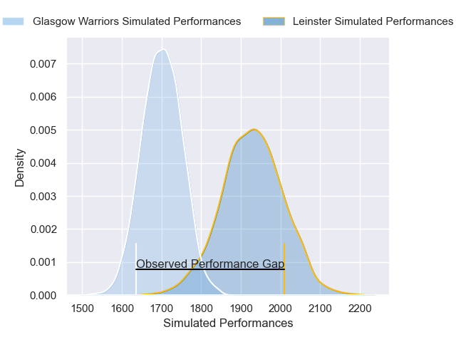
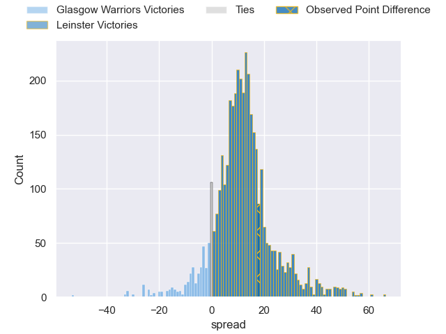
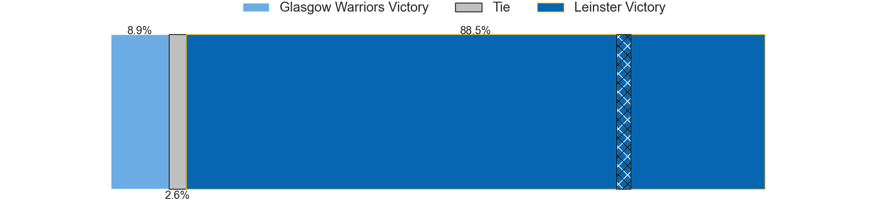
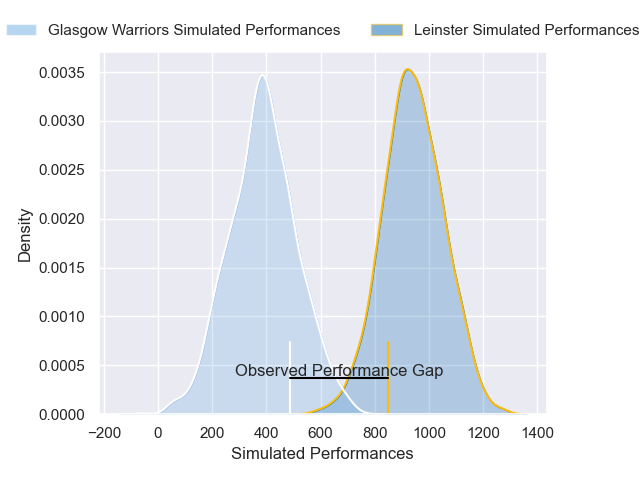
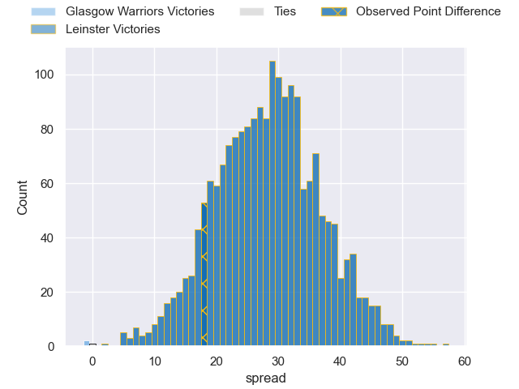
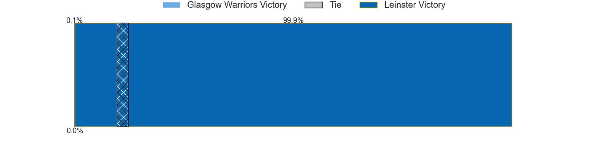

---  
layout: page  
title: Glasgow Warriors at Leinster; 19-37  
date: 2025-06-07 18:00:00 -0500  
categories: "United Rugby Championship 24/25" match review  
---
# Glasgow Warriors at Leinster; 19-37

# Club Level Predictions

The first set of predictions treats a club as the smallest object, as the club develops its members, organizes a gameplan, and deploys its players as needed for each match. This club model has a prediction of 0.787, which translates to predicting Leinster to win by 11.5.

Our Over/Under is 51.5 - and combined with the spread above, we have a predicted scoreline of 20 to 32

Each club has a rating and a rating deviation (similar to a Glicko rating), and expected performances can be generated. This allows for simulated matches and spreads like the ones below.
## Projected Performances - Club Model

## Projected Spreads - Club Model

## Projected Results - Club Model

# Player Level Predictions

Treating teams instead as an entity made up of the currently active players, I have ratings for each player in an altogether different system. These can be combined to form team ratings once teamsheets are announced, weighting starters a bit higher than the reserves. After the match is played, players can be weighted by their minutes on the field, allowing for an accurate measure of the team's composition. With these compiled team ratings, we can make predictions, measure inaccuracy, and update the individual player ratings.
## Prediction without Player Minutes: Leinster by 13.7

Leinster by 3.6 on a neutral pitch

## Projected Performances - Player Model

## Projected Spreads - Player Model

## Projected Results - Player Model

|   Away Minutes | Away Player       |   Away Percentile |   Number |   Home Percentile | Home Player         |   Home Minutes |
|---------------:|:------------------|------------------:|---------:|------------------:|:--------------------|---------------:|
|             21 | Jamie Bhatti      |             94.52 |        1 |             87.3  | Andrew Porter       |             65 |
|             21 | Gregor Hiddleston |             42.61 |        2 |             34.85 | Dan Sheehan         |             22 |
|             19 | Finlay Richardson |             71.91 |        3 |             76.61 | Thomas Clarkson     |             19 |
|             80 | Alex Samuel       |             20.86 |        4 |             79.67 | Joe McCarthy        |             30 |
|             53 | Scott Cummings    |             99.17 |        5 |             95.2  | James Ryan          |             15 |
|             80 | Euan Ferrie       |             15.75 |        6 |             81.5  | Ryan Baird          |             13 |
|             53 | Rory Darge        |             93.45 |        7 |             88.16 | Scott Penny         |             15 |
|             20 | Henco Venter      |             96.63 |        8 |             99.16 | Jack Conan          |             19 |
|             24 | George Horne      |             99.04 |        9 |             96.55 | Jamison Gibson-Park |             60 |
|             80 | Adam Hastings     |             98.63 |       10 |             23.74 | Sam Prendergast     |             22 |
|             58 | Kyle Rowe         |             83.23 |       11 |            100    | James Lowe          |             80 |
|             80 | Tom Jordan        |             36.24 |       12 |             94.79 | Jordie Barrett      |             36 |
|             24 | Sione Tuipulotu   |             90.83 |       13 |             91.28 | Jamie Osborne       |             80 |
|             80 | Kyle Steyn        |             98.7  |       14 |             73.25 | Tommy O'Brien       |             31 |
|             80 | Josh McKay        |             77.02 |       15 |             93.87 | Jimmy O'Brien       |             19 |
|             67 | Johnny Matthews   |             23.3  |       16 |             94.32 | Ronan Kelleher      |             58 |
|             13 | Rory Sutherland   |             66.78 |       17 |             65.57 | Jack Boyle          |             15 |
|             33 | Sam Talakai       |             55.48 |       18 |             96.7  | Rabah Slimani       |             80 |
|             24 | Max Williamson    |             67.57 |       19 |             99.58 | RG Snyman           |             59 |
|             31 | Jack Mann         |             39.79 |       20 |             95.56 | Max Deegan          |             56 |
|             60 | Macenzzie Duncan  |            nan    |       21 |             99.71 | Luke McGrath        |             80 |
|             60 | Macenzzie Duncan  |            nan    |       21 |             99.71 | Luke McGrath        |             61 |
|             80 | Stafford McDowall |             82.45 |       22 |             95.43 | Ross Byrne          |             61 |
|             80 | Jamie Dobie       |             80.84 |       23 |             61.42 | Ciaran Frawley      |             18 |

