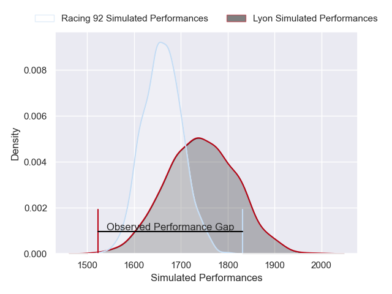
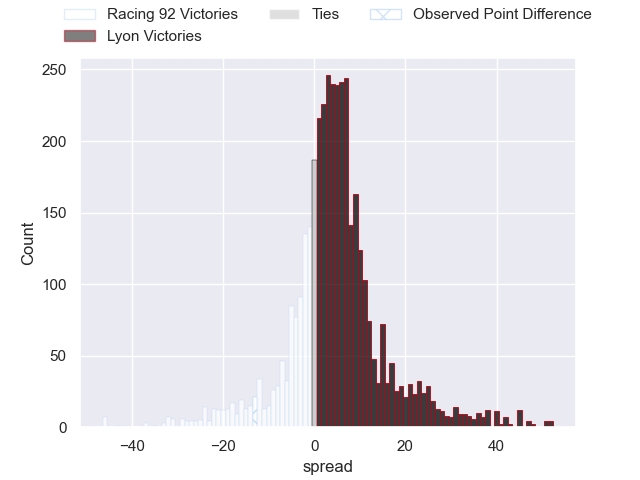
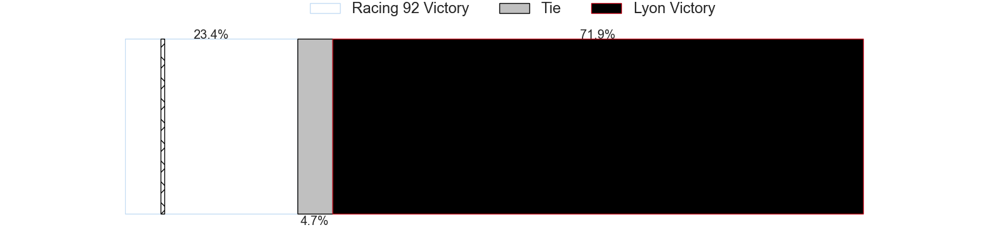
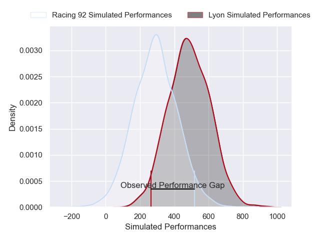
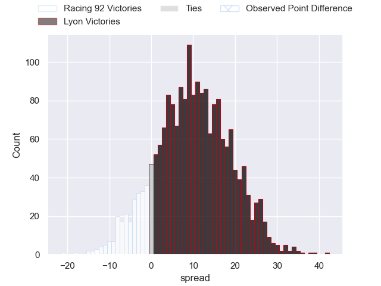
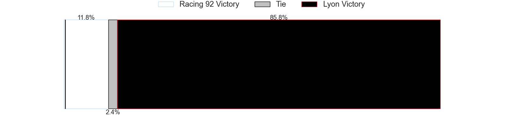

---  
layout: page  
title: Racing 92 at Lyon; 47-34  
date: 2025-06-07 18:00:00 -0500  
categories: "Top 14 Orange 24/25" match review  
---
# Racing 92 at Lyon; 47-34

# Club Level Predictions

The first set of predictions treats a club as the smallest object, as the club develops its members, organizes a gameplan, and deploys its players as needed for each match. This club model has a prediction of 0.62, which translates to predicting Lyon to win by 4.3.

Our Over/Under is 57.5 - and combined with the spread above, we have a predicted scoreline of 27 to 31

Each club has a rating and a rating deviation (similar to a Glicko rating), and expected performances can be generated. This allows for simulated matches and spreads like the ones below.
## Projected Performances - Club Model

## Projected Spreads - Club Model

## Projected Results - Club Model

# Player Level Predictions

Treating teams instead as an entity made up of the currently active players, I have ratings for each player in an altogether different system. These can be combined to form team ratings once teamsheets are announced, weighting starters a bit higher than the reserves. After the match is played, players can be weighted by their minutes on the field, allowing for an accurate measure of the team's composition. With these compiled team ratings, we can make predictions, measure inaccuracy, and update the individual player ratings.
## Prediction without Player Minutes: Lyon by 13.0

Lyon by 0.4 on a neutral pitch

## Projected Performances - Player Model

## Projected Spreads - Player Model

## Projected Results - Player Model

|   Away Minutes | Away Player         |   Away Percentile |   Number |   Home Percentile | Home Player         |   Home Minutes |
|---------------:|:--------------------|------------------:|---------:|------------------:|:--------------------|---------------:|
|             80 | Guram Gogichashvili |             89.51 |        1 |              8.44 | Jerome Rey          |             80 |
|             40 | Janick Tarrit       |             52.47 |        2 |              9.51 | Yanis Charcosset    |             80 |
|             72 | Gia Kharaishvili    |             72    |        3 |              9.24 | Jermaine Ainsley    |             73 |
|             21 | Boris Palu          |             89.55 |        4 |             71.38 | Alban Roussel       |             80 |
|             16 | Romain Taofifenua   |             55.65 |        5 |             50.05 | Mickael Guillard    |             45 |
|             12 | Soumaila Camara     |             51.81 |        6 |             69.47 | Dylan Cretin        |             59 |
|              8 | Ibrahim Diallo      |             26.91 |        7 |              3.94 | Theo William        |             80 |
|             28 | Maxime Baudonne     |             77.57 |        8 |             87.65 | Arno Botha          |             68 |
|             50 | Kleo Labarbe        |             72.08 |        9 |             79.54 | Charlie Cassang     |             80 |
|             66 | Antoine Gibert      |             94.98 |       10 |             76.26 | Leo Berdeu          |             23 |
|             80 | Paul Leraitre       |             71.69 |       11 |             82.48 | Davit Niniashvili   |             35 |
|             64 | Vinaya Habosi       |             65.15 |       12 |             98.78 | Semi Radradra       |             35 |
|             80 | Josua Tuisova       |             97    |       13 |              4.22 | Josiah Maraku       |             21 |
|             80 | Henry Arundell      |             24.85 |       14 |             94.91 | Monty Ioane         |             35 |
|              4 | Henry Arundell      |             24.85 |       14 |             94.91 | Monty Ioane         |             35 |
|             80 | Sam James           |             95.3  |       15 |              4.25 | Martin Meliande     |              0 |
|             19 | Diego Escobar       |            nan    |       16 |             93.16 | Camille Chat        |             80 |
|             20 | Hassane Kolingar    |             20.89 |       17 |            nan    | Wayan de Benedittis |             80 |
|              8 | Will Rowlands       |             32.63 |       18 |             25.77 | Killian Geraci      |             45 |
|             80 | Jordan Joseph       |             85.8  |       19 |             66.81 | Beka Saginadze      |             45 |
|             80 | Cameron Woki        |             94.57 |       20 |            nan    | Esteban Gonzalez    |             80 |
|              0 | Tristan Tedder      |             22.82 |       21 |             31.57 | Ethan Dumortier     |             70 |
|             50 | Henry Chavancy      |             99.89 |       22 |             46.73 | Thibaut Regard      |             22 |
|             54 | Lehopa Leota        |            nan    |       23 |            nan    | Valentin Simutoga   |             80 |

