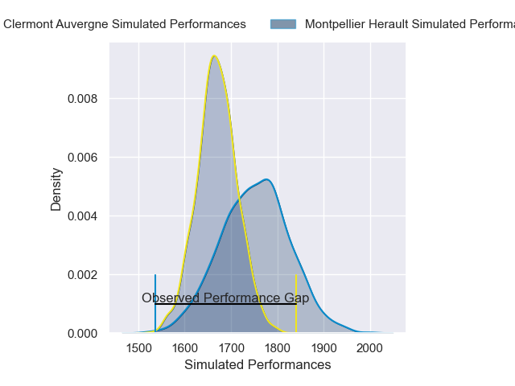
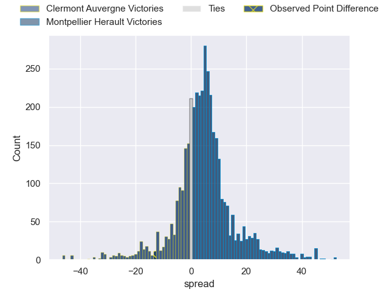
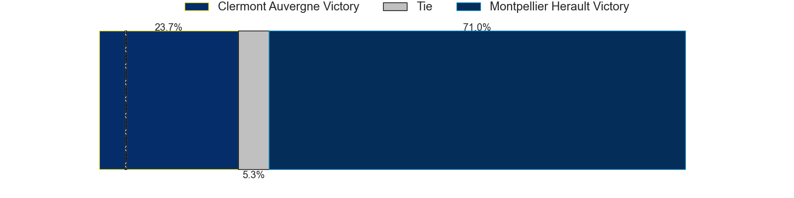
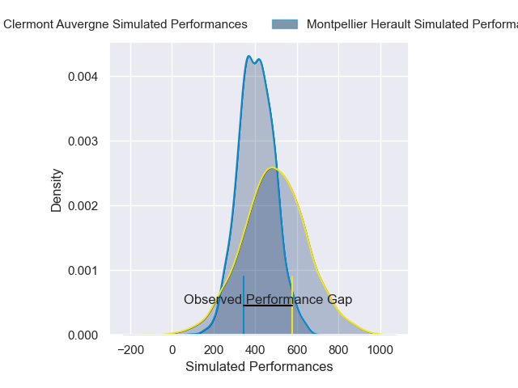
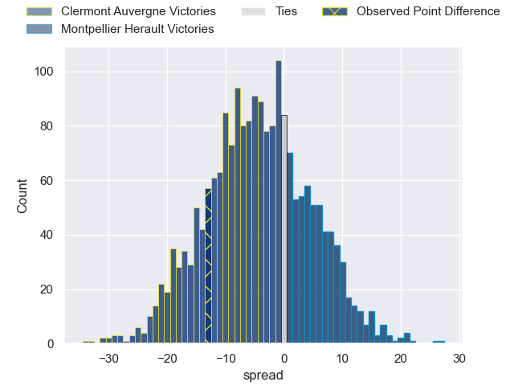
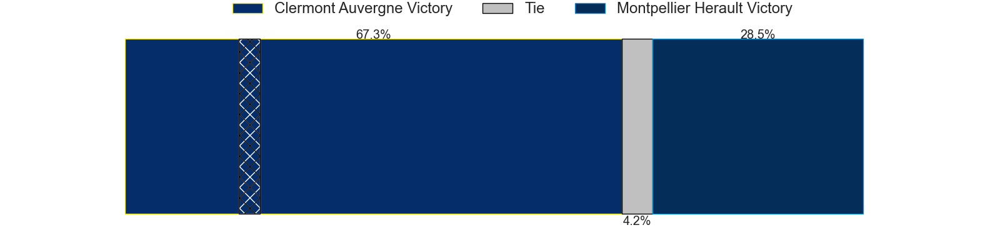

---  
layout: page  
title: Clermont Auvergne at Montpellier Herault; 23-10  
date: 2025-06-07 18:00:00 -0500  
categories: "Top 14 Orange 24/25" match review  
---
# Clermont Auvergne at Montpellier Herault; 23-10

# Club Level Predictions

The first set of predictions treats a club as the smallest object, as the club develops its members, organizes a gameplan, and deploys its players as needed for each match. This club model has a prediction of 0.613, which translates to predicting Montpellier Herault to win by 4.0.

Our Over/Under is 49.5 - and combined with the spread above, we have a predicted scoreline of 23 to 27

Each club has a rating and a rating deviation (similar to a Glicko rating), and expected performances can be generated. This allows for simulated matches and spreads like the ones below.
## Projected Performances - Club Model

## Projected Spreads - Club Model

## Projected Results - Club Model

# Player Level Predictions

Treating teams instead as an entity made up of the currently active players, I have ratings for each player in an altogether different system. These can be combined to form team ratings once teamsheets are announced, weighting starters a bit higher than the reserves. After the match is played, players can be weighted by their minutes on the field, allowing for an accurate measure of the team's composition. With these compiled team ratings, we can make predictions, measure inaccuracy, and update the individual player ratings.
## Prediction without Player Minutes: Montpellier Herault by 7.8

Clermont Auvergne by 4.2 on a neutral pitch

## Projected Performances - Player Model

## Projected Spreads - Player Model

## Projected Results - Player Model

|   Away Minutes | Away Player          |   Away Percentile |   Number |   Home Percentile | Home Player                 |   Home Minutes |
|---------------:|:---------------------|------------------:|---------:|------------------:|:----------------------------|---------------:|
|           10   | Giorgi Akhaladze     |             38.27 |        1 |              2.96 | Baptiste Erdocio            |             34 |
|           52   | Etienne Fourcade     |             85.69 |        2 |              8.85 | Jordan Uelese               |              0 |
|           80   | Regis Montagne       |             79.51 |        3 |             25.16 | Mohamed Haouas              |             80 |
|           80   | Rob Simmons          |             91.03 |        4 |             92.41 | Yacouba Camara              |             80 |
|           46   | Thomas Ceyte         |             77.22 |        5 |             86.71 | Bastien Chalureau           |             57 |
|           80   | Killian Tixeront     |             89.6  |        6 |             86.82 | Nicolaas Janse van Rensburg |             25 |
|           57   | Alexandre Fischer    |             84.03 |        7 |             71.7  | Alexandre Becognee          |             31 |
|           31   | Pita Gus Sowakula    |             94.01 |        8 |             95.87 | Marco Tauleigne             |              5 |
|           30   | Baptiste Jauneau     |             91.12 |        9 |             94.02 | Cobus Reinach               |             21 |
|           80   | Benjamin Urdapilleta |             87.67 |       10 |             29.22 | Anthony Bouthier            |             80 |
|           80   | Alivereti Raka       |              9.56 |       11 |             13.66 | Gabriel Ngandebe            |             21 |
|           30.5 | Irae Simone          |             56.17 |       12 |             46.21 | Jan Serfontein              |              7 |
|           70   | Leon Darricarrere    |             93.43 |       13 |             65.01 | Thomas Darmon               |             21 |
|           80   | Bautista Delguy      |             87.18 |       14 |             19.96 | Mael Moustin                |             12 |
|           80   | Alex Newsome         |             88    |       15 |             87.33 | Joshua Moorby               |             55 |
|           80   | Folau Fainga'a       |             90.58 |       16 |             44.63 | Lyam Akrab                  |             23 |
|           19   | Matheo Frisach       |            nan    |       17 |             91.55 | Enzo Forletta               |             40 |
|           25   | Thibaud Lanen        |             71.2  |       18 |             80.7  | Tyler Duguid                |              0 |
|           59   | Thibaud Lanen        |             71.2  |       18 |             80.7  | Tyler Duguid                |              0 |
|           80   | Thibaud Lanen        |             71.2  |       18 |             80.7  | Tyler Duguid                |              0 |
|           73   | Peceli Yato          |             65.08 |       19 |             59.49 | Sam Simmonds                |             28 |
|           80   | Sebastien Bezy       |             85.52 |       20 |             69.31 | Leo Coly                    |             34 |
|           39   | Anthony Belleau      |             96.58 |       21 |             65.07 | Hugo Reus                   |             23 |
|           57   | Anthime Hemery       |            nan    |       22 |             86.07 | Arthur Vincent              |              0 |
|           51   | Cristian Ojovan      |             58.76 |       23 |             78.35 | Wilfrid Hounkpatin          |             75 |

