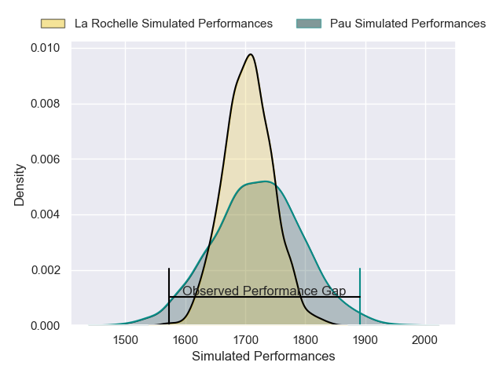
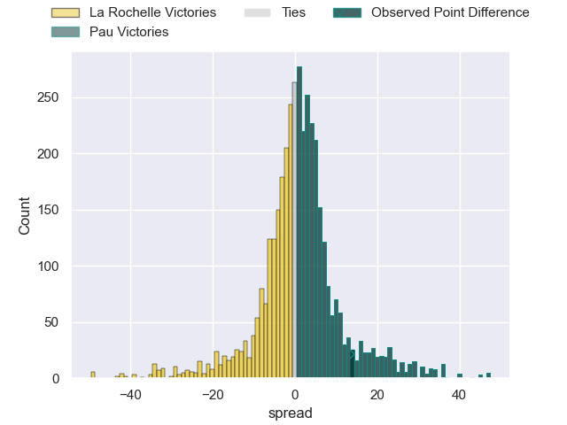
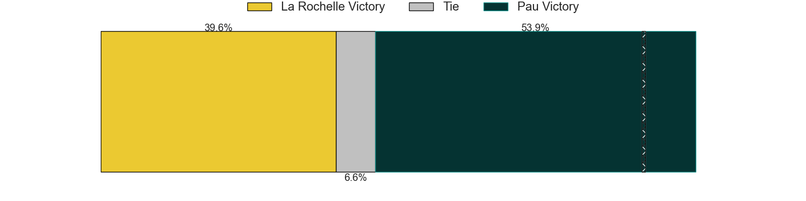
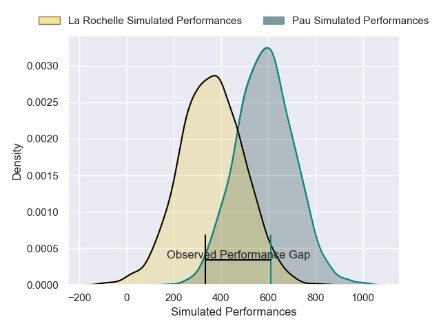
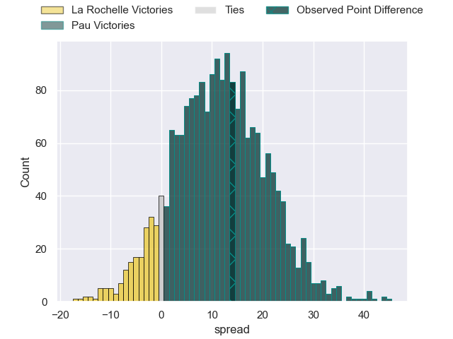
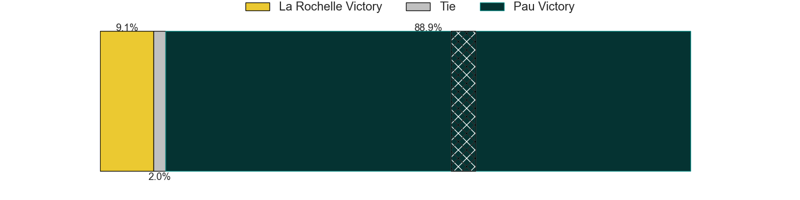

---  
layout: page  
title: La Rochelle at Pau; 18-32  
date: 2025-06-07 18:00:00 -0500  
categories: "Top 14 Orange 24/25" match review  
---
# La Rochelle at Pau; 18-32

# Club Level Predictions

The first set of predictions treats a club as the smallest object, as the club develops its members, organizes a gameplan, and deploys its players as needed for each match. This club model has a prediction of 0.522, which translates to predicting Pau to win by 0.8.

Our Over/Under is 54.5 - and combined with the spread above, we have a predicted scoreline of 27 to 28

Each club has a rating and a rating deviation (similar to a Glicko rating), and expected performances can be generated. This allows for simulated matches and spreads like the ones below.
## Projected Performances - Club Model

## Projected Spreads - Club Model

## Projected Results - Club Model

# Player Level Predictions

Treating teams instead as an entity made up of the currently active players, I have ratings for each player in an altogether different system. These can be combined to form team ratings once teamsheets are announced, weighting starters a bit higher than the reserves. After the match is played, players can be weighted by their minutes on the field, allowing for an accurate measure of the team's composition. With these compiled team ratings, we can make predictions, measure inaccuracy, and update the individual player ratings.
## Prediction without Player Minutes: Pau by 17.9

Pau by 4.8 on a neutral pitch

## Projected Performances - Player Model

## Projected Spreads - Player Model

## Projected Results - Player Model

|   Away Minutes | Away Player         |   Away Percentile |   Number |   Home Percentile | Home Player        |   Home Minutes |
|---------------:|:--------------------|------------------:|---------:|------------------:|:-------------------|---------------:|
|             80 | Reda Wardi          |             89.87 |        1 |              3.82 | Daniel Bibi Biziwu |             67 |
|             66 | Pierre Bourgarit    |             80.8  |        2 |              4.56 | Lucas Rey          |             32 |
|             70 | Aleksandre Kuntelia |             19.73 |        3 |             87.73 | Siate Tokolahi     |             46 |
|             80 | Thomas Lavault      |             68.85 |        4 |             77.61 | Hugo Auradou       |             51 |
|             56 | Will Skelton        |             93.98 |        5 |             72.76 | Remi Picquette     |             51 |
|              5 | Judicael Cancoriet  |              5.11 |        6 |             47.23 | Sacha Zegueur      |             51 |
|             80 | Matthias Haddad     |             35    |        7 |             39.36 | Loic Credoz        |             23 |
|             13 | Paul Boudehent      |              5.56 |        8 |             75.72 | Beka Gorgadze      |             60 |
|             80 | Tawera Kerr-Barlow  |             97.71 |        9 |             91.59 | Thibault Daubagna  |              5 |
|             80 | Antoine Hastoy      |             21.92 |       10 |             84.7  | Joe Simmonds       |             80 |
|             60 | Hoani Bosmorin      |             32.79 |       11 |             94.2  | Tumua Manu         |             80 |
|             80 | Jonathan Danty      |             90.12 |       12 |             77.69 | Fabien Brau Boirie |             80 |
|             60 | Jules Favre         |             80.36 |       13 |             64.37 | Emilien Gailleton  |             48 |
|             29 | Jack Nowell         |              1.02 |       14 |             91.24 | Theo Attissogbe    |             70 |
|             29 | Jack Nowell         |              1.02 |       14 |             91.24 | Theo Attissogbe    |             67 |
|             29 | Dillyn Leyds        |             95.08 |       15 |             84.56 | Jack Maddocks      |             13 |
|             20 | Quentin Lespiaucq   |             21.86 |       16 |             70.91 | Youri Delhommel    |              0 |
|             48 | Thierry Paiva       |            nan    |       17 |             58.22 | Hugo Parrou        |             22 |
|             29 | Ultan Dillane       |             59.13 |       18 |            nan    | Thomas Jolmes      |             26 |
|             80 | Levani Botia        |             93.94 |       19 |             76.13 | Carwyn Tuipulotu   |             26 |
|             54 | Thomas Berjon       |             87    |       20 |             84.57 | Reece Hewat        |             80 |
|             33 | Ihaia West          |             35.39 |       21 |             67.3  | Thomas Souverbie   |             26 |
|             67 | Teddy Thomas        |             69.92 |       22 |             92.47 | Axel Desperes      |             73 |
|             80 | Uini Atonio         |             98.58 |       23 |             48.18 | Jon Zabala         |             80 |

