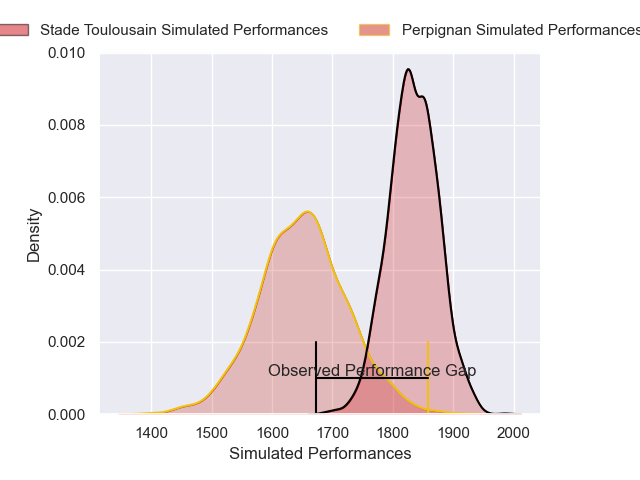
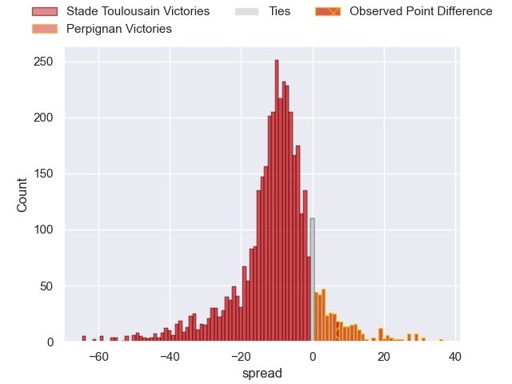
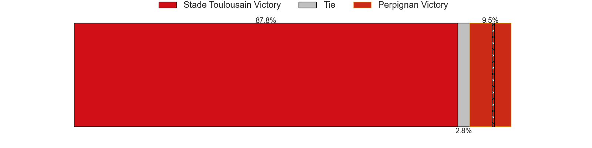
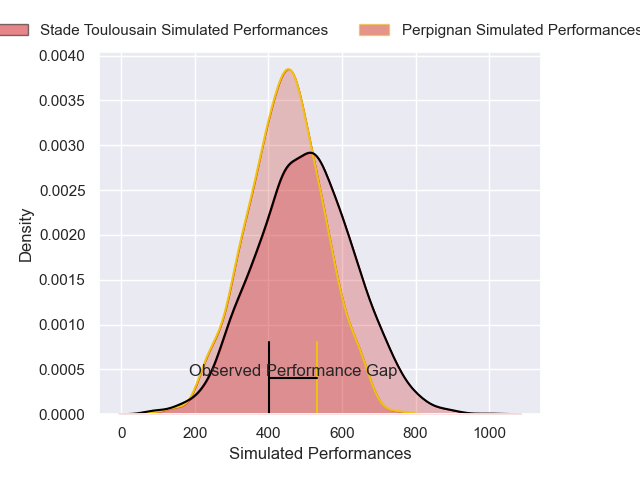
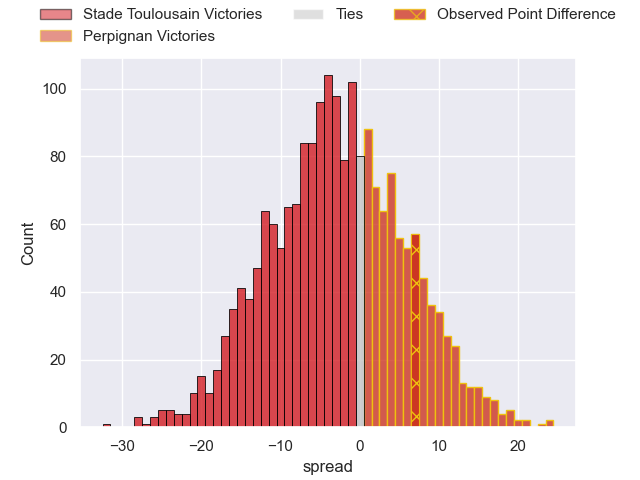
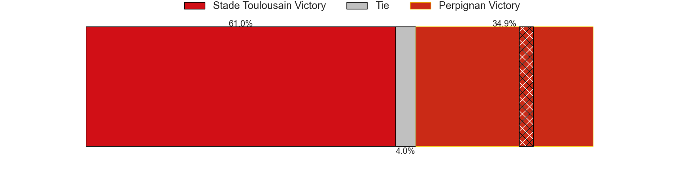

---  
layout: page  
title: Stade Toulousain at Perpignan; 35-42  
date: 2025-06-07 18:00:00 -0500  
categories: "Top 14 Orange 24/25" match review  
---
# Stade Toulousain at Perpignan; 35-42

# Club Level Predictions

The first set of predictions treats a club as the smallest object, as the club develops its members, organizes a gameplan, and deploys its players as needed for each match. This club model has a prediction of 0.259, which translates to predicting Stade Toulousain to win by 9.2.

Our Over/Under is 55.5 - and combined with the spread above, we have a predicted scoreline of 32 to 23

Each club has a rating and a rating deviation (similar to a Glicko rating), and expected performances can be generated. This allows for simulated matches and spreads like the ones below.
## Projected Performances - Club Model

## Projected Spreads - Club Model

## Projected Results - Club Model

# Player Level Predictions

Treating teams instead as an entity made up of the currently active players, I have ratings for each player in an altogether different system. These can be combined to form team ratings once teamsheets are announced, weighting starters a bit higher than the reserves. After the match is played, players can be weighted by their minutes on the field, allowing for an accurate measure of the team's composition. With these compiled team ratings, we can make predictions, measure inaccuracy, and update the individual player ratings.
## Prediction without Player Minutes: Stade Toulousain by 3.8

Stade Toulousain by 18.6 on a neutral pitch

## Projected Performances - Player Model

## Projected Spreads - Player Model

## Projected Results - Player Model

|   Away Minutes | Away Player            |   Away Percentile |   Number |   Home Percentile | Home Player           |   Home Minutes |
|---------------:|:-----------------------|------------------:|---------:|------------------:|:----------------------|---------------:|
|             72 | Cyril Baille           |             98.47 |        1 |             80.95 | Giorgi Beria          |             41 |
|             80 | Thomas Lacombre        |             80.23 |        2 |             37.1  | Seilala Lam           |             21 |
|             57 | Dorian Aldegheri       |             98.29 |        3 |             85    | Nemo Roelofse         |             59 |
|             80 | Clement Verge          |             72.89 |        4 |             72.26 | Mathieu Tanguy        |             10 |
|             64 | Emmanuel Meafou        |             91.77 |        5 |             16.46 | Posolo Tuilagi        |             30 |
|              3 | Mathis Castro-Ferreira |             78.78 |        6 |             56.38 | Jacobus van Tonder    |             10 |
|             80 | Leo Banos              |             88    |        7 |             49.41 | Noe Della Schiava     |              8 |
|             28 | Alexandre Roumat       |             97.93 |        8 |             17.77 | Lucas Velarte         |             28 |
|             29 | Paul Graou             |             62.93 |        9 |             90.15 | James Hall            |             40 |
|             76 | Romain Ntamack         |             97.03 |       10 |             54.34 | Tommaso Allan         |             52 |
|             80 | Matthis Lebel          |             98.95 |       11 |             44.96 | Jefferson Joseph      |             80 |
|             51 | Pita Ahki              |             45.3  |       12 |             98.07 | Jeronimo de la Fuente |             68 |
|              0 | Dimitri Delibes        |             87.32 |       13 |              5.21 | Alivereti Duguivalu   |             66 |
|              8 | Ange Capuozzo          |             98.63 |       14 |             62.71 | Tavite Veredamu       |             80 |
|             16 | Lucien Richardis       |             39.11 |       15 |             85.78 | Lucas Dubois          |             64 |
|             80 | Guillaume Cramont      |             84.93 |       16 |            nan    | Mathys Lotrian        |             19 |
|             80 | Rodrigue Neti          |             36.84 |       17 |             18.06 | Bruce Devaux          |             20 |
|             59 | Joshua Brennan         |             92.93 |       18 |             75.21 | Joaquin Oviedo        |             80 |
|             80 | Alban Placines         |            nan    |       19 |            nan    | Alan Brazo            |             80 |
|             80 | Theo Ntamack           |             57.02 |       20 |             62.16 | Gela Aprasidze        |             50 |
|             59 | Naoto Saito            |             15.83 |       21 |             81.33 | Valentin Delpy        |             54 |
|             60 | Mathieu Galtier        |            nan    |       22 |             70.78 | Apisai Naqalevu       |             50 |
|             25 | Joel Merkler           |             88.05 |       23 |              4.22 | Kieran Brookes        |             40 |

